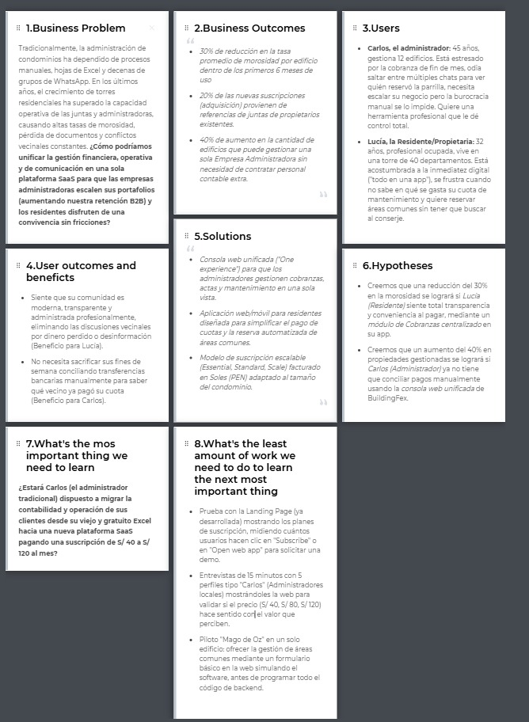
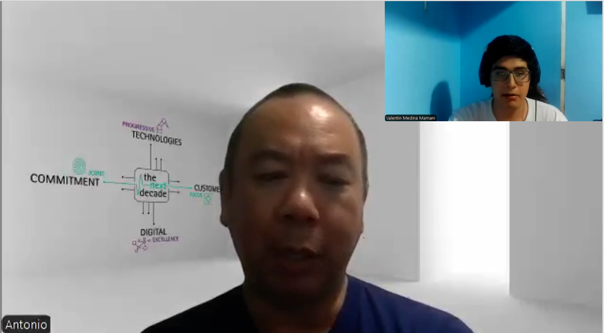
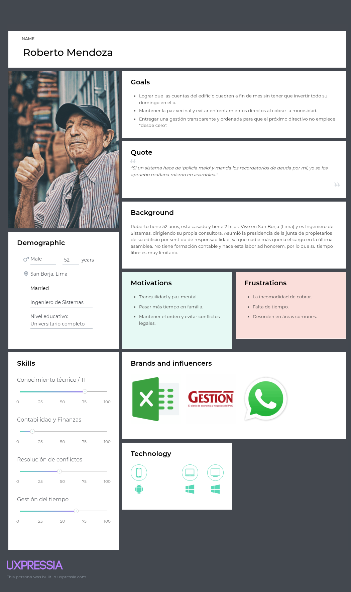
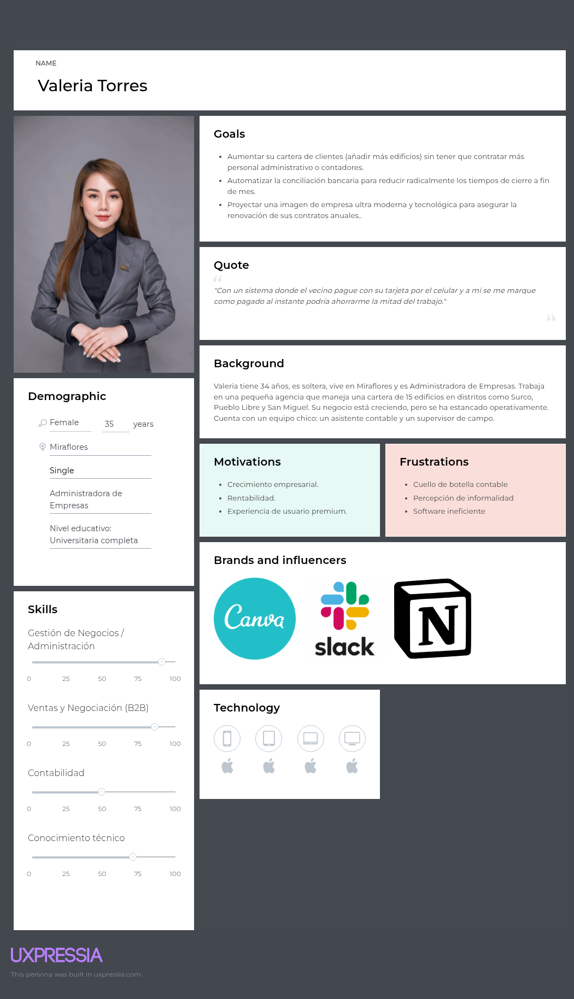
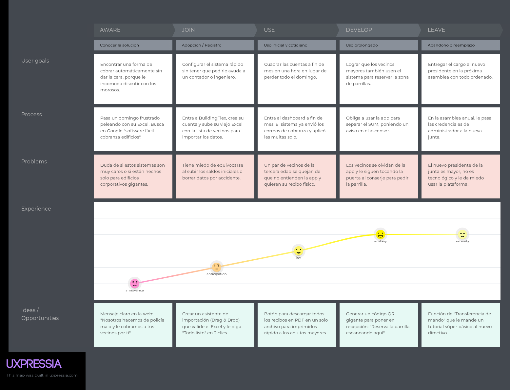
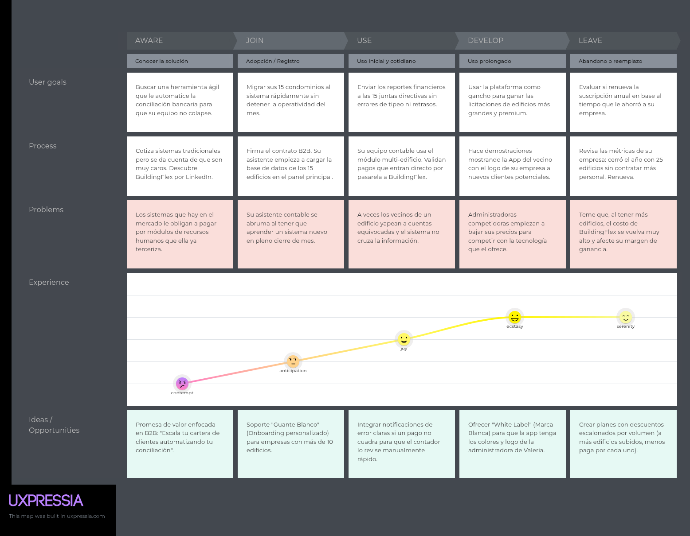
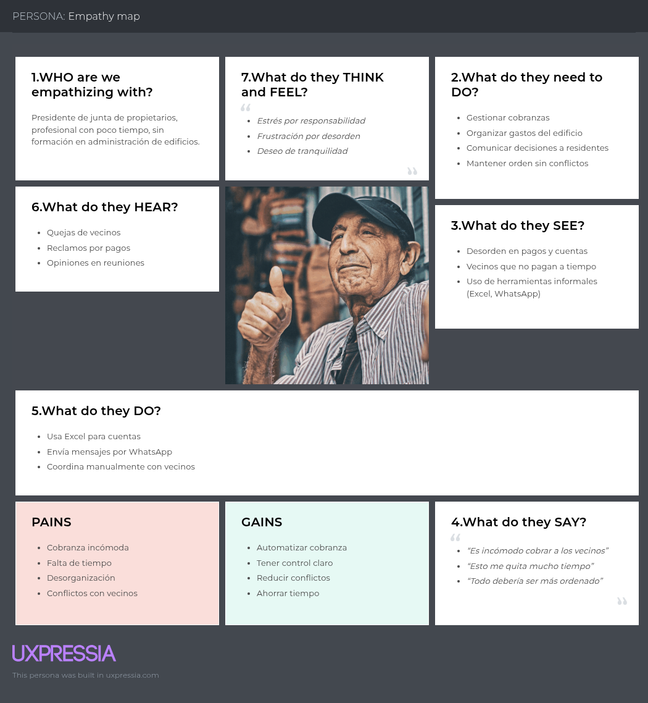
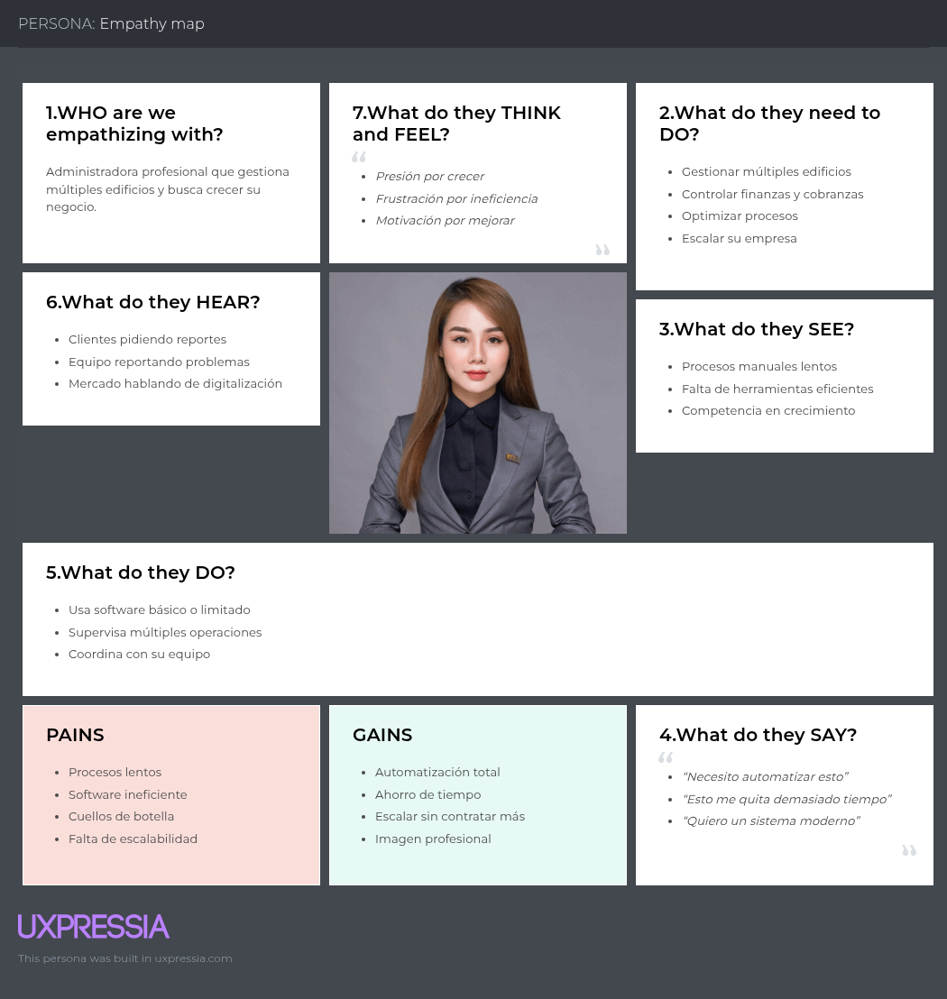
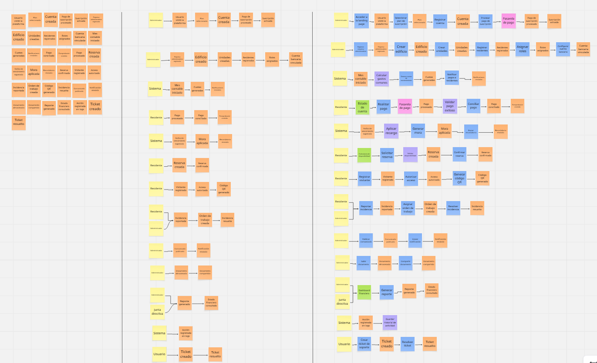

<div align="center">
  

# Universidad Peruana de Ciencias Aplicadas
## Carrera de Ingeniería de Software

**Curso:** 1ACC0238 - Aplicaciones para Dispositivos Móviles  
**NRC:** 4939  

---

# Informe del Trabajo Final

**Docente:** Quevedo Velasco, David Gerardo  
**Equipo:** BuildingFex  
**Proyecto:** BuildingFex  

### Integrantes

| Código     | Apellidos y Nombres |
|:-----------| :--- |
| u202022211 | Javier Murillo, Mathias |
| u202318220 | Hermoza Quispe, Jude Alessandro |
| u202312510 | Jave Chang, Alejandro Manuel |
| u201910803 | Heredia Hoyos, Danitza Ivonne |
|            | Suteau, Antonin |

**Período:** 2026-20  
**Fecha:** Setiembre 2026

</div>

<div style="page-break-after: always;"></div>

## Registro de Versiones del Informe

| Versión | Fecha | Autor | Descripción de modificación |
| :--- | :--- | :--- | :--- |
| AV1 | 02-09-2026 | Equipo BuildingFex | Estructura inicial correspondiente a la primera entrega. |
| AV1 | 06-09-2026 | Hermoza Quispe, Jude Alessandro | Redacción de las secciones 2.2 Entrevistas (diseño), 2.4.3 Product Backlog y 2.5.3 Software Architecture; registro de datos personales del integrante. |

<div style="page-break-after: always;"></div>

## Project Report Collaboration Insights

**URL del repositorio del informe:** https://github.com/BuildingFex-UPC/report

Evidencias de colaboración y participación del equipo para la entrega AV1:

| Integrante | Participación |
| :--- | :--- |
| Javier Murillo, Mathias |  |
| Jude Alessandro Hermoza Quispe |  |
| Alejandro Manuel Jave Chang |  |
| Danitza Ivonne Heredia Hoyos |  |
| Antonin Suteau |  |


<div style="page-break-after: always;"></div>

## Contenido Student Outcome

**ABET Student Outcome 5:** Funcionamiento en equipos multidisciplinarios.

<table>
  <tr>
    <th>Criterio Específico</th>
    <th>Nombre del Integrante</th>
    <th>Acciones Realizadas</th>
    <th>Conclusión</th>
  </tr>
  <tr>
    <td rowspan="5">Actualiza conceptos y conocimientos necesarios para su desarrollo profesional y en especial para su proyecto en soluciones de ingeniería de software</td>
    <td>Mathias Javier Murillo</td>
    <td><b>AV1:</b></td>
    <td><b>AV1:</b></td>
  </tr>
  <tr>
    <td>Jude Alessandro Hermoza Quispe</td>
    <td><b>AV1:</b> Investigó y aplicó técnicas de entrevista estructurada (sección 2.2), la construcción del Product Backlog —épicas, User Stories, Spike Stories y estimación con Story Points sobre la sucesión de Fibonacci (sección 2.4.3)— y el modelo C4 para la Software Architecture (sección 2.5.3). Reclasificó la US29 de EP01 a EP02 por corresponder a egresos recurrentes e incorporó la Spike Story SP01 sobre almacenamiento seguro de documentos (EP07).</td>
    <td><b>AV1:</b> Actualizó y consolidó conocimientos de ingeniería de requisitos y de arquitectura de software, aplicándolos directamente en los artefactos del proyecto BuildingFex.</td>
  </tr>
  <tr>
    <td>Alejandro Manuel Jave Chang</td>
    <td><b>AV1:</b></td>
    <td><b>AV1:</b></td>
  </tr>
  <tr>
    <td>Danitza Ivonne Heredia Hoyos</td>
    <td><b>AV1:</b></td>
    <td><b>AV1:</b></td>
  </tr>
  <tr>
    <td>Antonin Suteau</td>
    <td><b>AV1:</b></td>
    <td><b>AV1:</b></td>
  </tr>
  <tr>
    <td rowspan="5">Reconoce la necesidad del aprendizaje permanente para el desempeño profesional y el desarrollo de proyectos en soluciones de tecnologías de ingeniería de software.</td>
    <td>Mathias Javier Murillo</td>
    <td><b>AV1:</b></td>
    <td><b>AV1:</b></td>
  </tr>
  <tr>
    <td>Jude Alessandro Hermoza Quispe</td>
    <td><b>AV1:</b> Identificó vacíos propios en priorización de backlog y modelado arquitectónico; se capacitó de forma autónoma en el uso de Spike Stories y en la notación C4, y trasladó lo aprendido a la revisión y corrección del backlog del equipo (mover la US29 a EP02, añadir la Spike Story SP01).</td>
    <td><b>AV1:</b> Demostró disposición al aprendizaje permanente al incorporar prácticas nuevas (Spike Stories, C4) y aplicarlas para mejorar la calidad de la documentación técnica del proyecto.</td>
  </tr>
  <tr>
    <td>Alejandro Manuel Jave Chang</td>
    <td><b>AV1:</b></td>
    <td><b>AV1:</b></td>
  </tr>
  <tr>
    <td>Danitza Ivonne Heredia Hoyos</td>
    <td><b>AV1:</b></td>
    <td><b>AV1:</b></td>
  </tr>
  <tr>
    <td>Antonin Suteau</td>
    <td><b>AV1:</b></td>
    <td><b>AV1:</b></td>
  </tr>
</table>

<div style="page-break-after: always;"></div>

## Capítulo I: Presentación

### 1.1. Startup Profile
#### 1.1.1. Descripción de la Startup
La administración de condominios y torres residenciales implica gestionar múltiples procesos críticos: desde el control de las finanzas y la recaudación de cuotas, hasta
el mantenimiento de las instalaciones y la comunicación con los residentes. Tradicionalmente, estas operaciones se manejan de forma fragmentada, utilizando hojas de
cálculo, correos electrónicos y grupos de mensajería, lo que genera desorden, retrasos en los pagos y falta de transparencia.
A pesar de que existen algunas herramientas digitales en el mercado, muchas de ellas resultan demasiado complejas para los comités de administración o no ofrecen
una experiencia unificada tanto para el gestor como para el residente. Esto provoca que la información sobre normativas, actas o estados de cuenta no sea fácilmente
accesible para la comunidad.
Frente a esta situación, se requiere una plataforma centralizada y escalable que simplifique estas operaciones. Una solución en la nube que integre la gestión de áreas
comunes, cobranzas, mantenimiento y comunicados en un solo entorno, mejorando la convivencia, optimizando el tiempo de los administradores y brindando total
visibilidad a las juntas de propietarios.

#### 1.1.2. Perfiles de integrantes del equipo

| Foto                                                            | Nombre                       | Código     | Carrera                | Descripción de habilidades y conocimientos |
|-----------------------------------------------------------------|------------------------------|------------|------------------------|--------------------------------------------|
|                | Mathias Javier Murillo       | U202022211 | Ingeniería de Software | Soy estudiante de 7mo ciclo de Ingeniería de Software en la UPC. Me especializo en desarrollo full stack de s y aplicaciones móviles. Me caracterizo por ser una persona muy responsable, puntual y organizada. Aporto al equipo apoyo en el diseño, organización y desarrollo de los Sprints. |
|  | Jude Alessandro Hermoza Quispe | u202318220 | Ingeniería de Software | Soy estudiante de Ingeniería de Software en la UPC con interés en el desarrollo de aplicaciones  y móviles. Me enfoco en el levantamiento de requerimientos, el modelado del backlog y el diseño de la arquitectura de software. Aporto al equipo organización, análisis de entrevistas y documentación técnica del proyecto. |
|                 | Alejandro Manuel Jave Chang  | U202312510 | Ingenieria de Software | Vengo de la carrera de Ingeniería de software, me gusta explorar diversas soluciones a desafíos tecnológicos y me apasiona aprender nuevas cosas. Mi enfoque dedicado a los proyectos que me apasionan me impulsa a explorar nuevas fronteras en mi carrera. |
|         | Danitza Ivonne Heredia Hoyos | U201910803 | Ingeniería de Software | Soy estudiante de la carrera de Ingeniería de Software. Cuento con conocimientos en UX/UI Design, enfocado en la creación de interfaces intuitivas y centradas en la experiencia del usuario. Me interesa seguir fortaleciendo mis habilidades tanto en el ámbito del desarrollo de software como en el diseño de soluciones digitales, aportando creatividad y enfoque práctico en cada proyecto. |
|                                                                 |                              |            |                        |  |

### 1.2. Solution Profile
El nombre de nuestro producto es <b>“BuildingFex”</b>. Este término fusiona la palabra inglesa "Building" (edificio), haciendo referencia directa a nuestro rubro inmobiliario,
con "Fex", que evoca un sentido de eficiencia, agilidad y flexibilidad operativa. Este nombre transmite la misión principal de la plataforma: modernizar y agilizar las
operaciones de los condominios y torres residenciales bajo un ecosistema robusto y profesional. <br>
<b>Product Description:</b> BuildingFex es una plataforma SaaS (Software as a Service) integral diseñada para juntas de propietarios y empresas administradoras. El sistema
unifica la operatividad del edificio ofreciendo una misma experiencia fluida tanto en la aplicación web como en la versión móvil. <br>
El software centraliza las siguientes operaciones clave:
* <b>Áreas Comunes:</b> Gestión de reservas, reglas y mantenimiento en una sola vista.
* <b>Cobranzas (Collections):</b> Visibilidad de pagos, cuotas y recordatorios para los residentes, disminuyendo la morosidad.
* <b>Mantenimiento:</b> Registro de solicitudes, control de proveedores y estado de las reparaciones de todo el edificio.
* <b>Comunicados y Documentos:</b> Emisión de avisos oficiales y un repositorio seguro para actas, reglamentos y archivos de la comunidad.
* <b>Accesos y Visitas:</b> Registros alineados con las políticas de seguridad del edificio.

De esta forma, BuildingFex garantiza una entrega de servicio responsable y estandarizada, guiada por normativas éticas y de transparencia para toda la comunidad.<br>

<b>Monetización:</b> El modelo de negocio es B2B, basado en suscripciones mensuales (SaaS) facturadas en Soles Peruanos (PEN). Los planes están diseñados para escalar
según el tamaño del condominio:
* <b>Plan Essential (S/ 40 al mes):</b> Dirigido a edificios pequeños o condominios boutique (10 a 15 departamentos). Incluye la consola web, gestión de áreas comunes,
cobranzas, comunicados, documentos, registro de visitas y soporte por correo en días hábiles.
* <b>Plan Standard (S/ 80 al mes):</b> Diseñado para torres medianas y comunidades activas (16 a 40 departamentos). Suma a lo anterior una mayor capacidad,
visibilidad más clara de deudas, notificaciones masivas para residentes y soporte operativo prioritario.
* <b>Plan Scale (S/ 120 al mes):</b> Enfocado en grandes complejos y portafolios de gran altura (41 a 80 departamentos). Incluye reportes avanzados para comités
grandes, asistencia en la implementación (onboarding) y canales de soporte con tiempos de respuesta acordados.
#### 1.2.1. Antecedentes y problemática
<b>Descripción de la problemática:</b> El problema central se encuentra en la ineficiencia logística y financiera que sufren las administraciones de inmuebles al no contar con
un flujo de trabajo centralizado. La dependencia de procesos manuales dificulta el seguimiento de la morosidad, genera conflictos en la reserva de espacios
compartidos y propicia la pérdida de información histórica del edificio (como actas o contratos con proveedores).<br>

Esta carencia de tecnología perjudica tanto a las empresas administradoras, que ven limitada su capacidad de gestionar más propiedades, como a los propietarios, que
perciben una falta de transparencia sobre cómo se invierte su dinero y cómo se gestionan las incidencias del día a día.<br>

<b>Objetivos</b><br>
* Desarrollar una plataforma SaaS que unifique la administración de finanzas, operaciones y comunicaciones de los edificios.
* Facilitar la visibilidad de los pagos y automatizar los recordatorios para reducir los índices de morosidad.
* Proveer un sistema transparente de reportes y almacenamiento de documentos accesibles para la comunidad.
* Escalar la capacidad operativa de los property managers mediante flujos de trabajo claros y estandarizados.

<b>Restricciones</b><br>
* La plataforma depende de la conexión a internet para la sincronización de datos en tiempo real entre la aplicación móvil y los usuarios.
* La adopción del sistema requiere un cambio de hábitos en los residentes, especialmente en aquellos menos familiarizados con herramientas digitales.
* La gestión de datos financieros y personales exige altos estándares de seguridad y protección de la privacidad.

<b>Antecedentes</b><br>
* <b>Administración tradicional:</b> El uso de herramientas genéricas como Excel y WhatsApp domina el mercado actual. Aunque son de bajo costo, no escalan, carecen
de seguridad de datos y no ofrecen transparencia financiera en tiempo real.
* <b>Sistemas contables genéricos:</b> Existen programas de contabilidad robustos, pero no están enfocados en la convivencia comunitaria, dejando de lado módulos
esenciales como la reserva de áreas comunes o el control de visitas.
* <b>Plataformas extranjeras:</b> Hay soluciones PropTech en otros países, pero sus planes de suscripción suelen ser elevados (facturados en dólares) y no siempre se
adaptan a las dinámicas residenciales locales.<br>

<b>Herramienta de 5W y 2H</b><br>
* <b>What - ¿Cuál es el problema?:</b><br>La gestión dispersa, poco transparente y manual de las operaciones y cobranzas en condominios y torres residenciales.<br>
* <b>When - ¿Cuándo sucede el problema?:</b><br>Ocurre constantemente en el registro de visitas e incidencias diarias, y se agudiza a fin de mes durante los procesos de facturación y conciliación de pagos.<br>
* <b>Where - ¿Dónde surge el problema?:</b><br>En la administración interna de edificios de departamentos y complejos residenciales.<br>
* <b>Who - ¿Quiénes son afectados por el problema?:</b><br>Las empresas administradoras, las juntas de propietarios, los conserjes y, en última instancia, los residentes.<br>
* <b>Why - ¿Cuál es la causa del problema?:</b><br>La falta de adopción de plataformas centralizadas y la dependencia de métodos informales para la comunicación y contabilidad.<br>
* <b>How - ¿Cómo se manifiesta el problema?:</b><br>Mediante altos índices de pagos atrasados, desinformación sobre las normativas del edificio, cruces en reservas de áreas comunes y demoras en el
mantenimiento.
How much - ¿Cuál es la magnitud del problema?
Afecta directamente la salud financiera del condominio y genera horas de trabajo no productivo para los administradores, limitando el crecimiento de sus
portafolios.
#### 1.2.2. Lean UX Process
##### 1.2.2.1. Lean UX Problem Statements
La operación diaria de torres residenciales ha recaído históricamente en el esfuerzo manual de los administradores y en canales de comunicación no oficiales. Este
enfoque, aunque funcional para edificios muy pequeños, genera cuellos de botella en la recaudación de cuotas, pérdida de trazabilidad en las reparaciones y frustración
entre los propietarios por la falta de transparencia.

Debido a esto, los ecosistemas de gestión actuales están desconectados. Los administradores no tienen una única vista para controlar las áreas comunes y las finanzas al
mismo tiempo, lo que reduce su capacidad de respuesta y profesionalismo.

Nuestro producto resuelve esta fricción al ofrecer BuildingFex, una plataforma centralizada que actúa como el núcleo operativo del edificio.

<b>A través de esta plataforma unificada se cubren los frentes más críticos:</b><br>
* Los residentes pueden revisar sus deudas, reservar áreas comunes y leer comunicados oficiales desde una misma interfaz.<br>
* Los administradores y juntas cuentan con una consola para gestionar proveedores, emitir avisos, llevar el control de accesos y visualizar el estado financiero
de la comunidad de manera estructurada.<br>
A diferencia de los métodos improvisados, BuildingFex brinda flujos de trabajo claros, alineados con la ética profesional y términos de servicio transparentes, preparados
para escalar desde un edificio boutique hasta un gran complejo.<br>

<b>El éxito de la solución se medirá en función de:</b><br>
* La disminución de la cartera morosa gracias a la visibilidad de los pagos y recordatorios.<br>
* El tiempo ahorrado por las empresas administradoras al gestionar múltiples tareas desde "una sola experiencia".<br>
* La cantidad de suscripciones activas (MRR) en los diferentes planes (Essential, Standard, Scale).<br>

##### 1.2.2.2. Lean UX Assumptions
En esta sección se detallan las suposiciones que validarán la viabilidad y adopción de BuildingFex. Se categorizan en impactos comerciales, beneficios para el usuario y
funcionalidades clave del software.<br>

<b>Business Outcomes</b><br>
* Creemos que al centralizar la visibilidad de las cobranzas, reduciremos la tasa de morosidad en los condominios afiliados en un 25%.<br>
* Creemos que al ofrecer planes de suscripción escalonados basados en el número de departamentos, facilitaremos la adquisición de clientes de diversos tamaños.<br>
* Creemos que el diseño responsivo y la interfaz estandarizada reducirán los tiempos de capacitación (onboarding) para las empresas administradoras en un 40%.<br>
* Creemos que al proveer flujos de trabajo claros, las administradoras podrán gestionar más edificios simultáneamente, incrementando nuestra retención de
clientes B2B.<br>

<b>Business Outcomes Assumptions</b><br>
* Creemos que las juntas de propietarios están dispuestas a pagar entre S/ 40 y S/ 120 mensuales si perciben un incremento real en la transparencia y orden del
edificio.<br>
* Creemos que el mercado local requiere facturación en moneda nacional (PEN) para agilizar la aprobación de presupuestos en asambleas.<br>
* Creemos que las agencias de administración prefieren un software unificado antes que utilizar múltiples aplicaciones desconectadas.<br>

<b>User Outcomes</b><br>
* Creemos que al ofrecer un módulo digital de reservas, los residentes evitarán conflictos y malentendidos por el uso de áreas comunes.<br>
* Creemos que al disponer de un repositorio de documentos en la nube, los propietarios tendrán la tranquilidad de consultar reglamentos y actas cuando lo
necesiten.<br>
* Creemos que los avisos oficiales en la plataforma mejorarán la tasa de lectura de comunicados en comparación con los correos electrónicos tradicionales.<br>
* Creemos que el registro digital de visitas brindará un mayor sentido de seguridad y control a toda la comunidad.<br>

<b>User Outcomes Assumptions</b><br>
* Creemos que los residentes demandan una manera rápida y transparente de verificar si sus pagos han sido registrados correctamente.<br>
* Creemos que los comités de administración necesitan reportes consolidados para justificar sus decisiones frente a los vecinos.<br>
* Creemos que la estandarización de procesos de mantenimiento calmará la ansiedad de los residentes frente a desperfectos en el edificio.<br>

<b>Features Assumptions</b><br>
* Creemos que incluir un sistema de recordatorios de cobro será la característica más valorada por los tesoreros.<br>
* Creemos que la consola para administradores facilitará la gestión simultánea de múltiples propiedades.<br>
* Creemos que ofrecer soporte segmentado (email en días hábiles vs. tiempos de respuesta acordados) aportará valor diferenciado a los planes superiores.<br>
* Creemos que un dashboard que resuma áreas comunes, cobranzas e incidencias en "una sola vista" será el diferencial principal frente a la competencia.<br>

##### 1.2.2.3. Lean UX Hypothesis Statements
Las siguientes hipótesis buscan validar el impacto de la adopción de BuildingFex en la operatividad de los condominios y el crecimiento del producto en el mercado.<br>

<b>Hypothesis Statement #1</b><br>
* Creemos que incrementaremos la puntualidad en el pago de cuotas de mantenimiento.<br>
* Si las juntas de propietarios y residentes<br>
Obtienen visibilidad clara de las deudas y un sistema de recordatorios.<br>
* Con un módulo de "Collections" centralizado dentro de la plataforma.<br>

<b>Hypothesis Statement #2</b><br>
* Creemos que optimizaremos la eficiencia del personal de administración y conserjería.<br>
* Si los property managers<br>
Obtienen la capacidad de gestionar visitas, solicitudes de mantenimiento y emitir anuncios masivos.<br>
* Con una consola unificada que reemplaza los registros en papel y los avisos en ascensores.<br>

<b>Hypothesis Statement #3</b><br>
* Creemos que reduciremos las quejas vecinales respecto al uso de las instalaciones.<br>
* Si los propietarios<br>
Obtienen un acceso directo a las normativas y disponibilidad de espacios.<br>
* Con un módulo de "Common areas" que muestra reservas, reglas y mantenimiento en una sola vista.<br>

<b>Hypothesis Statement #4</b><br>
* Creemos que lograremos un rápido crecimiento comercial entre diferentes perfiles de clientes.<br>
* Si las comunidades de edificios<br>
Reciben opciones de precios adaptadas a su tamaño real.<br>
* Con una estructura de suscripción en tres niveles (Essential, Standard, Scale) basada en la cantidad de unidades<br>

##### 1.2.2.4. Lean UX Canvas
A continuación, se adjunta el Lean UX Canvas, una matriz colaborativa que nos ayuda a mapear los dolores de la administración de inmuebles con las soluciones de
nuestra plataforma, estructurando el diseño de nuestros MVP y las métricas que evaluarán la adopción de los planes de suscripción. <br>



### 1.3. Segmentos objetivo
La modernización del sector de la gestión de propiedades demuestra que implementar soluciones tecnológicas es fundamental no solo para llevar un control contable, sino para garantizar la armonía residencial y el mantenimiento del valor de los inmuebles. El uso de plataformas digitales elimina la fricción diaria y profesionaliza la labor de los comités vecinales.

Para dimensionar correctamente la cuota de mercado (Market Share) a la que apuntamos, hemos definido nuestros segmentos bajo variables geográficas, demográficas y operativas, enfocándonos inicialmente en el mercado inmobiliario de Lima Metropolitana:

- **Segmento 1: Empresas y agencias administradoras de inmuebles (Property Managers B2B).** Compañías constituidas que buscan escalar sus operaciones y gestionar múltiples torres residenciales o condominios bajo una misma consola estandarizada y eficiente.
  - **Perfil Demográfico y Operativo:** Empresas formales (Mypes y medianas empresas) con equipos operativos conformados por profesionales de entre 24 y 50 años. Manejan portafolios que van desde 3 hasta más de 20 edificios (alcanzando volúmenes de 100 a 700+ departamentos gestionados simultáneamente).
  - **Perfil Geográfico (Market Focus):** Principalmente ubicadas en Lima Metropolitana, con fuerte enfoque en distritos de alta densidad vertical de Lima Moderna y Lima Top (ej. San Borja, Santiago de Surco, Jesús María, Miraflores, San Isidro, Magdalena).
  - **Comportamiento:** Son usuarios altamente tecnológicos y pragmáticos (nativos digitales en muchos casos), que buscan reemplazar el uso excesivo de Excel y WhatsApp por soluciones que reduzcan sus "horas-hombre" y les permitan captar más clientes sin aumentar su plantilla.

- **Segmento 2: Juntas de propietarios de condominios y torres residenciales (B2C / B2B2C).** Edificios autogestionados por los propios vecinos que requieren organizar sus cobros, áreas comunes y comunicaciones con total transparencia y seguridad para evitar conflictos internos.
  - **Perfil Demográfico:** Residentes y propietarios pertenecientes a los Niveles Socioeconómicos (NSE) A, B y C+. Los miembros de las juntas directivas suelen ser profesionales o personas jubiladas con edades que oscilan entre los 28 y 75 años, quienes asumen el cargo *ad honorem*.
  - **Perfil Geográfico y Estructural:** Edificios y torres residenciales ubicados en zonas urbanas de Lima Metropolitana. El segmento abarca desde condominios "boutique" pequeños (10 a 15 unidades) hasta grandes complejos residenciales (40 a 80 unidades).
  - **Comportamiento:** Valoran la confianza, la transparencia financiera y la comunicación clara. Tienen distintos niveles de adopción tecnológica, por lo que necesitan una plataforma sencilla e intuitiva que automatice los recordatorios de morosidad sin generar fricción vecinal.


<div style="page-break-after: always;"></div>

## Capítulo II: Requirements Development and Software Solution Design

### 2.1. Competidores
<b>Condo Control</b><br>
Es una plataforma SaaS especializada en la gestión de comunidades residenciales, principalmente en Norteamérica. Permite administrar unidades, gestionar
comunicaciones internas, controlar reservas de áreas comunes y llevar registros de visitantes. También ofrece herramientas básicas de reportes y gestión operativa.

<b>Buildium</b><br>
Plataforma digital enfocada en la administración de propiedades residenciales y asociaciones. Incluye herramientas para la gestión financiera, cobranza automatizada,
generación de reportes y administración de mantenimiento.

<b>ComunidadFeliz</b><br>
Plataforma orientada al mercado latinoamericano para la gestión de condominios. Permite gestionar cobros, comunicaciones, reservas de espacios y reportes financieros
dentro de una misma plataforma.

#### 2.1.1. Análisis competitivo

El siguiente análisis compara BuildingFlex con sus principales competidores para identificar fortalezas, debilidades y oportunidades de diferenciación en el mercado de administración de condominios.

##### Competitive Analysis Landscape

|  |  | **Condo Control** | **Buildium** | **ComunidadFeliz** | **BuildingFlex** |
|---|---|---|---|---|---|
| **Perfil** | **Overview** | Plataforma SaaS especializada en la gestión de comunidades residenciales. Permite administrar residentes, comunicaciones, reservas, mantenimiento y diferentes procesos administrativos. | Plataforma digital orientada a la administración de propiedades residenciales y asociaciones, con énfasis en la gestión financiera, contable y operativa. | Plataforma especializada en la administración de condominios y comunidades residenciales, principalmente orientada al mercado latinoamericano. | Plataforma en la nube orientada a centralizar la administración de condominios y torres residenciales, integrando las principales necesidades de administradores y residentes. |
| | **Ventaja competitiva ¿Qué valor ofrece?** | Ofrece múltiples herramientas integradas para facilitar la administración y comunicación de comunidades residenciales. | Cuenta con herramientas completas para automatizar procesos financieros, contables y administrativos. | Su principal ventaja es su especialización en la gestión de condominios y su enfoque en el mercado latinoamericano. | Busca ofrecer una experiencia sencilla y centralizada, facilitando la gestión y el acceso transparente a la información de la comunidad. |
| **Perfil de Marketing** | **Mercado objetivo** | Condominios, comunidades residenciales y asociaciones de propietarios. | Empresas y profesionales dedicados a la administración de propiedades residenciales. | Administradores, condominios y comunidades residenciales de Latinoamérica. | Administradores, juntas de propietarios y residentes de condominios y torres residenciales. |
| | **Estrategias de marketing** | Marketing digital, demostraciones del producto y contenido dirigido a administradores y comunidades residenciales. | Marketing digital, contenido especializado, demostraciones y estrategias dirigidas a profesionales de administración inmobiliaria. | Marketing digital y contenido orientado a administradores y comunidades residenciales. | Marketing digital, redes sociales, demostraciones de la plataforma y estrategias dirigidas a administradores y comunidades residenciales. |
| **Perfil de Producto** | **Productos & Servicios** | Gestión de residentes, comunicaciones, pagos, mantenimiento, reservas de áreas comunes y administración de comunidades. | Gestión financiera, contabilidad, pagos, mantenimiento, reportes y herramientas para residentes. | Gestión de cobranzas, finanzas, comunicaciones, reservas, mantenimiento y herramientas para administradores y residentes. | Gestión de cobranzas, estados de cuenta, mantenimiento, reservas de áreas comunes, comunicados, normativas, actas y acceso centralizado a la información del condominio. |
| | **Precios & Costos** | Modelo SaaS basado en planes de suscripción según las necesidades de cada comunidad. | Planes de suscripción asociados al tamaño de la propiedad y las funcionalidades contratadas. | Modelo de planes y servicios orientados a las necesidades de cada comunidad. | Modelo de suscripción escalable según el tamaño y las necesidades del condominio. |
| | **Canales de distribución** | Plataforma web y herramientas digitales para administradores y residentes. | Plataforma web y aplicación móvil. | Plataforma web y aplicación móvil. | Plataforma web y aplicación móvil, accesibles desde la nube. |

#### Análisis SWOT

| **Análisis SWOT** | **Condo Control** | **Buildium** | **ComunidadFeliz** | **BuildingFlex** |
|---|---|---|---|---|
| **Fortalezas** | Amplia variedad de funcionalidades y experiencia especializada en comunidades residenciales. | Potente gestión financiera, contable y administrativa. | Especialización en condominios y orientación al mercado latinoamericano. | Centralización de procesos, facilidad de uso y enfoque tanto en administradores como en residentes. |
| **Debilidades** | La gran cantidad de funcionalidades puede generar una curva de aprendizaje para algunos usuarios. | Su enfoque está principalmente orientado a empresas y profesionales de administración inmobiliaria. | Algunas funcionalidades pueden depender del mercado o del plan contratado. | Al ser una solución nueva, inicialmente tendrá menor reconocimiento y una base de usuarios más pequeña que los competidores establecidos. |
| **Oportunidades** | Crecimiento de la digitalización de comunidades residenciales. | Mayor demanda de automatización de procesos administrativos y financieros. | Crecimiento de las soluciones digitales para condominios en Latinoamérica. | Condominios que todavía utilizan hojas de cálculo, correos electrónicos y grupos de mensajería para administrar sus procesos. |
| **Amenazas** | Aparición de nuevas plataformas especializadas y soluciones locales. | Alta competencia dentro del mercado de administración de propiedades. | Competencia de nuevas plataformas regionales y soluciones especializadas. | Competidores consolidados con mayor experiencia, reconocimiento y cantidad de funcionalidades. |

#### 2.1.2. Estrategias y tácticas frente a competidores

Con el fin de diferenciar BuildingFlex de otras plataformas de administración de condominios como Condo Control, Buildium y ComunidadFeliz, se plantean estrategias orientadas a ofrecer una experiencia más simple, centralizada y accesible para administradores, juntas de propietarios y residentes.

**Estrategias:**

- Priorizar la simplicidad y facilidad de uso, desarrollando una plataforma intuitiva que permita a administradores y residentes gestionar sus principales necesidades sin requerir conocimientos técnicos.
- Centralizar la gestión del condominio, integrando en un mismo entorno las cobranzas, mantenimiento, reservas de áreas comunes, comunicados y documentos importantes.
- Fortalecer la transparencia y comunicación, facilitando el acceso a información como estados de cuenta, normativas, actas y comunicados.
- Orientar la solución a las necesidades específicas de condominios y torres residenciales, adaptando sus funcionalidades a las necesidades de administradores y residentes.

**Tácticas:**

- Diseñar una interfaz sencilla e intuitiva, con una navegación diferenciada para administradores y residentes.
- Implementar un panel centralizado que permita visualizar pagos pendientes, solicitudes de mantenimiento, reservas y comunicados desde un mismo lugar.
- Incorporar notificaciones automáticas para recordar pagos, informar sobre mantenimientos, comunicar anuncios y confirmar reservas.
- Facilitar el acceso digital a actas, normativas, comunicados y estados de cuenta.
- Utilizar redes sociales y canales digitales para promocionar BuildingFlex y llegar a administradores y comunidades residenciales.
- Recoger retroalimentación de administradores y residentes mediante encuestas y sugerencias para realizar mejoras continuas.
- Mantener una plataforma escalable y basada en la nube que pueda adaptarse a condominios de diferentes tamaños.

### 2.2. Entrevistas

Para complementar la investigación secundaria realizada sobre los competidores y el mercado, el equipo BuildingFex llevó a cabo un proceso de entrevistas **estructuradas** dirigidas a los dos segmentos objetivo definidos en la sección 1.3: empresas y agencias administradoras de inmuebles (B2B) y juntas de propietarios de condominios y torres residenciales (B2C / B2B2C). El objetivo fue validar los *pain points* identificados, contrastar las suposiciones del Lean UX y priorizar las funcionalidades del producto a partir de evidencia directa de los usuarios.

Se optó por un formato de entrevista estructurada porque permite comparar de forma homogénea las respuestas entre entrevistados, reducir el sesgo del entrevistador y obtener datos que puedan tabularse para el análisis posterior (sección 2.2.3) y para la construcción del Product Backlog (sección 2.4.3).

A continuación, presentamos las preguntas diseñadas para las entrevistas de validación. Las hemos estructurado en dos bloques: un grupo de preguntas transversales para ambos segmentos (para entender el perfil general y uso de tecnología) y preguntas específicas enfocadas en los dolores particulares de cada tipo de administrador.

#### Información a recolectar (transversal a los 2 segmentos)

##### 1. Datos demográficos y profesionales básicos
- ¿Cuál es su edad?
- ¿En qué distrito reside o en qué zona opera principalmente?
- ¿Cuál es su ocupación principal o cargo actual?
- ¿Cuál es su nivel educativo o formación profesional?

##### 2. Contexto de gestión y equipo de trabajo
- ¿Cuenta con el apoyo de un equipo administrativo, conserjes o contadores en su día a día?
- ¿Con qué frecuencia coordina con ellos para revisar temas del edificio?
- ¿Quién se encarga específicamente de hacer los cobros y cuadrar las cuentas?

##### 3. Estilo de trabajo y relación con la tecnología
- ¿Cómo describiría un día típico gestionando los temas del condominio?
- ¿Qué tareas administrativas le consumen más tiempo a la semana?
- ¿Cómo se considera respecto al uso de nuevas plataformas o software: le resulta fácil, regular o prefiere lo tradicional?

##### 4. Dispositivos de preferencia y canales digitales
- ¿Qué dispositivo utiliza más para gestionar el edificio: la computadora de escritorio/laptop o el celular?
- ¿Qué herramientas usa actualmente para comunicarse con los vecinos (WhatsApp, correos, murales físicos)?
- ¿Cómo prefiere organizar los datos financieros: cuadernos, Excel, algún software genérico?

##### 5. Objetivos y motivaciones
- ¿Qué es lo más importante para usted al momento de entregar las cuentas a fin de mes?
- ¿Qué le motivaría a cambiar su método actual por una plataforma digital de pago por suscripción?
- ¿Qué significa para usted tener "tranquilidad" en la gestión de un edificio?

##### 6. Frustraciones y problemas actuales
- ¿Qué dificultades reales tiene hoy en día para cobrar puntualmente el mantenimiento?
- ¿Cómo maneja actualmente el control de las reservas de áreas comunes y el registro de visitas? ¿Le genera problemas?
- ¿Cuál es la queja más frecuente que recibe por parte de los residentes?

##### 7. Background y experiencia
- ¿Podría contarme brevemente cómo empezó a administrar edificios o cómo asumió el cargo en la directiva?
- ¿Recuerda alguna "historia de terror" o conflicto grave relacionado con cuentas poco claras o vecinos morosos?
- Si pudiera, ¿qué proceso de su gestión diaria automatizaría de inmediato?


#### 2.2.1. Diseño de entrevistas

A continuación se presentan las preguntas dirigidas por segmento objetivo.

##### Segmento 1: Junta de Directiva (Propietarios que administran su propio edificio)

**Objetivo:**  
Entender la carga que representa administrar el edificio "ad honorem" o como tarea extra, la fricción directa con sus propios vecinos y su necesidad de una herramienta muy simple que no requiera conocimientos contables.

###### Preguntas principales
- Al ser vecino y directivo a la vez, ¿cómo maneja la incomodidad de tener que cobrarle la mora a alguien con quien se cruza en el ascensor?
- ¿Cuánto tiempo de su vida personal o fines de semana le dedica a cuadrar los pagos de mantenimiento?
- ¿Alguna vez han tenido problemas de desconfianza por parte de otros vecinos respecto a cómo se gasta el dinero?
- ¿Qué tan útil sería para la junta que el sistema aplique las multas y envíe recordatorios de pago automáticamente sin que ustedes den la cara?
- ¿Qué barreras cree que tendrían los vecinos más mayores de su edificio para usar una app para ver sus recibos?

###### Preguntas complementarias
- ¿Cómo se organizan actualmente cuando un vecino quiere reservar la zona de parrillas o el salón de usos múltiples?
- Si la directiva cambia el próximo año, ¿qué tan difícil es pasarle toda la información (cuentas, morosos, historial) a la nueva gestión?

##### Segmento 2: Empresas de Gestión de Edificios (Administradores profesionales)

**Objetivo:**  
Explorar cómo manejan el volumen (varios edificios a la vez), cómo estandarizan sus procesos para no tener que contratar un contador por cada edificio nuevo, y cómo un software les ayudaría a escalar su negocio.

###### Preguntas principales
- ¿Cuántos edificios o condominios maneja su empresa actualmente en total?
- ¿Qué proceso se vuelve un "cuello de botella" cuando intentan sumar un nuevo edificio a su cartera de clientes?
- ¿Cómo consolidan actualmente la información financiera de distintos edificios para rendir cuentas a cada junta de propietarios?
- ¿Han perdido algún contrato de administración por problemas de comunicación o falta de transparencia percibida por los vecinos?
- En términos de negocio, ¿valorarían más una herramienta que les ahorre horas hombre en contabilidad, o una que mejore la experiencia del residente con una buena app?

###### Preguntas complementarias
- ¿Han intentado usar algún software de administración antes? ¿Qué les gustó o disgustó de esa experiencia?
- ¿Qué tan importante es para su empresa poder ofrecer a los condominios integraciones con pasarelas de pago o bancos locales para automatizar la conciliación?

#### 2.2.2. Registro de entrevistas

### Segmento 1: Junta de Directiva (Propietarios que administran su propio edificio)

#### Entrevista 1

| Campo | Detalle |
|------|--------|
| **Segmento** | Junta de Directiva |
| **Nombre** | Ismael |
| **Apellidos** | Paredes |
| **Edad** | 73 |
| **Distrito** | Jesus Maria |
| **Screenshot** |  |
| **URL** | https://upcedupe-my.sharepoint.com/:v:/g/personal/u202316829_upc_edu_pe/IQAjOrj36WAbS7yjtkqR3BOjAYmhb5EJho0nURxlr5DQ3h0?e=ruuATc |
| **Duración** | 6:02 |
| **Resumen** | Prefiere trato personal antes que automatización en cobranzas. Maneja deudas mediante conversación y confianza directa. Percibe que la confianza reduce conflictos entre vecinos. Considera que el software puede ser útil, pero no indispensable en edificios pequeños. Tiene preocupaciones sobre privacidad y seguridad de datos. Ve la digitalización como tendencia, pero prioriza el factor humano. |
| **Personalidad** | - **Empático y Conciliador:** Prefiere el trato directo persona a persona antes que la automatización o publicación de morosos para entender la situación de cada residente.<br>- **Conservador y Cauteloso:** Valora altamente la confianza mutua y muestra preocupación por la privacidad de los datos financieros y riesgos de ciberseguridad.<br>- **Enfocado en Rentabilidad:** Prioriza la eficiencia de costos y métodos tradicionales de bajo presupuesto por sobre la adopción de softwares complejos. |
| **Marcas** | - **Comunicación presencial / Diálogo directo:** Su principal medio para resolver deudas, acordar pagos y construir confianza con los residentes.<br>- **WhatsApp / Vías tradicionales:** Utilizados para coordinaciones administrativas mínimas del edificio. |
| **Dispositivos** | - **Smartphone:** Herramienta básica para contacto telefónico o mensajes directos con los propietarios.<br>- **Laptop / Computadora:** Uso esporádico relegado a revisiones puntuales de la administración. |
| **Flujos principales** | - Gestión personalizada de cobranza y mediación de deudas mediante conversación directa.<br>- Coordinación interna entre el equipo de directiva, abogado y contador.<br>- Control básico de gastos y mantenimiento del edificio basado en la confianza vecinal. |

#### Entrevista 2

| Campo | Detalle |
|------|--------|
| **Segmento** | Junta de Directiva |
| **Nombre** | Valeria |
| **Apellidos** | Carpio |
| **Edad** | 28 |
| **Distrito** | Lima |
| **Screenshot** |  |
| **URL** | https://upcedupe-my.sharepoint.com/:v:/g/personal/u202217853_upc_edu_pe/IQACC1SIKVjvTagwZh1y0u4aAXk8Tw2TAlffNsDCWQMPQrc?e=pekn9G&nav=eyJyZWZlcnJhbEluZm8iOnsicmVmZXJyYWxBcHAiOiJTdHJlYW1XZWJBcHAiLCJyZWZlcnJhbFZpZXciOiJTaGFyZURpYWxvZy1MaW5rIiwicmVmZXJyYWxBcHBQbGF0Zm9ybSI6IldlYiIsInJlZmVycmFsTW9kZSI6InZpZXcifX0%3D |
| **Duración** | 5:51 |
| **Resumen** | La administración ejecuta, la junta planifica y supervisa. Ella dedica tiempo a presupuestos y proyección financiera. Identifica la falta de comunicación como principal problema. Reconoce la importancia de la transparencia financiera. Considera útil la automatización (recordatorios, pagos), pero como apoyo. Valora el software por su capacidad de organización y control. |
| **Personalidad** | - **Sobrecargada pero Adaptable:** Asumió el cargo por falta de voluntarios y dedica más de 6 horas semanales de su tiempo personal a gestionar el edificio.<br>- **Formal y Respetuosa:** Mantiene una postura estricta al tratar la morosidad para evitar conflictos personales con sus propios vecinos.<br>- **Buscadora de Automatización:** Prefiere la simplicidad en la tecnología y está altamente motivada a adoptar herramientas digitales que reduzcan errores manuales y automaticen cobros. |
| **Marcas** | - **WhatsApp:** Utilizado para atender consultas, coordinar reservas de áreas comunes y emitir avisos.<br>- **Libros de Excel:** Su herramienta base para organizar cuentas, llevar el registro de pagos y seguimiento a morosos.<br>- **Avisos físicos / Murales:** Medio complementario en el edificio para comunicar temas importantes. |
| **Dispositivos** | - **Smartphone:** Dispositivo principal de respuesta rápida para coordinaciones diarias con el conserje y atención a vecinos.<br>- **Laptop / Computadora:** Destinada a la elaboración de hojas de cálculo, seguimiento de morosos y liquidación de cuentas con el contador. |
| **Flujos principales** | - Seguimiento de cobros y gestión de morosidad.<br>- Coordinación de reservas de áreas comunes y atención de incidencias vecinales.<br>- Cuadre de cuentas mensual y rendición de información en el traspaso de directivas. |

#### Entrevista 3

| Campo | Detalle |
|------|--------|
| **Segmento** | Junta de Directiva |
| **Nombre** | Antonio |
| **Apellidos** | Chan |
| **Edad** | 50 |
| **Distrito** | Jesus Maria |
| **Screenshot** |  |
| **URL** | https://upcedupe-my.sharepoint.com/:v:/g/personal/u202316829_upc_edu_pe/IQCeaFiAnHVMS4osYS6VReweAdCzF57CR0YvpEt6g_Fkdjc?e=Vk1CG6&nav=eyJyZWZlcnJhbEluZm8iOnsicmVmZXJyYWxBcHAiOiJTdHJlYW1XZWJBcHAiLCJyZWZlcnJhbFZpZXciOiJTaGFyZURpYWxvZy1MaW5rIiwicmVmZXJyYWxBcHBQbGF0Zm9ybSI6IldlYiIsInJlZmVycmFsTW9kZSI6InZpZXcifX0%3D |
| **Duración** | 5:51 |
| **Resumen** | La administración ejecuta, la junta planifica y supervisa. Dedica tiempo a presupuestos y proyección financiera. Identifica la falta de comunicación como principal problema. Reconoce la importancia de la transparencia financiera. Considera útil la automatización (recordatorios, pagos), pero como apoyo. Valora el software por su capacidad de organización y control. |
| **Personalidad** | - **Planificador y Supervisor:** Se enfoca en la proyección financiera, elaboración de presupuestos y definición de normativas para la asamblea.<br>- **Pragmático y Orientado al Control:** Valora las herramientas digitales como un medio para organizar las cuentas, mantener la transparencia y reducir cuestionamientos por falta de información.<br>- **Delegador:** Prefiere que la administración ejecute la parte operativa y el cobro directo para no desgastar el rol directivo ante los propietarios. |
| **Marcas** | - **Excel / Hojas de cálculo:** Herramienta utilizada para el ordenamiento de estados financieros y proyecciones presupuestales.<br>- **WhatsApp / Asambleas:** Canales clave para coordinar acuerdos, informar a los propietarios y mitigar la falta de comunicación. |
| **Dispositivos** | - **Laptop / Computadora:** Su uso principal está destinado a la revisión de presupuestos y supervisión de estados financieros.<br>- **Smartphone:** Utilizado para la comunicación directa y seguimiento de temas puntuales con la administración. |
| **Flujos principales** | - Proyección financiera y aprobación de presupuestos anuales.<br>- Supervisión de estados de cuenta y transparencia económica.<br>- Planificación de acuerdos y resoluciones aprobadas en asamblea. |


### Segmento 2: Empresas de Gestión de Edificios (Administradores profesionales)

#### Entrevista 4

| Campo | Detalle |
|------|--------|
| **Segmento** | Empresas de Gestión de Edificios |
| **Nombre** | Manuel |
| **Apellidos** | Mera |
| **Edad** | 45 |
| **Distrito** | San Borja |
| **Screenshot** |  |
| **URL** | [upc-pre-202610-1asi0730-6818-BuildingFex-needfinding-sprint-4.mp4](https://upcedupe-my.sharepoint.com/:v:/g/personal/u202312510_upc_edu_pe/IQAEMbg8JmgaQaVqskOQem9iAb1I7oRMsDqavQquDJIMQeA?e=dLkD0t&nav=eyJyZWZlcnJhbEluZm8iOnsicmVmZXJyYWxBcHAiOiJTdHJlYW1XZWJBcHAiLCJyZWZlcnJhbFZpZXciOiJTaGFyZURpYWxvZy1MaW5rIiwicmVmZXJyYWxBcHBQbGF0Zm9ybSI6IldlYiIsInJlZmVycmFsTW9kZSI6InZpZXcifX0%3D) |
| **Duración** | 17:37 |
| **Resumen** | Manuel es un profesional que trabaja de forma remota y reside en un edificio de departamentos. Relata incidentes de gas y electricidad con procesos frustrantes: depende de recomendaciones, búsquedas en Google o apoyo limitado del conserje. Su principal problema es la falta de confianza en técnicos y la dificultad para encontrar especialistas calificados rápidamente. |
| **Personalidad** | - Precavido y analítico: investiga antes de contratar.<br>- Pragmático: busca soluciones directas.<br>- Escéptico: desconfía de servicios informales. |
| **Marcas** | - WhatsApp: comunicación y contactos.<br>- Excel: control de cuentas e información. |
| **Dispositivos** | - Smartphone: comunicación y búsquedas rápidas.<br>- Laptop: trabajo e investigación. |
| **Flujos principales** | - Búsqueda y selección de confianza<br>- Gestión de la emergencia<br>- Validación y pago<br>- Post-servicio (garantía) |

#### Entrevista 5

| Campo | Detalle |
|------|--------|
| **Segmento** | Empresas de Gestión de Edificios |
| **Nombre** | Carlos |
| **Apellidos** | Chang |
| **Edad** | 24 |
| **Distrito** | San Borja |
| **Screenshot** |  |
| **URL** | [upc-pre-202610-1asi0730-6818-BuildingFex-needfinding-sprint-5.mp4](https://upcedupe-my.sharepoint.com/:v:/g/personal/u202312510_upc_edu_pe/IQAb0fPmezaQR4uOkVXODq7XAYk47uCjZoA2l1mIjnWkvAA?nav=eyJyZWZlcnJhbEluZm8iOnsicmVmZXJyYWxBcHAiOiJTdHJlYW1XZWJBcHAiLCJyZWZlcnJhbFZpZXciOiJTaGFyZURpYWxvZy1MaW5rIiwicmVmZXJyYWxBcHBQbGF0Zm9ybSI6IldlYiIsInJlZmVycmFsTW9kZSI6InZpZXcifX0%3D&e=qppxed) |
| **Duración** | 12:12 |
| **Resumen** | Administrador general de 24 años que gestiona 18 edificios (~700 departamentos) en Lima Moderna. Depende fuertemente de procesos manuales y Excel. Su principal problema es la conciliación bancaria y la cobranza. Ve la digitalización como clave para reducir horas-hombre y escalar su negocio, siempre que el software esté adaptado al contexto peruano y automatice pagos. |
| **Personalidad** | - Pragmático y enfocado en eficiencia (busca reducir carga administrativa).<br>- Detallista y orientado a la confianza financiera.<br>- Cauteloso con software nuevo (prefiere soluciones simples e intuitivas). |
| **Marcas** | - Excel: base actual de gestión financiera.<br>- WhatsApp: comunicación operativa diaria.<br>- Yape / Plin: clave para automatizar cobros. |
| **Dispositivos** | - Laptop/PC: tareas complejas (reportes, cuentas).<br>- Smartphone: uso diario para coordinación y emergencias. |
| **Flujos principales** | - Conciliación de pagos y cobranza<br>- Gestión de reservas<br>- Onboarding de edificios<br>- Mantenimiento e incidencias |

#### Entrevista 6

| Campo | Detalle |
|------|--------|
| **Segmento** | Empresas de Gestión de Edificios |
| **Nombre** | Adrian |
| **Apellidos** | Delgado |
| **Edad** | 24 |
| **Distrito** | Surco |
| **Screenshot** |    |
| **URL** | [upc-pre-202610-1asi0730-6818-BuildingFex-needfinding-sprint-6.mp4](https://upcedupe-my.sharepoint.com/:v:/g/personal/u202312510_upc_edu_pe/IQCU3cNsBGklT4-T2l_crjfeAfIA-zu4Aj5K_0AmkObByA8?nav=eyJyZWZlcnJhbEluZm8iOnsicmVmZXJyYWxBcHAiOiJTdHJlYW1XZWJBcHAiLCJyZWZlcnJhbFZpZXciOiJTaGFyZURpYWxvZy1MaW5rIiwicmVmZXJyYWxBcHBQbGF0Zm9ybSI6IldlYiIsInJlZmVycmFsTW9kZSI6InZpZXcifX0%3D&e=12dNB5) |
| **Duración** | 17:04 |
| **Resumen** | Adrián es un Asistente de Operaciones de 24 años que actúa como el brazo ejecutor y la mano derecha en la gestión de 18 edificios. A diferencia de un perfil tradicional, es un nativo digital que sufre con los procesos analógicos de su propia empresa. Su día a día es altamente reactivo y caótico: pasa horas persiguiendo comprobantes de pago, actualizando hojas de cálculo desde su celular y actuando como mediador en conflictos por reservas mal anotadas. Ve en la adopción de una plataforma moderna la clave no solo para automatizar su carga operativa (y recuperar su tiempo libre), sino para mejorar radicalmente la experiencia del residente, un factor que ya les ha costado contratos en el pasado por parecer "anticuados". |
| **Personalidad** | - Nativo Digital y Dinámico: Le frustra la dependencia del papel y los procesos lentos.<br>- Orientado a la Experiencia del Usuario (UX): Entiende perfectamente que la retención del negocio depende de tener a los residentes contentos.<br>- Resolutivo pero Saturado: Tiene la iniciativa de mejorar los procesos (como migrar de Excel a Google Sheets por su cuenta). |
| **Marcas** | - WhatsApp: Su centro principal de operaciones.<br>- Google Sheets: La herramienta que impuso en su equipo para poder trabajar desde el celular, reemplazando al Excel tradicional.<br>- Yape: Crítico en su operativa diaria. |
| **Dispositivos** | - Smartphone: Es su herramienta de trabajo principal absoluto. <br>- Laptop/Computadora: Su uso está estrictamente relegado a tareas pesadas que no puede hacer desde su celular. |
| **Flujos principales** | - Recaudación y Verificación de Pagos.<br>- Gestión de Áreas Comunes.<br>- Onboarding y Creación de Base de Datos.<br>- Consolidación y Reportes. |

#### 2.2.3. Análisis de entrevistas

##### Segmento 1: Juntas de Directiva (Propietarios que administran su propio edificio)

---

###### Resumen

Los miembros de juntas directivas entrevistados presentan un perfil de gestión ad honorem o delegada por falta de voluntarios, caracterizado por asumir la administración como una carga adicional a sus actividades profesionales personales. Su día a día se ve afectado por la falta de tiempo, la centralización de la información y la fricción constante al gestionar cobros o resolver reclamos con sus propios vecinos.

Su relación con la tecnología varía según la edad y la costumbre digital: mientras que perfiles más jóvenes o adaptables buscan herramientas simples para automatizar cobros y evitar el desgaste personal, perfiles de mayor edad priorizan la comunicación directa e interpersonal para no erosionar la convivencia vecinal ni exponer la privacidad de las cuentas.

Se apoyan principalmente en WhatsApp para coordinar emergencias o reservas de áreas comunes, y en hojas de cálculo (Excel) junto con asesores externos (contadores o conserjes) para llevar las cuentas. Para ellos, la tranquilidad en la gestión radica en contar con transparencia financiera frente a las asambleas, reducir la morosidad mediante procesos automatizados o formales y garantizar una transición de información sencilla cuando cambia la directiva.

---

###### Edad de entrevistados

| Entrevistado                          | Edad |
|---------------------------------------|------|
| Antonio Chan                          | 50   |
| Valeria Carpio                        | 28   |
| Ismael Paredes                        | 73   |
| **Media**                             | **50.3** |

---

###### Personalidad

- **Directivos por compromiso:**  
  Asumen el cargo motivados por mantener la convivencia o ante la ausencia de voluntarios; buscan balancear el tiempo personal con la responsabilidad del edificio sin desgastar sus relaciones vecinales.

- **Gestores empáticos y cautelosos:**  
  Valoran el trato humano y directo en temas delicados como la morosidad; muestran cautela frente a la exposición pública de deudas o riesgos asociados a la ciberseguridad y manejo de información confidencial.

- **Adaptables en búsqueda de eficiencia:**  
  Reconocen la necesidad de organización y transparencia; se muestran dispuestos a adoptar herramientas digitales siempre que sean intuitivas, reduzcan la burocracia y no requieran conocimientos contables avanzados.

---

###### Marcas y canales de comunicación

| Marca / Canal           | Frecuencia Absoluta | Frecuencia Relativa |
|-------------------------|--------------------|---------------------|
| WhatsApp                | 3                  | 42.8%               |
| Excel / Hojas de cálculo| 2                  | 28.6%               |
| Comunicación presencial / Murales | 2       | 28.6%               |
| **Total**               | **7**              | **100%**            |

---

###### Dispositivos

| Dispositivo            | Frecuencia Absoluta | Frecuencia Relativa |
|------------------------|--------------------|---------------------|
| Smartphone             | 3                  | 60%                 |
| Computadora / Laptop   | 2                  | 40%                 |
| **Total**              | **5**              | **100%**            |

---

###### Flujos principales

| Flujo de trabajo                                               | Frecuencia Absoluta | Frecuencia Relativa |
|----------------------------------------------------------------|--------------------|---------------------|
| Seguimiento de cobros y gestión de morosos                     | 3                  | 33.3%               |
| Rendición de cuentas y proyección de presupuestos para asambleas | 3               | 33.3%               |
| Coordinación de reservas de áreas comunes y atención a vecinos | 2                  | 22.2%               |
| Traspaso de información y documentación a nuevas directivas    | 1                  | 11.2%               |
| **Total**                                                      | **9**              | **100%**            |

##### Segmento 2: Empresas de Gestión de Edificios (Administradores profesionales)

---

###### Resumen

Los administradores de edificios y asistentes de operaciones entrevistados presentan un perfil altamente operativo y enfocado en la eficiencia del negocio. Aunque manejan un volumen fuerte de información y coordinan con cientos de residentes, su día a día está saturado de tareas manuales repetitivas, especialmente la conciliación de pagos y la resolución de conflictos vecinales. 

La tecnología es su entorno natural (son nativos digitales que operan casi todo el día desde el smartphone), pero se ven frenados por la dependencia de herramientas improvisadas como Excel, cuadernos físicos o plataformas que no se adaptan al contexto local.

Se apoyan fundamentalmente en WhatsApp para apagar "incendios" diarios y coordinar con los conserjes, y en hojas de cálculo para el back-office. Para ellos, la tranquilidad significa automatizar el cobro y lograr que el edificio funcione en piloto automático, lo que les permitiría escalar su cartera de clientes y proyectar una imagen de total transparencia ante las juntas de propietarios.

---

###### Edad de entrevistados

| Entrevistado                         | Edad |
|------------------------------------|------|
| Manuel Mera         | 45   |
| Adrián Delgado                     | 24   |
| Carlos Chang | 24   |
| **Media**                          | **31** |

---

###### Personalidad

- **Administradores operativos:**  
  Pragmáticos, dinámicos y enfocados en el rendimiento; buscan reducir desesperadamente las "horas hombre" invertidas en trabajo manual para poder hacer crecer el negocio de la empresa inmobiliaria.

- **Nativos digitales saturados:**  
  Orientados a la inmediatez y a la experiencia del usuario (UX). Prefieren trabajar en la nube y desde el celular, sintiendo profunda frustración por los procesos burocráticos, el uso de papel y los sistemas contables anticuados.

- **Gestores de comunidad:**  
  Detallistas y muy conscientes de su reputación. Saben que la confianza lo es todo; un error en las cuentas o parecer poco transparentes les cuesta contratos, por lo que valoran la claridad visual en los reportes.

---

###### Marcas y canales de comunicación

| Marca / Canal          | Frecuencia Absoluta | Frecuencia Relativa |
|-----------------------|--------------------|---------------------|
| WhatsApp              | 3                  | 42.8%               |
| Excel / Google Sheets | 3                  | 42.8%               |
| Yape / Plin           | 1                  | 14.4%               |
| **Total**             | **7**              | **100%**            |

---

###### Dispositivos

| Dispositivo           | Frecuencia Absoluta | Frecuencia Relativa |
|----------------------|--------------------|---------------------|
| Smartphone           | 3                  | 50%                 |
| Laptop / Computadora | 3                  | 50%                 |
| **Total**            | **6**              | **100%**            |

---

###### Flujos principales

| Flujo de trabajo                                               | Frecuencia Absoluta | Frecuencia Relativa |
|----------------------------------------------------------------|--------------------|---------------------|
| Conciliación bancaria y validación manual de pagos             | 3                  | 33.3%               |
| Coordinación diaria con conserjes y atención de incidencias    | 3                  | 33.3%               |
| Gestión y mediación por reservas de áreas comunes              | 2                  | 22.2%               |
| Levantamiento de información (onboarding) de nuevos edificios  | 1                  | 11.2%               |
| **Total**                                                      | **9**              | **100%**            |

---

### 2.3. Needfinding
#### 2.3.1. User Personas
A partir de la información recopilada en las entrevistas, hemos construido dos User Personas que representan nuestros segmentos objetivos principales. Estos arquetipos ideales nos permiten empatizar con las necesidades, frustraciones y metas reales de los usuarios que interactuarán con la plataforma BuildingFex.

##### User Persona 1: Segmento: Junta directiva



##### User Persona 2: Segmento: Empresas de Gestión de Edificios



#### 2.3.2. User Task Matrix

Esta sección permite identificar las tareas clave que realizan los usuarios de los segmentos objetivos, evaluando su frecuencia e importancia. El análisis resalta coincidencias, diferencias y puntos críticos que la plataforma BuildingFex debe atender, especialmente en los cuellos de botella operativos de cada perfil.

| Tarea (Taks) | Directivo Roberto (Frecuencia) | Directivo Roberto (Importancia) | Administradora Valeria (Frecuencia) | Administradora Valeria (Importancia) |
|------|-------------------------------|---------------------------------|------------------------------------|--------------------------------------|
| Generar y enviar recibos | Baja (mensual) | Alta | Alta (varios edificios) | Muy alta |
| Conciliación bancaria | Media (fin de mes) | Muy alta | Muy alta (diario/semanal) | Muy alta |
| Recordatorios a morosos | Baja (evita hacerlo) | Alta | Alta (constante) | Alta |
| Reportes financieros | Baja (mensual) | Alta | Media (por edificio) | Muy alta |
| Reservas áreas comunes | Media (fines de semana) | Media | Media (supervisión) | Media |
| Incidencias y quejas | Alta (diario WhatsApp) | Media | Muy alta (diario) | Alta |
| Configuración inicial | Muy baja (una vez) | Alta | Media (nuevos clientes) | Muy alta |
| Dashboard (estado) | Media (revisión rápida) | Alta | Alta (diario) | Muy alta |

Análisis de la matriz:

Por un lado, la conciliación bancaria y el envío de recordatorios a morosos son tareas de muy alta importancia para ambos segmentos. Para el directivo representan una carga emocional (incomodidad vecinal) y pérdida de tiempo libre, mientras que para el administrador representan un freno económico (necesidad de contratar más personal contable). BuildingFlex debe priorizar la automatización absoluta de estas dos tareas.

Por otro lado, mientras el directivo realiza la carga de datos inicial solo una vez en su vida, el administrador lo hace cada vez que consigue un nuevo cliente. Por ello, el módulo de Onboarding o importación masiva desde Excel debe ser tan robusto como sencillo, para satisfacer la necesidad de crecimiento de las empresas administradoras


#### 2.3.3. User Journey Mapping

En esta sección se presenta el User Journey Mapping para la plataforma de gestión de condominios BuildingFlex, destacando las interacciones clave de los usuarios desde que descubren su problema hasta la etapa final de su ciclo en la plataforma.

Se detallan las acciones, problemas y emociones de cada etapa, lo que nos permite identificar oportunidades clave para mejorar el desarrollo.

##### Segmento 1: Junta Directiva



##### Segmento 2: Empresa de gestión de edificios



#### 2.3.4. Empathy Mapping

##### User Persona 1 Empathy Map: Segmento: Junta directiva



##### User Persona 2: Segmento: Empresas de Gestión de Edificios



#### 2.3.5. Big Picture EventStorming



link del Big Picture EventStorming https://miro.com/welcomeonboard/bXdOWFFHWU1GWVdZa1JWK2k4TDNWdTdoYUpIQjB3R0hnZnpuVTNkM2dkN1Joc3pvd0ZRSGhuY3NXenU3T2pvVXBBcTg3bThxeUY3dXh6R2RPWUxpVFBwcVNPb3FvbThENEoxMWVKblRPSFVjK3dudjNpSnRlVE5mdU1jeFNoRy9Bd044SHFHaVlWYWk0d3NxeHNmeG9BPT0hdjE=?share_link_id=905759698205

#### 2.3.6. Ubiquitous Language

El Ubiquitous Language de BuildingFex establece un conjunto común de términos utilizados por los miembros del equipo y los stakeholders para describir el dominio de la administración de condominios y conjuntos residenciales. Este glosario permite mantener una comunicación clara y consistente durante la definición de las necesidades del negocio y de las funcionalidades del producto.

Los términos se encuentran definidos de acuerdo con el contexto de BuildingFex y representan conceptos utilizados por administradores, empresas administradoras, miembros de la junta y residentes.

| Term                            | Spanish Equivalent            | Definition                                                                                                                                                      |
| ------------------------------- | ----------------------------- | --------------------------------------------------------------------------------------------------------------------------------------------------------------- |
| **Property Management**         | Administración de propiedades | Actividad encargada de gestionar y supervisar las operaciones administrativas, financieras y de mantenimiento de un condominio o conjunto residencial.          |
| **Property Manager**            | Administrador                 | Persona responsable de gestionar las actividades administrativas, financieras, operativas y de mantenimiento de un condominio o conjunto residencial.           |
| **Property Management Company** | Empresa administradora        | Organización que presta servicios de administración y gestión a uno o más condominios o conjuntos residenciales.                                                |
| **Homeowner Association (HOA)** | Junta de propietarios         | Organización conformada por los propietarios de las unidades de un condominio, encargada de participar en la toma de decisiones y supervisar su administración. |
| **Board Member**                | Miembro de la junta           | Propietario que forma parte de la junta de propietarios y participa en la supervisión y toma de decisiones relacionadas con el condominio.                      |
| **Resident**                    | Residente                     | Persona que habita una unidad dentro del condominio, sea propietaria o arrendataria.                                                                            |
| **Unit**                        | Unidad                        | Espacio residencial individual que forma parte de un condominio o conjunto residencial, como un departamento.                                                   |
| **Common Area**                 | Área común                    | Espacio del condominio destinado al uso compartido de los residentes, como salones, terrazas, gimnasios o áreas recreativas.                                    |
| **Reservation**                 | Reserva                       | Solicitud realizada por un residente para utilizar un área común en una fecha y horario determinados.                                                           |
| **Maintenance**                 | Mantenimiento                 | Conjunto de actividades destinadas a conservar las instalaciones, servicios y áreas comunes del condominio en condiciones adecuadas de funcionamiento.          |
| **Incident**                    | Incidencia                    | Situación, problema o desperfecto identificado dentro del condominio que requiere atención, seguimiento o solución.                                             |
| **Monthly Fee**                 | Cuota mensual                 | Pago periódico que corresponde a cada unidad para cubrir los gastos, servicios y actividades relacionados con la administración y mantenimiento del condominio. |
| **Payment**                     | Pago                          | Cantidad de dinero entregada para cumplir con una obligación económica asociada a una unidad del condominio.                                                    |
| **Debt**                        | Deuda                         | Monto pendiente de pago asociado a una unidad por cuotas u otras obligaciones económicas vencidas o pendientes.                                                 |
| **Delinquency**                 | Morosidad                     | Situación en la que una unidad mantiene una obligación de pago vencida y pendiente de regularización.                                                           |
| **Receipt**                     | Recibo                        | Documento que acredita el registro de un pago realizado por una unidad.                                                                                         |
| **Expense**                     | Egreso                        | Salida de dinero destinada a cubrir gastos administrativos, servicios, mantenimiento u otras obligaciones del condominio.                                       |
| **Financial Report**            | Reporte financiero            | Documento que presenta información sobre los ingresos, egresos, pagos y morosidad del condominio durante un periodo determinado.                                |
| **Subscription Plan**           | Plan de suscripción           | Modalidad de servicio contratada por una empresa administradora de acuerdo con la cantidad de unidades que gestiona y las necesidades del negocio.              |
| **Official Notice**             | Comunicado oficial            | Información emitida por la administración para comunicar asuntos relevantes a los residentes o propietarios del condominio.                                     |
| **Document Repository**         | Repositorio de documentos     | Espacio destinado a conservar y consultar documentos relevantes para la administración del condominio, como reglamentos, actas y otros documentos oficiales.    |
| **Payment Reminder**            | Recordatorio de pago          | Aviso dirigido a un residente o propietario para recordar una obligación de pago pendiente o próxima a vencer.                                                  |
| **Outstanding Balance**         | Saldo pendiente               | Monto que una unidad aún debe pagar por cuotas, servicios u otras obligaciones económicas.                                                                      |
| **Assembly**                    | Asamblea                      | Reunión de propietarios en la que se tratan asuntos relacionados con la administración, funcionamiento y toma de decisiones del condominio.                     |

### 2.4. Requirements specification

En esta sección se especifican los requisitos de BuildingFex a partir de las necesidades identificadas en el análisis del problema y de los objetivos del producto. Los requisitos se organizan mediante el **To-Be Scenario Mapping, User Stories, Impact Map y Product Backlog**, permitiendo relacionar las necesidades de los usuarios con las funcionalidades y prioridades del producto.

#### 2.4.1. User Stories

Las User Stories de BuildingFex representan las funcionalidades requeridas para los distintos actores del sistema. Cada historia se encuentra asociada a una épica y contiene criterios de aceptación verificables, redactados bajo la estructura **Given-When-Then**. Asimismo, se consideran las historias técnicas necesarias para funcionalidades internas del sistema y las Spike Stories orientadas a reducir incertidumbres antes de la implementación.

### US01 – Registrar cuotas mensuales

<table> 
  <tr>
  <th>Story ID</th><th>User</th><th>Priority</th><th>Epic</th></tr> 
  <tr> <td>US01</td><td>Administrador</td><td>Alta</td><td>EP01 – Gestión de cobranzas</td></tr> 
  <tr><th colspan="4">Title</th></tr> <tr><td colspan="4">Registrar cuotas mensuales</td></tr> 
  <tr><th colspan="4">Description</th></tr> <tr><td colspan="4">Como administrador, quiero registrar las cuotas mensuales de cada unidad para gestionar la cobranza del edificio.</td></tr> 
  <tr><th colspan="4">Acceptance Criteria</th></tr> <tr><td colspan="4"> <strong>AC01 – Given:</strong> existen unidades registradas.<br> <strong>When:</strong> el administrador registra una cuota mensual válida.<br> <strong>Then:</strong> el sistema crea la cuota asociada a la unidad y al período correspondiente.<br><br> <strong>AC02 – Given:</strong> existe una cuota registrada para la misma unidad y período.<br> <strong>When:</strong> el administrador intenta registrar otra cuota para ese período.<br> <strong>Then:</strong> el sistema rechaza el registro duplicado.<br><br> <strong>AC03 – Given:</strong> faltan datos requeridos para registrar la cuota.<br> <strong>When:</strong> el administrador intenta registrarla.<br> <strong>Then:</strong> el sistema rechaza el registro e informa la validación correspondiente. </td>
  </tr> 
</table>

### US02 – Consultar deudas

<table> 
  <tr>
  <th>Story ID</th><th>User</th><th>Priority</th><th>Epic</th></tr> 
  <tr><td>US02</td><td>Residente</td><td>Alta</td><td>EP01 – Gestión de cobranzas</td></tr> 
  <tr><th colspan="4">Title</th></tr> <tr><td colspan="4">Consultar deudas y estado de pago</td></tr> 
  <tr><th colspan="4">Description</th></tr> <tr><td colspan="4">Como residente, quiero visualizar mis deudas y su estado de pago para saber cuánto y cuándo debo pagar.</td></tr> 
  <tr><th colspan="4">Acceptance Criteria</th></tr> <tr><td colspan="4"> <strong>AC01 – Given:</strong> el residente tiene cuotas registradas.<br> <strong>When:</strong> consulta su estado de cuenta.<br> <strong>Then:</strong> el sistema proporciona las cuotas pendientes y su estado de pago.<br><br> <strong>AC02 – Given:</strong> el residente no tiene deudas pendientes.<br> <strong>When:</strong> consulta su estado de cuenta.<br> <strong>Then:</strong> el sistema indica que no existen cuotas pendientes.<br><br> <strong>AC03 – Given:</strong> el usuario no está asociado a una unidad.<br> <strong>When:</strong> intenta consultar información financiera.<br> <strong>Then:</strong> el sistema rechaza el acceso. </td>
  </tr> 
</table>

### US03 – Registrar pago

<table> 
  <tr>
  <th>Story ID</th><th>User</th><th>Priority</th><th>Epic</th></tr> 
  <tr><td>US03</td><td>Residente</td><td>Alta</td><td>EP01 – Gestión de cobranzas</td></tr> 
  <tr><th colspan="4">Title</th></tr> <tr><td colspan="4">Registrar pago y comprobante</td></tr> 
  <tr><th colspan="4">Description</th></tr> <tr><td colspan="4">Como residente, quiero registrar el pago de mi cuota y adjuntar el comprobante para dejar constancia del pago realizado.</td></tr> 
  <tr><th colspan="4">Acceptance Criteria</th></tr> <tr><td colspan="4"> <strong>AC01 – Given:</strong> existe una cuota pendiente asociada al residente.<br> <strong>When:</strong> el residente registra un pago válido y adjunta el comprobante.<br> <strong>Then:</strong> el sistema registra el pago asociado a la cuota y conserva el comprobante.<br><br> <strong>AC02 – Given:</strong> no existe una cuota pendiente asociada al residente.<br> <strong>When:</strong> el residente intenta registrar un pago.<br> <strong>Then:</strong> el sistema rechaza el registro.<br><br> <strong>AC03 – Given:</strong> falta el comprobante requerido.<br> <strong>When:</strong> el residente intenta registrar el pago.<br> <strong>Then:</strong> el sistema rechaza el registro por información incompleta. </td>
  </tr> 
</table>


### US04 – Recordatorios de cobro

<table> 
  <tr>
  <th>Story ID</th><th>User</th><th>Priority</th><th>Epic</th></tr> 
  <tr><td>US04</td><td>Administrador</td><td>Alta</td><td>EP01 – Gestión de cobranzas</td></tr> 
  <tr><th colspan="4">Title</th></tr> <tr><td colspan="4">Enviar recordatorios automáticos de cobro</td></tr> 
  <tr><th colspan="4">Description</th></tr> <tr><td colspan="4">Como administrador, quiero que el sistema envíe recordatorios automáticos de cobro a los residentes para reducir la morosidad.</td></tr> 
  <tr><th colspan="4">Acceptance Criteria</th></tr> <tr><td colspan="4"> <strong>AC01 – Given:</strong> un residente presenta una cuota vencida.<br> <strong>When:</strong> se ejecuta el proceso de recordatorios.<br> <strong>Then:</strong> el sistema envía un recordatorio de cobro al residente.<br><br> <strong>AC02 – Given:</strong> un residente no presenta cuotas vencidas.<br> <strong>When:</strong> se ejecuta el proceso de recordatorios.<br> <strong>Then:</strong> el sistema no envía un recordatorio de morosidad.<br><br> <strong>AC03 – Given:</strong> un recordatorio no puede ser enviado.<br> <strong>When:</strong> se ejecuta el proceso de notificación.<br> <strong>Then:</strong> el sistema registra el resultado del intento de envío. </td>
  </tr> 
</table>

### US05 – Recibo digital

<table> 
  <tr>
  <th>Story ID</th><th>User</th><th>Priority</th><th>Epic</th></tr> 
  <tr><td>US05</td><td>Residente</td><td>Media</td><td>EP01 – Gestión de cobranzas</td></tr> 
  <tr><th colspan="4">Title</th></tr> <tr><td colspan="4">Recibir recibo digital</td></tr> 
  <tr><th colspan="4">Description</th></tr> <tr><td colspan="4">Como residente, quiero recibir un recibo digital al confirmarse mi pago para tener respaldo.</td></tr> 
  <tr><th colspan="4">Acceptance Criteria</th></tr> <tr><td colspan="4"> <strong>AC01 – Given:</strong> un pago se encuentra confirmado.<br> <strong>When:</strong> el sistema procesa la confirmación.<br> <strong>Then:</strong> genera un recibo digital asociado al pago.<br><br> <strong>AC02 – Given:</strong> un pago no se encuentra confirmado.<br> <strong>When:</strong> el sistema procesa su estado.<br> <strong>Then:</strong> no genera un recibo como pago confirmado. </td>
  </tr> 
</table>

### US06 – Reporte financiero consolidado

<table> 
  <tr>
  <th>Story ID</th><th>User</th><th>Priority</th><th>Epic</th></tr> 
  <tr><td>US06</td><td>Miembro de la junta</td><td>Alta</td><td>EP02 – Reportes financieros</td></tr> 
  <tr><th colspan="4">Title</th></tr> <tr><td colspan="4">Consultar reporte financiero consolidado</td></tr> 
  <tr><th colspan="4">Description</th></tr> <tr><td colspan="4">Como miembro de la junta, quiero ver un reporte consolidado de ingresos, egresos y morosidad para rendir cuentas en asamblea.</td></tr> <tr><th colspan="4">Acceptance Criteria</th></tr> <tr><td colspan="4"> <strong>AC01 – Given:</strong> existen registros financieros del período solicitado.<br> <strong>When:</strong> el miembro de la junta consulta el reporte.<br> <strong>Then:</strong> el sistema proporciona los ingresos, egresos y morosidad correspondientes.<br><br> <strong>AC02 – Given:</strong> no existen registros financieros para el período.<br> <strong>When:</strong> se solicita el reporte.<br> <strong>Then:</strong> el sistema genera un reporte sin movimientos registrados.<br><br> <strong>AC03 – Given:</strong> el usuario no tiene permisos de junta.<br> <strong>When:</strong> solicita información financiera consolidada.<br> <strong>Then:</strong> el sistema rechaza el acceso. </td>
  </tr> 
</table>

### US07 – Registrar gastos

<table> 
  <tr>
  <th>Story ID</th><th>User</th><th>Priority</th><th>Epic</th></tr> 
  <tr><td>US07</td><td>Administrador</td><td>Media</td><td>EP02 – Reportes financieros</td></tr> 
  <tr><th colspan="4">Title</th></tr> <tr><td colspan="4">Registrar gastos administrativos</td></tr> 
  <tr><th colspan="4">Description</th></tr> <tr><td colspan="4">Como administrador, quiero registrar los gastos administrativos y servicios compartidos para reflejarlos en el estado de cuenta.</td></tr> <tr><th colspan="4">Acceptance Criteria</th></tr> <tr><td colspan="4"> <strong>AC01 – Given:</strong> los datos del gasto son válidos.<br> <strong>When:</strong> el administrador registra el gasto.<br> <strong>Then:</strong> el sistema almacena el gasto asociado al período correspondiente.<br><br> <strong>AC02 – Given:</strong> faltan datos requeridos.<br> <strong>When:</strong> el administrador intenta registrar el gasto.<br> <strong>Then:</strong> el sistema rechaza el registro.<br><br> <strong>AC03 – Given:</strong> existe un gasto registrado.<br> <strong>When:</strong> se genera el estado de cuenta correspondiente.<br> <strong>Then:</strong> el sistema incluye dicho gasto en el resultado. </td>
  </tr> 
</table>

### US08 – Exportar reportes financieros

<table> 
  <tr>
  <th>Story ID</th><th>User</th><th>Priority</th><th>Epic</th></tr> 
  <tr><td>US08</td><td>Miembro de la junta</td><td>Media</td><td>EP02 – Reportes financieros</td></tr> 
  <tr><th colspan="4">Title</th></tr> <tr><td colspan="4">Exportar reportes financieros en PDF</td></tr> 
  <tr><th colspan="4">Description</th></tr> <tr><td colspan="4">Como miembro de la junta, quiero exportar los reportes financieros en PDF para compartirlos.</td></tr> <tr><th colspan="4">Acceptance Criteria</th></tr> <tr><td colspan="4"> <strong>AC01 – Given:</strong> existe un reporte financiero generado.<br> <strong>When:</strong> el miembro de la junta solicita su exportación.<br> <strong>Then:</strong> el sistema genera un archivo PDF con la información del reporte.<br><br> <strong>AC02 – Given:</strong> el usuario no tiene permisos para consultar reportes.<br> <strong>When:</strong> solicita una exportación.<br> <strong>Then:</strong> el sistema rechaza la operación. </td>
  </tr> 
</table>

### US09 – Seleccionar plan

<table> 
  <tr>
  <th>Story ID</th><th>User</th><th>Priority</th><th>Epic</th></tr> 
  <tr><td>US09</td><td>Empresa administradora</td><td>Alta</td><td>EP03 – Planes de suscripción</td></tr> 
  <tr><th colspan="4">Title</th></tr> <tr><td colspan="4">Seleccionar plan según número de unidades</td></tr> 
  <tr><th colspan="4">Description</th></tr> <tr><td colspan="4">Como empresa administradora, quiero elegir un plan según el número de unidades para pagar solo por lo que necesito.</td></tr> <tr><th colspan="4">Acceptance Criteria</th></tr> <tr><td colspan="4"> <strong>AC01 – Given:</strong> la cantidad de unidades corresponde a un rango de plan disponible.<br> <strong>When:</strong> la empresa administradora selecciona el plan.<br> <strong>Then:</strong> el sistema asocia la suscripción al plan correspondiente.<br><br> <strong>AC02 – Given:</strong> la cantidad de unidades no corresponde a ningún plan disponible.<br> <strong>When:</strong> se intenta seleccionar un plan.<br> <strong>Then:</strong> el sistema rechaza la selección. </td>
  </tr> 
</table> 

### US10 – Cambiar plan

<table> 
  <tr>
  <th>Story ID</th><th>User</th><th>Priority</th><th>Epic</th></tr> 
  <tr><td>US10</td><td>Empresa administradora</td><td>Media</td><td>EP03 – Planes de suscripción</td></tr> 
  <tr><th colspan="4">Title</th></tr> <tr><td colspan="4">Cambiar plan de suscripción</td></tr> 
  <tr><th colspan="4">Description</th></tr> <tr><td colspan="4">Como empresa administradora, quiero cambiar de plan cuando incorporo o retiro edificios para ajustar mi facturación.</td></tr> <tr><th colspan="4">Acceptance Criteria</th></tr> <tr><td colspan="4"> <strong>AC01 – Given:</strong> la cantidad de unidades de la empresa cambia.<br> <strong>When:</strong> se actualiza la suscripción.<br> <strong>Then:</strong> el sistema determina el plan correspondiente a la nueva cantidad de unidades.<br><br> <strong>AC02 – Given:</strong> el nuevo plan tiene una tarifa diferente.<br> <strong>When:</strong> se actualiza la suscripción.<br> <strong>Then:</strong> el sistema aplica la nueva tarifa en la facturación correspondiente.<br><br> <strong>AC03 – Given:</strong> la cantidad de unidades no corresponde a un plan disponible.<br> <strong>When:</strong> se intenta actualizar la suscripción.<br> <strong>Then:</strong> el sistema rechaza el cambio. </td>
  </tr> 
</table>

### US11 – Facturación en PEN

<table> 
  <tr>
  <th>Story ID</th><th>User</th><th>Priority</th><th>Epic</th></tr> 
  <tr><td>US11</td><td>Responsable de pagos</td><td>Media</td><td>EP03 – Planes de suscripción</td></tr> 
  <tr><th colspan="4">Title</th></tr> <tr><td colspan="4">Recibir facturación mensual en soles</td></tr> 
  <tr><th colspan="4">Description</th></tr> <tr><td colspan="4">Como responsable de pagos, quiero recibir la facturación mensual en soles (PEN) para agilizar su aprobación.</td></tr> <tr><th colspan="4">Acceptance Criteria</th></tr> <tr><td colspan="4"> <strong>AC01 – Given:</strong> existe una suscripción activa.<br> <strong>When:</strong> se genera la facturación mensual.<br> <strong>Then:</strong> el sistema genera el importe expresado en soles (PEN).<br><br> <strong>AC02 – Given:</strong> la facturación mensual se genera correctamente.<br> <strong>When:</strong> el responsable de pagos consulta la facturación.<br> <strong>Then:</strong> el sistema proporciona el monto correspondiente en PEN. </td>
  </tr> 
</table>

### US12 – Registrar cuenta y edificios

<table> 
  <tr>
  <th>Story ID</th><th>User</th><th>Priority</th><th>Epic</th></tr> 
  <tr><td>US12</td><td>Empresa administradora</td><td>Alta</td><td>EP04 – Gestión de usuarios y acceso</td></tr> 
  <tr><th colspan="4">Title</th></tr> <tr><td colspan="4">Registrar cuenta y edificios</td></tr> 
  <tr><th colspan="4">Description</th></tr> <tr><td colspan="4">Como empresa administradora, quiero registrar mi cuenta y dar de alta edificios para empezar a operar.</td></tr> <tr><th colspan="4">Acceptance Criteria</th></tr> <tr><td colspan="4"> <strong>AC01 – Given:</strong> los datos de la empresa son válidos.<br> <strong>When:</strong> se registra la cuenta.<br> <strong>Then:</strong> el sistema crea la cuenta de la empresa administradora.<br><br> <strong>AC02 – Given:</strong> la cuenta de la empresa está registrada.<br> <strong>When:</strong> se registra un edificio con datos válidos.<br> <strong>Then:</strong> el sistema asocia el edificio a la empresa.<br><br> <strong>AC03 – Given:</strong> los datos requeridos son inválidos o incompletos.<br> <strong>When:</strong> se intenta registrar la cuenta o edificio.<br> <strong>Then:</strong> el sistema rechaza el registro. </td>
  </tr> 
</table>

### US13 – Invitar residentes

<table> 
  <tr>
  <th>Story ID</th><th>User</th><th>Priority</th><th>Epic</th></tr> 
  <tr><td>US13</td><td>Administrador</td><td>Alta</td><td>EP04 – Gestión de usuarios y acceso</td></tr> 
  <tr><th colspan="4">Title</th></tr> <tr><td colspan="4">Invitar residentes y asignar unidad</td></tr> 
  <tr><th colspan="4">Description</th></tr> <tr><td colspan="4">Como administrador, quiero invitar residentes y asignarles una unidad para que accedan al sistema.</td></tr> <tr><th colspan="4">Acceptance Criteria</th></tr> <tr><td colspan="4"> <strong>AC01 – Given:</strong> existe una unidad registrada y los datos del residente son válidos.<br> <strong>When:</strong> el administrador genera la invitación.<br> <strong>Then:</strong> el sistema crea la invitación asociada a la unidad.<br><br> <strong>AC02 – Given:</strong> la unidad indicada no existe.<br> <strong>When:</strong> el administrador intenta generar la invitación.<br> <strong>Then:</strong> el sistema rechaza la operación.<br><br> <strong>AC03 – Given:</strong> el residente ya tiene una invitación activa.<br> <strong>When:</strong> el administrador intenta generar otra invitación.<br> <strong>Then:</strong> el sistema evita duplicar la invitación activa. </td>
  </tr> 
</table>

### US14 – Iniciar sesión

<table> 
  <tr>
  <th>Story ID</th><th>User</th><th>Priority</th><th>Epic</th></tr> 
  <tr><td>US14</td><td>Usuario</td><td>Alta</td><td>EP04 – Gestión de usuarios y acceso</td></tr> 
  <tr><th colspan="4">Title</th></tr> <tr><td colspan="4">Iniciar sesión de forma segura</td></tr> 
  <tr><th colspan="4">Description</th></tr> <tr><td colspan="4">Como usuario, quiero iniciar sesión de forma segura para proteger la información.</td></tr> <tr><th colspan="4">Acceptance Criteria</th></tr> <tr><td colspan="4"> <strong>AC01 – Given:</strong> el usuario posee credenciales válidas.<br> <strong>When:</strong> inicia sesión.<br> <strong>Then:</strong> el sistema autentica al usuario y permite el acceso autorizado.<br><br> <strong>AC02 – Given:</strong> las credenciales proporcionadas son inválidas.<br> <strong>When:</strong> el usuario intenta iniciar sesión.<br> <strong>Then:</strong> el sistema rechaza la autenticación.<br><br> <strong>AC03 – Given:</strong> la cuenta del usuario no está habilitada.<br> <strong>When:</strong> intenta iniciar sesión.<br> <strong>Then:</strong> el sistema rechaza el acceso. </td>
  </tr> 
</table>

### US15 – Definir roles

<table> 
  <tr>
  <th>Story ID</th><th>User</th><th>Priority</th><th>Epic</th></tr> 
  <tr><td>US15</td><td>Administrador</td><td>Media</td><td>EP04 – Gestión de usuarios y acceso</td></tr> 
  <tr><th colspan="4">Title</th></tr> <tr><td colspan="4">Definir roles y permisos</td></tr> 
  <tr><th colspan="4">Description</th></tr> <tr><td colspan="4">Como administrador, quiero definir roles (admin, junta, residente) para controlar permisos.</td></tr> <tr><th colspan="4">Acceptance Criteria</th></tr> <tr><td colspan="4"> <strong>AC01 – Given:</strong> existe un usuario registrado.<br> <strong>When:</strong> el administrador asigna un rol válido.<br> <strong>Then:</strong> el sistema registra el rol asociado al usuario.<br><br> <strong>AC02 – Given:</strong> un usuario posee un rol determinado.<br> <strong>When:</strong> solicita una operación restringida.<br> <strong>Then:</strong> el sistema permite o rechaza la operación según los permisos de su rol.<br><br> <strong>AC03 – Given:</strong> un usuario sin permisos de administración intenta modificar roles.<br> <strong>When:</strong> realiza la operación.<br> <strong>Then:</strong> el sistema rechaza la modificación. </td>
  </tr> 
</table>

### US16 – Consultar áreas comunes

<table> <tr><th>Story ID</th><th>User</th><th>Priority</th><th>Epic</th></tr> 
  <tr><td>US16</td><td>Residente</td><td>Alta</td><td>EP05 – Áreas comunes y reservas</td></tr> 
  <tr><th colspan="4">Title</th></tr> <tr><td colspan="4">Consultar catálogo de áreas comunes</td></tr> 
  <tr><th colspan="4">Description</th></tr> <tr><td colspan="4">Como residente, quiero ver el catálogo de áreas comunes con reglas y disponibilidad para saber qué puedo reservar.</td></tr> <tr><th colspan="4">Acceptance Criteria</th></tr> <tr><td colspan="4"> <strong>AC01 – Given:</strong> existen áreas comunes configuradas.<br> <strong>When:</strong> el residente consulta el catálogo.<br> <strong>Then:</strong> el sistema proporciona las áreas, sus reglas y su disponibilidad.<br><br> <strong>AC02 – Given:</strong> un área se encuentra en mantenimiento.<br> <strong>When:</strong> el residente consulta su disponibilidad.<br> <strong>Then:</strong> el sistema indica que el área no está disponible para reserva.<br><br> <strong>AC03 – Given:</strong> no existen áreas comunes registradas.<br> <strong>When:</strong> el residente consulta el catálogo.<br> <strong>Then:</strong> el sistema informa que no existen áreas disponibles. </td>
  </tr> 
</table>

### US17 – Reservar área común

<table> 
  <tr>
  <th>Story ID</th><th>User</th><th>Priority</th><th>Epic</th></tr> 
  <tr><td>US17</td><td>Residente</td><td>Alta</td><td>EP05 – Áreas comunes y reservas</td></tr> 
  <tr><th colspan="4">Title</th></tr> <tr><td colspan="4">Reservar un área común</td></tr> 
  <tr><th colspan="4">Description</th></tr> <tr><td colspan="4">Como residente, quiero reservar un área común en fecha y hora para asegurar su uso sin conflictos.</td></tr> <tr><th colspan="4">Acceptance Criteria</th></tr> <tr><td colspan="4"> <strong>AC01 – Given:</strong> el área común está disponible y la solicitud cumple las reglas establecidas.<br> <strong>When:</strong> el residente registra la reserva.<br> <strong>Then:</strong> el sistema crea la reserva asociada al residente.<br><br> <strong>AC02 – Given:</strong> el horario solicitado no está disponible.<br> <strong>When:</strong> el residente intenta registrar la reserva.<br> <strong>Then:</strong> el sistema rechaza la solicitud.<br><br> <strong>AC03 – Given:</strong> la solicitud incumple las reglas del área común.<br> <strong>When:</strong> el residente intenta reservarla.<br> <strong>Then:</strong> el sistema rechaza la reserva. </td>
  </tr> 
</table>

### US18 – Validar solapamiento de reservas

<table> 
  <tr>
  <th>Story ID</th><th>User</th><th>Priority</th><th>Epic</th></tr> 
  <tr><td>US18</td><td>Developer</td><td>Alta</td><td>EP05 – Áreas comunes y reservas</td></tr> 
  <tr><th colspan="4">Title</th></tr> <tr><td colspan="4">Validar solapamiento de reservas</td></tr> 
  <tr><th colspan="4">Description</th></tr> <tr><td colspan="4">Como Developer, quiero validar el solapamiento de reservas para evitar reservas incompatibles.</td></tr> <tr><th colspan="4">Acceptance Criteria</th></tr> <tr><td colspan="4"> <strong>AC01 – Given:</strong> existe una reserva para la misma área y un horario que se solapa.<br> <strong>When:</strong> el servicio recibe una solicitud de nueva reserva.<br> <strong>Then:</strong> rechaza la solicitud con una respuesta de conflicto y no crea la reserva.<br><br> <strong>AC02 – Given:</strong> no existe una reserva que se solape y la solicitud contiene datos válidos.<br> <strong>When:</strong> el servicio recibe la solicitud.<br> <strong>Then:</strong> acepta la creación y devuelve una respuesta exitosa.<br><br> <strong>AC03 – Given:</strong> la solicitud no contiene los datos requeridos.<br> <strong>When:</strong> el servicio recibe la solicitud.<br> <strong>Then:</strong> devuelve una respuesta de validación y no crea la reserva.<br><br> <strong>AC04 – Given:</strong> existen solicitudes concurrentes para el mismo horario.<br> <strong>When:</strong> el servicio procesa las solicitudes.<br> <strong>Then:</strong> confirma únicamente las reservas compatibles y evita la duplicidad del horario. </td>
  </tr> 
</table>

### US19 – Configurar áreas comunes

<table> 
  <tr>
  <th>Story ID</th><th>User</th><th>Priority</th><th>Epic</th></tr> 
  <tr><td>US19</td><td>Administrador</td><td>Media</td><td>EP05 – Áreas comunes y reservas</td></tr> 
  <tr><th colspan="4">Title</th></tr> <tr><td colspan="4">Configurar reglas y mantenimiento de áreas</td></tr> 
  <tr><th colspan="4">Description</th></tr> <tr><td colspan="4">Como administrador, quiero configurar reglas y mantenimiento de cada espacio para gestionar su disponibilidad.</td></tr> <tr><th colspan="4">Acceptance Criteria</th></tr> <tr><td colspan="4"> <strong>AC01 – Given:</strong> existe un área común registrada.<br> <strong>When:</strong> el administrador configura sus reglas.<br> <strong>Then:</strong> el sistema almacena las reglas asociadas al área.<br><br> <strong>AC02 – Given:</strong> un área requiere mantenimiento.<br> <strong>When:</strong> el administrador registra su estado de mantenimiento.<br> <strong>Then:</strong> el sistema actualiza su disponibilidad.<br><br> <strong>AC03 – Given:</strong> un usuario sin permisos administrativos intenta modificar la configuración.<br> <strong>When:</strong> realiza la operación.<br> <strong>Then:</strong> el sistema rechaza el cambio. </td>
  </tr> 
</table>

### US20 – Reportar incidencia

<table> 
  <tr>
  <th>Story ID</th><th>User</th><th>Priority</th><th>Epic</th></tr> 
  <tr><td>US20</td><td>Residente</td><td>Alta</td><td>EP06 – Gestión de incidencias</td></tr> 
  <tr><th colspan="4">Title</th></tr> <tr><td colspan="4">Reportar una incidencia</td></tr> 
  <tr><th colspan="4">Description</th></tr> <tr><td colspan="4">Como residente, quiero reportar una incidencia con descripción y foto para dejar constancia del problema.</td></tr> <tr><th colspan="4">Acceptance Criteria</th></tr> <tr><td colspan="4"> <strong>AC01 – Given:</strong> el residente proporciona una descripción válida y una foto.<br> <strong>When:</strong> registra la incidencia.<br> <strong>Then:</strong> el sistema crea la incidencia con estado abierta.<br><br> <strong>AC02 – Given:</strong> falta la descripción requerida.<br> <strong>When:</strong> el residente intenta registrar la incidencia.<br> <strong>Then:</strong> el sistema rechaza el registro.<br><br> <strong>AC03 – Given:</strong> la incidencia se registra correctamente.<br> <strong>When:</strong> finaliza el registro.<br> <strong>Then:</strong> el sistema asocia la incidencia al residente correspondiente. </td>
  </tr> 
</table>

### US21 – Dar seguimiento a incidencias

<table> 
<tr>
<th>Story ID</th><th>User</th><th>Priority</th><th>Epic</th></tr> 
  <tr><td>US21</td><td>Administrador</td><td>Alta</td><td>EP06 – Gestión de incidencias</td></tr> 
  <tr><th colspan="4">Title</th></tr> <tr><td colspan="4">Actualizar estado de incidencias</td></tr> 
  <tr><th colspan="4">Description</th></tr> <tr><td colspan="4">Como administrador, quiero dar seguimiento al estado de cada incidencia (abierta, en proceso, resuelta) para controlar su resolución.</td></tr> <tr><th colspan="4">Acceptance Criteria</th></tr> <tr><td colspan="4"> <strong>AC01 – Given:</strong> existe una incidencia abierta.<br> <strong>When:</strong> el administrador inicia su atención.<br> <strong>Then:</strong> el sistema actualiza el estado a en proceso.<br><br> <strong>AC02 – Given:</strong> una incidencia se encuentra en proceso.<br> <strong>When:</strong> el administrador registra su resolución.<br> <strong>Then:</strong> el sistema actualiza el estado a resuelta.<br><br> <strong>AC03 – Given:</strong> el estado indicado no pertenece a los estados permitidos.<br> <strong>When:</strong> el administrador intenta actualizar la incidencia.<br> <strong>Then:</strong> el sistema rechaza el cambio. </td>
  </tr> 
</table>

### US22 – Notificación de incidencias

<table> 
  <tr>
  <th>Story ID</th><th>User</th><th>Priority</th><th>Epic</th></tr> 
  <tr><td>US22</td><td>Residente</td><td>Media</td><td>EP06 – Gestión de incidencias</td></tr> 
  <tr><th colspan="4">Title</th></tr> <tr><td colspan="4">Recibir notificaciones sobre incidencias</td></tr> 
  <tr><th colspan="4">Description</th></tr> <tr><td colspan="4">Como residente, quiero recibir notificación cuando cambie el estado de mi incidencia para conocer su avance.</td></tr> <tr><th colspan="4">Acceptance Criteria</th></tr> <tr><td colspan="4"> <strong>AC01 – Given:</strong> existe una incidencia asociada al residente.<br> <strong>When:</strong> el administrador cambia su estado.<br> <strong>Then:</strong> el sistema envía una notificación al residente.<br><br> <strong>AC02 – Given:</strong> el estado de la incidencia no cambia.<br> <strong>When:</strong> se procesa la incidencia.<br> <strong>Then:</strong> el sistema no genera una notificación de cambio de estado. </td>
  </tr> 
</table>

### US23 – Publicar comunicados

<table> 
  <tr>
  <th>Story ID</th><th>User</th><th>Priority</th><th>Epic</th></tr> 
  <tr><td>US23</td><td>Administrador</td><td>Alta</td><td>EP07 – Comunicaciones y documentos</td></tr> 
  <tr><th colspan="4">Title</th></tr> <tr><td colspan="4">Publicar comunicados oficiales</td></tr> 
  <tr><th colspan="4">Description</th></tr> <tr><td colspan="4">Como administrador, quiero publicar comunicados oficiales para que los residentes los reciban.</td></tr> <tr><th colspan="4">Acceptance Criteria</th></tr> <tr><td colspan="4"> <strong>AC01 – Given:</strong> el administrador proporciona información válida.<br> <strong>When:</strong> publica un comunicado.<br> <strong>Then:</strong> el sistema registra el comunicado y lo asocia al edificio correspondiente.<br><br> <strong>AC02 – Given:</strong> el comunicado no contiene información requerida.<br> <strong>When:</strong> el administrador intenta publicarlo.<br> <strong>Then:</strong> el sistema rechaza la publicación.<br><br> <strong>AC03 – Given:</strong> un usuario no posee permisos administrativos.<br> <strong>When:</strong> intenta publicar un comunicado.<br> <strong>Then:</strong> el sistema rechaza la operación. </td>
  </tr> 
</table>

### US24 – Consultar documentos

<table> 
  <tr>
  <th>Story ID</th><th>User</th><th>Priority</th><th>Epic</th></tr> 
  <tr><td>US24</td><td>Residente</td><td>Media</td><td>EP07 – Comunicaciones y documentos</td></tr> 
  <tr><th colspan="4">Title</th></tr> <tr><td colspan="4">Consultar reglamento y actas en la nube para acceder a los documentos oficiales del edificio.</td></tr> 
  <tr><th colspan="4">Description</th></tr> <tr><td colspan="4">Como residente, quiero consultar reglamento y actas en la nube.</td></tr> <tr><th colspan="4">Acceptance Criteria</th></tr> <tr><td colspan="4"> <strong>AC01 – Given:</strong> existen documentos disponibles para el edificio.<br> <strong>When:</strong> el residente consulta el repositorio.<br> <strong>Then:</strong> el sistema proporciona los documentos a los que tiene acceso.<br><br> <strong>AC02 – Given:</strong> el residente no pertenece al edificio asociado al documento.<br> <strong>When:</strong> intenta acceder al documento.<br> <strong>Then:</strong> el sistema rechaza el acceso.<br><br> <strong>AC03 – Given:</strong> no existen documentos disponibles.<br> <strong>When:</strong> el residente consulta el repositorio.<br> <strong>Then:</strong> el sistema informa que no existen documentos disponibles. </td>
  </tr> 
</table>

### US25 – Notificaciones push

<table> 
  <tr>
  <th>Story ID</th><th>User</th><th>Priority</th><th>Epic</th></tr> 
  <tr><td>US25</td><td>Residente</td><td>Media</td><td>EP07 – Comunicaciones y documentos</td></tr> 
  <tr><th colspan="4">Title</th></tr> <tr><td colspan="4">Recibir notificaciones push de comunicados importantes</td></tr> 
  <tr><th colspan="4">Description</th></tr> <tr><td colspan="4">Como residente, quiero recibir notificaciones push de comunicados importantes para conocer información relevante del edificio.</td></tr> <tr><th colspan="4">Acceptance Criteria</th></tr> <tr><td colspan="4"> <strong>AC01 – Given:</strong> existe un comunicado marcado como importante.<br> <strong>When:</strong> el administrador lo publica.<br> <strong>Then:</strong> el sistema envía una notificación push a los residentes correspondientes.<br><br> <strong>AC02 – Given:</strong> un comunicado no está marcado como importante.<br> <strong>When:</strong> se publica.<br> <strong>Then:</strong> el sistema no genera una notificación push de importancia.<br><br> <strong>AC03 – Given:</strong> el envío de una notificación falla.<br> <strong>When:</strong> el sistema procesa el comunicado.<br> <strong>Then:</strong> registra el resultado del intento de envío. </td>
  </tr> 
</table>

### US26 – Dashboard unificado

<table> 
  <tr>
  <th>Story ID</th><th>User</th><th>Priority</th><th>Epic</th></tr> 
  <tr><td>US26</td><td>Administrador</td><td>Alta</td><td>EP08 – Dashboard unificado</td></tr> 
  <tr><th colspan="4">Title</th></tr> <tr><td colspan="4">Consultar dashboard unificado</td></tr> 
  <tr><th colspan="4">Description</th></tr> <tr><td colspan="4">Como administrador, quiero consultar un dashboard con resumen de cobranzas, reservas e incidencias para conocer el estado general del edificio.</td></tr> <tr><th colspan="4">Acceptance Criteria</th></tr> <tr><td colspan="4"> <strong>AC01 – Given:</strong> existen datos de cobranzas, reservas e incidencias.<br> <strong>When:</strong> el administrador consulta el dashboard.<br> <strong>Then:</strong> el sistema proporciona un resumen actualizado de las tres categorías.<br><br> <strong>AC02 – Given:</strong> una de las categorías no contiene registros.<br> <strong>When:</strong> se consulta el dashboard.<br> <strong>Then:</strong> el sistema muestra la categoría sin registros sin afectar las demás.<br><br> <strong>AC03 – Given:</strong> el usuario no tiene permisos administrativos.<br> <strong>When:</strong> intenta consultar el dashboard administrativo.<br> <strong>Then:</strong> el sistema rechaza el acceso. </td>
  </tr> 
</table>

### US27 – Indicadores de junta

<table> 
  <tr>
  <th>Story ID</th><th>User</th><th>Priority</th><th>Epic</th></tr> 
  <tr><td>US27</td><td>Miembro de la junta</td><td>Media</td><td>EP08 – Dashboard unificado</td></tr> 
  <tr><th colspan="4">Title</th></tr> <tr><td colspan="4">Consultar indicadores de morosidad e incidencias</td></tr> 
  <tr><th colspan="4">Description</th></tr> <tr><td colspan="4">Como miembro de la junta, quiero consultar indicadores de morosidad e incidencias pendientes.</td></tr> <tr><th colspan="4">Acceptance Criteria</th></tr> <tr><td colspan="4"> <strong>AC01 – Given:</strong> existen cuotas pendientes e incidencias registradas.<br> <strong>When:</strong> el miembro de la junta consulta los indicadores.<br> <strong>Then:</strong> el sistema proporciona los indicadores de morosidad e incidencias pendientes.<br><br> <strong>AC02 – Given:</strong> no existen cuotas pendientes.<br> <strong>When:</strong> se consultan los indicadores.<br> <strong>Then:</strong> el sistema muestra un indicador de morosidad igual a cero.<br><br> <strong>AC03 – Given:</strong> el usuario no pertenece a la junta.<br> <strong>When:</strong> intenta consultar estos indicadores.<br> <strong>Then:</strong> el sistema rechaza el acceso. </td></tr> 
</table>

### US28 – Recuperar contraseña

<table> 
  <tr>
  <th>Story ID</th><th>User</th><th>Priority</th><th>Epic</th></tr> 
  <tr><td>US28</td><td>Usuario</td><td>Baja</td><td>EP04 – Gestión de usuarios y acceso</td></tr> 
  <tr><th colspan="4">Title</th></tr> <tr><td colspan="4">Recuperar contraseña</td></tr> 
  <tr><th colspan="4">Description</th></tr> <tr><td colspan="4">Como usuario, quiero recuperar mi contraseña para volver a acceder a mi cuenta.</td></tr> <tr><th colspan="4">Acceptance Criteria</th></tr> <tr><td colspan="4"> <strong>AC01 – Given:</strong> existe una cuenta asociada al identificador proporcionado.<br> <strong>When:</strong> el usuario solicita recuperar su contraseña.<br> <strong>Then:</strong> el sistema genera un mecanismo de recuperación válido.<br><br> <strong>AC02 – Given:</strong> no existe una cuenta asociada al identificador proporcionado.<br> <strong>When:</strong> el usuario solicita recuperar su contraseña.<br> <strong>Then:</strong> el sistema no genera credenciales de recuperación.<br><br> <strong>AC03 – Given:</strong> el mecanismo de recuperación ha expirado.<br> <strong>When:</strong> el usuario intenta utilizarlo.<br> <strong>Then:</strong> el sistema rechaza la recuperación. </td>
  </tr> 
</table>

### US29 – Configurar pagos fijos periódicos

<table> 
  <tr>
  <th>Story ID</th><th>User</th><th>Priority</th><th>Epic</th></tr> 
  <tr><td>US29</td><td>Administrador</td><td>Baja</td><td>EP02 – Reportes financieros</td></tr> 
  <tr><th colspan="4">Title</th></tr> <tr><td colspan="4">Configurar pagos fijos periódicos</td></tr> 
  <tr><th colspan="4">Description</th></tr> <tr><td colspan="4">Como administrador, quiero configurar pagos fijos periódicos para automatizar egresos recurrentes.</td></tr> <tr><th colspan="4">Acceptance Criteria</th></tr> <tr><td colspan="4"> <strong>AC01 – Given:</strong> los datos del pago recurrente son válidos.<br> <strong>When:</strong> el administrador configura el pago periódico.<br> <strong>Then:</strong> el sistema registra la periodicidad, monto y concepto del egreso.<br><br> <strong>AC02 – Given:</strong> existe una configuración de pago recurrente activa.<br> <strong>When:</strong> llega el período programado.<br> <strong>Then:</strong> el sistema genera el egreso correspondiente según la configuración registrada.<br><br> <strong>AC03 – Given:</strong> la configuración contiene datos inválidos o incompletos.<br> <strong>When:</strong> el administrador intenta registrarla.<br> <strong>Then:</strong> el sistema rechaza la configuración. </td></tr> 
</table>

### US30 – Evolución de morosidad

<table> 
  <tr>
  <th>Story ID</th><th>User</th><th>Priority</th><th>Epic</th></tr> 
  <tr><td>US30</td><td>Administrador</td><td>Baja</td><td>EP02 – Reportes financieros</td></tr> 
  <tr><th colspan="4">Title</th></tr> <tr><td colspan="4">Consultar evolución mensual de morosidad</td></tr> 
  <tr><th colspan="4">Description</th></tr> <tr><td colspan="4">Como administrador, quiero consultar la evolución mensual de morosidad en un gráfico para identificar tendencias.</td></tr> <tr><th colspan="4">Acceptance Criteria</th></tr> <tr><td colspan="4"> <strong>AC01 – Given:</strong> existen registros históricos de morosidad.<br> <strong>When:</strong> el administrador consulta su evolución mensual.<br> <strong>Then:</strong> el sistema proporciona los valores correspondientes a cada período.<br><br> <strong>AC02 – Given:</strong> existen datos de varios períodos.<br> <strong>When:</strong> se consulta la evolución.<br> <strong>Then:</strong> el sistema presenta los datos en orden cronológico.<br><br> <strong>AC03 – Given:</strong> no existen registros históricos.<br> <strong>When:</strong> el administrador consulta la evolución.<br> <strong>Then:</strong> el sistema informa que no existen datos suficientes para mostrar una tendencia. </td>
  </tr> 
</table>

#### Spike Stories

### SP01 – Evaluar almacenamiento seguro de documentos

<table> 
  <tr>
  <th>Story ID</th><th>User</th><th>Priority</th><th>Epic</th></tr> 
  <tr><td>SP01</td><td>Developer</td><td>Media</td><td>EP07 – Comunicaciones y documentos</td></tr> 
  <tr><th colspan="4">Title</th></tr> <tr><td colspan="4">Evaluar almacenamiento seguro de documentos</td></tr> 
  <tr><th colspan="4">Description</th></tr> <tr><td colspan="4">Como Developer, quiero investigar alternativas de almacenamiento seguro de documentos para determinar una solución viable para BuildingFex.</td></tr> <tr><th colspan="4">Acceptance Criteria</th></tr> <tr><td colspan="4"> <strong>AC01 – Given:</strong> BuildingFex requiere almacenar reglamentos, actas y otros documentos.<br> <strong>When:</strong> se investigan alternativas de almacenamiento.<br> <strong>Then:</strong> se documentan sus capacidades, limitaciones y requisitos técnicos.<br><br> <strong>AC02 – Given:</strong> la plataforma maneja información que requiere protección.<br> <strong>When:</strong> se evalúan las alternativas.<br> <strong>Then:</strong> se documentan sus mecanismos de seguridad, control de acceso y protección de datos.<br><br> <strong>AC03 – Given:</strong> existen al menos dos alternativas viables.<br> <strong>When:</strong> finaliza la evaluación.<br> <strong>Then:</strong> se documenta una comparación, una recomendación técnica y los riesgos identificados.<br><br> <strong>AC04 – Given:</strong> se selecciona una alternativa recomendada.<br> <strong>When:</strong> finaliza el spike.<br> <strong>Then:</strong> quedan documentadas las conclusiones y los siguientes pasos para su implementación. </td>
  </tr> 
</table>


#### 2.4.2. Impact Mapping
#### 2.4.3. Product Backlog

El Product Backlog de BuildingFex consolida y prioriza todas las historias de usuario derivadas de las secciones 2.4.1 (User Stories) y 2.4.2 (Impact Mapping), agrupándolas por *epics* alineados con los bounded contexts del producto (Finanzas, Suscripciones, Gestión de Usuarios, Áreas Comunes, Incidencias) y con las funcionalidades priorizadas en el Lean UX Canvas.

La priorización se define con la escala **Alta / Media / Baja** según el valor para el usuario y su aporte al MVP, y el esfuerzo se estima en **Story Points** usando la sucesión de Fibonacci (1, 2, 3, 5, 8, 13). El backlog también incorpora las **Spike Stories** (prefijo `SP`) necesarias para reducir incertidumbre técnica antes de la implementación. El backlog es un artefacto vivo: el orden y la estimación se ajustan al cierre de cada Sprint y tras el análisis de entrevistas (sección 2.2.3).

**Épicas**

| ID | Épica | Descripción | Bounded Context |
| :--- | :--- | :--- | :--- |
| EP01 | Gestión de cobranzas | Registro y seguimiento de cuotas, pagos, recibos y morosidad. | Finanzas |
| EP02 | Reportes financieros | Consolidación de KPIs, gastos y estados de cuenta para juntas y administradoras. | Finanzas |
| EP03 | Planes de suscripción | Alta, cambio y facturación de planes escalonados por número de unidades. | Suscripciones |
| EP04 | Gestión de usuarios y acceso | Registro de administradoras, residentes y roles; relación admin–residente. | Gestión de Usuarios (IAM) |
| EP05 | Áreas comunes y reservas | Catálogo de espacios, reglas y reserva con validación de solapamiento. | Áreas Comunes |
| EP06 | Gestión de incidencias | Reporte, seguimiento y resolución de incidencias del edificio. | Incidencias |
| EP07 | Comunicaciones y documentos | Comunicados oficiales y repositorio de reglamentos y actas. | Gestión de Usuarios / Transversal |
| EP08 | Dashboard unificado | Vista única con cobranzas, áreas comunes e incidencias. | Transversal |

**Product Backlog priorizado**

| ID | Épica | Historia de usuario | Prioridad | Story Points |
| :--- | :--- | :--- | :--- | :--- |
| US01 | EP01 | Como administrador, quiero registrar las cuotas mensuales de cada unidad para automatizar la cobranza del edificio. | Alta | 5 |
| US02 | EP01 | Como residente, quiero visualizar mis deudas y su estado de pago para saber cuánto y cuándo debo pagar. | Alta | 3 |
| US03 | EP01 | Como residente, quiero registrar el pago de mi cuota y adjuntar el comprobante para que quede constancia. | Alta | 5 |
| US04 | EP01 | Como administrador, quiero que el sistema envíe recordatorios automáticos de cobro a los residentes morosos para reducir la morosidad. | Alta | 5 |
| US05 | EP01 | Como residente, quiero recibir un recibo digital al confirmarse mi pago para tener respaldo de la transacción. | Media | 3 |
| US06 | EP02 | Como miembro de la junta, quiero ver un reporte consolidado de ingresos, egresos y morosidad para rendir cuentas en asamblea. | Alta | 8 |
| US07 | EP02 | Como administrador, quiero registrar los gastos administrativos y servicios compartidos para reflejarlos en el estado de cuenta del edificio. | Media | 5 |
| US08 | EP02 | Como miembro de la junta, quiero exportar los reportes financieros en PDF para compartirlos con los propietarios. | Media | 3 |
| US09 | EP03 | Como empresa administradora, quiero elegir un plan de suscripción según el número de unidades para pagar solo por lo que necesito. | Alta | 5 |
| US10 | EP03 | Como empresa administradora, quiero cambiar de plan cuando incorporo o retiro edificios para ajustar mi facturación. | Media | 5 |
| US11 | EP03 | Como responsable de pagos, quiero recibir la facturación mensual en soles (PEN) para agilizar la aprobación del presupuesto. | Media | 3 |
| US12 | EP04 | Como empresa administradora, quiero registrar mi cuenta y dar de alta los edificios que gestiono para empezar a operar en la plataforma. | Alta | 5 |
| US13 | EP04 | Como administrador, quiero invitar a los residentes de un edificio y asignarles su unidad para que accedan a la app. | Alta | 5 |
| US14 | EP04 | Como usuario, quiero iniciar sesión de forma segura para proteger mi información y la del edificio. | Alta | 3 |
| US15 | EP04 | Como administrador, quiero definir roles (administrador, miembro de junta, residente) para controlar qué puede hacer cada usuario. | Media | 5 |
| US16 | EP05 | Como residente, quiero ver el catálogo de áreas comunes con sus reglas y disponibilidad para saber qué puedo reservar. | Alta | 3 |
| US17 | EP05 | Como residente, quiero reservar un área común en una fecha y hora para asegurar su uso sin conflictos. | Alta | 5 |
| US18 | EP05 | Como sistema, quiero validar que una reserva no se solape con otra existente para evitar dobles reservas. | Alta | 5 |
| US19 | EP05 | Como administrador, quiero configurar las reglas y el mantenimiento de cada espacio para mantener el orden en su uso. | Media | 3 |
| US20 | EP06 | Como residente, quiero reportar una incidencia con descripción y foto para que la administración la atienda. | Alta | 5 |
| US21 | EP06 | Como administrador, quiero dar seguimiento al estado de cada incidencia (abierta, en proceso, resuelta) para controlar las reparaciones. | Alta | 5 |
| US22 | EP06 | Como residente, quiero recibir una notificación cuando cambie el estado de mi incidencia para estar informado. | Media | 3 |
| US23 | EP07 | Como administrador, quiero publicar comunicados oficiales para que todos los residentes los reciban en la app. | Alta | 3 |
| US24 | EP07 | Como residente, quiero consultar el reglamento interno y las actas en la nube para revisarlos cuando lo necesite. | Media | 3 |
| US25 | EP07 | Como residente, quiero recibir notificaciones push de los comunicados importantes para no perderme información relevante. | Media | 5 |
| US26 | EP08 | Como administrador, quiero un dashboard con el resumen de cobranzas, reservas e incidencias para tener el estado del edificio en una sola vista. | Alta | 8 |
| US27 | EP08 | Como miembro de la junta, quiero ver indicadores de morosidad y de incidencias pendientes para tomar decisiones informadas. | Media | 5 |
| US28 | EP04 | Como usuario, quiero recuperar mi contraseña para volver a acceder si la olvido. | Baja | 2 |
| US29 | EP02 | Como administrador, quiero configurar pagos fijos periódicos (por ejemplo, a trabajadores del edificio) para automatizar egresos recurrentes. | Baja | 5 |
| US30 | EP02 | Como administrador, quiero ver la evolución mensual de la morosidad en un gráfico para identificar tendencias. | Baja | 3 |
| SP01 | EP07 | Como Developer, quiero investigar alternativas de almacenamiento seguro de documentos para determinar una solución viable para BuildingFex (Spike Story). | Media | 3 |

### 2.5. Strategic-Level Domain-Driven Design
#### 2.5.1. EventStorming
Para descubrir los bounded contexts de BuildingFex se realizó una sesión de EventStorming en formato Big Picture, identificando los domain events (hechos relevantes del negocio, expresados en pasado) generados por cada actor del sistema. Estos eventos fueron agrupados posteriormente en clusters temáticos, dando origen a los cuatro bounded contexts que conforman la plataforma.
##### 2.5.1.1. Candidate Context Discovery
En esta etapa se identificaron los domain events (post-its naranjas) generados por los actores (Administrador, Residente, Sistema de Pagos) a lo largo del ciclo de vida del edificio. Los eventos se agruparon por afinidad temática, obteniendo los siguientes clusters candidatos:

**Cluster: Identidad y Suscripciones**
- AdministradorRegistrado
- ResidenteCreado
- CredencialesDeResidenteActualizadas
- ResidenteEliminado
- SesionIniciada
- PlanDeSuscripcionCambiado
- PagoDeSuscripcionConfirmado
- LimiteDeResidentesAlcanzado

**Cluster: Finanzas**
- CuotaCreada
- EstadoDeCuotaActualizado
- PagoRegistrado
- ReciboEmitido
- ReciboMarcadoComoPagado
- ConfiguracionFinancieraActualizada
- KpiFinancieroCalculado
- GastoAdministrativoRegistrado
- ServicioCompartidoDistribuido
- BeneficiarioDePagoFijoRegistrado
- WebhookDePagoRecibido

**Cluster: Áreas Comunes y Reservas**
- EspacioComunCreado
- EspacioComunActualizado
- EspacioComunEliminado
- ReservaCreada
- ReservaRechazadaPorSolapamientoDeHorario
- InvitadosDeReservaActualizados
- ReservaEliminada

**Cluster: Incidencias**
- IncidenciaReportada
- IncidenciaActualizada
- IncidenciaResuelta
- IncidenciaEliminada

Cada cluster reveló un límite natural de responsabilidad y lenguaje propio, confirmando la existencia de cuatro bounded contexts: **Suscripciones (IAM)**, **Finanzas**, **Reservas (Common Areas)** e **Incidencias**.
##### 2.5.1.2. Domain Message Flows Modeling

Para cada bounded context se modeló el flujo Comando → Evento → Política/Reacción, mostrando cómo una acción del usuario dispara un evento de dominio que puede activar una reacción automática del sistema.

**Flujo — Suscripciones (IAM)**
```
Comando: RegistrarAdministrador
   → Evento: AdministradorRegistrado
      → Política: GenerarTokenJWT

Comando: CrearResidente
   → Política: ValidarLimiteDeResidentesSegunPlan
      → Evento: ResidenteCreado (si hay cupo)
      → Evento: LimiteDeResidentesAlcanzado (si no hay cupo, rechazo)

Comando: ConfirmarPagoDeSuscripcion
   → Evento: PagoDeSuscripcionConfirmado
      → Política: ActualizarPlanYFechaDeVencimiento
```

**Flujo — Finanzas**
```
Comando: CrearPreferenciaDePago (MercadoPago)
   → Evento: PreferenciaDePagoCreada
      → (usuario paga en MercadoPago)
Evento externo: WebhookDePagoRecibido
   → Política: ValidarFirmaHMAC
      → Evento: PagoRegistrado
         → Política: ActualizarEstadoDeCuota
            → Evento: EstadoDeCuotaActualizado
         → Política: MarcarReciboComoPagado
            → Evento: ReciboMarcadoComoPagado
```

**Flujo — Reservas**
```
Comando: CrearReserva
   → Política: ValidarSolapamientoDeHorario (ReservationOverlapHelper)
      → Evento: ReservaCreada (si no hay solapamiento)
      → Evento: ReservaRechazadaPorSolapamientoDeHorario (si hay conflicto)
         → Reacción: GenerarGuestInviteToken
```

**Flujo — Incidencias**
```
Comando: ReportarIncidencia
   → Evento: IncidenciaReportada (estado inicial "open")

Comando: ActualizarIncidencia
   → Evento: IncidenciaActualizada
      → Política: ValidarTransicionDeEstado (open → in-progress → resolved)
      → Evento: IncidenciaResuelta (cuando Status = "resolved")
```

##### 2.5.1.3. Bounded Context Canvases

**Canvas — Suscripciones (Identity & Access Management)**

| Campo | Descripción |
| --- | --- |
| Nombre | Suscripciones (IAM) |
| Propósito | Autenticar usuarios, unificar administradores y residentes bajo multi-tenancy, y gestionar el ciclo de vida de los planes de suscripción SaaS. |
| Clasificación estratégica | **Core Domain** — es el diferenciador que sostiene el modelo de negocio B2B/B2B2C por niveles de suscripción. |
| Lenguaje ubicuo | User, Admin, Resident, OwnerAdmin, Plan (free/essential/standard/scale), ExternalId, Rol |
| Agregados | User, SubscriptionPlans |
| Entrada | Comandos SignIn, RegisterAdmin, CreateResident, UpdateResidentCredentials, DeleteResident |
| Salida | Provee `OwnerAdminId` y validación de identidad (JWT) a Finanzas, Reservas e Incidencias |
| Decisiones de negocio | Límite de residentes según plan; un residente pertenece a un único admin |
| Dependencias | Ninguna (contexto ascendente/upstream) |

**Canvas — Finanzas**

| Campo | Descripción |
| --- | --- |
| Nombre | Finanzas (Financial Billing Management) |
| Propósito | Administrar cuotas, pagos, recibos, KPIs financieros y la integración con la pasarela de pago MercadoPago. |
| Clasificación estratégica | **Core Domain** — resuelve el dolor principal identificado en el problema de negocio (morosidad y falta de transparencia). |
| Lenguaje ubicuo | Fee, Payment, Receipt, LateFee, KpiRecord, SharedUtilityService, FixedPayoutRecipient |
| Agregados | Fee, Payment, Receipt, FinanceSetting, KpiRecord, AdminManagementExpense, SharedUtilityService, FixedPayoutRecipient |
| Entrada | Consume `OwnerAdminId` validado por Suscripciones (vía FinanceOwnerResolver) |
| Salida | Expone KPIs consolidados al dashboard del administrador |
| Decisiones de negocio | Payment es inmutable una vez creado; reconciliación de pagos vía webhook HMAC |
| Dependencias | Downstream de Suscripciones (IAM); integra sistema externo MercadoPago |

**Canvas — Reservas (Common Areas)**

| Campo | Descripción |
| --- | --- |
| Nombre | Reservas (Common Areas Resource Reservation) |
| Propósito | Administrar el catálogo de espacios comunes y las reservas con validación de solapamiento horario. |
| Clasificación estratégica | **Supporting Domain** — mejora la convivencia pero no es el diferenciador financiero. |
| Lenguaje ubicuo | SocialSpace, Reservation, Overlap, GuestInviteToken |
| Agregados | SocialSpace, Reservation |
| Entrada | Consume `OwnerAdminId` validado por Suscripciones (vía SocialSpacesOwnerResolver) |
| Salida | Token público de invitados (guestInviteToken) para acceso sin autenticación |
| Decisiones de negocio | Dos reservas del mismo espacio no pueden solaparse en fecha/horario |
| Dependencias | Downstream de Suscripciones (IAM) |

**Canvas — Incidencias**

| Campo | Descripción |
| --- | --- |
| Nombre | Incidencias (Incident Maintenance Management) |
| Propósito | Registrar, actualizar y dar seguimiento a incidencias de mantenimiento reportadas por residentes o administradores. |
| Clasificación estratégica | **Supporting Domain** |
| Lenguaje ubicuo | Incident, Status (open/in-progress/resolved), Provider |
| Agregados | Incident |
| Entrada | Consume `OwnerAdminId` validado por Suscripciones (IAM) |
| Salida | Listado de incidencias por edificio para el dashboard del administrador |
| Decisiones de negocio | `DeleteBehavior.Restrict` evita eliminar un admin con incidencias asociadas |
| Dependencias | Downstream de Suscripciones (IAM) |

---

#### 2.5.2. Context Mapping

El Context Map de BuildingFex refleja una arquitectura con un contexto **upstream** (Suscripciones/IAM) del cual dependen los tres contextos **downstream** (Finanzas, Reservas e Incidencias), además de la integración con sistemas externos (MercadoPago, API de edificios y Firebase Cloud Messaging).

@startuml
!theme plain
skinparam packageStyle rectangle

package "Suscripciones (IAM)\n[Core Domain - Upstream]" as IAM

package "Finanzas\n[Core Domain - Downstream]" as FIN
package "Reservas\n[Supporting Domain - Downstream]" as RES
package "Incidencias\n[Supporting Domain - Downstream]" as INC

package "MercadoPago\n[Sistema Externo]" as MP
package "API de Edificios\n[Sistema Externo]" as EXT
package "Firebase Cloud Messaging\n[Sistema Externo]" as FCM

IAM --> FIN : Customer/Supplier\n(Conformist)\nOwnerAdminId, rol validado
IAM --> RES : Customer/Supplier\n(Conformist)\nOwnerAdminId, rol validado
IAM --> INC : Customer/Supplier\n(Conformist)\nOwnerAdminId, rol validado

FIN --> MP : Anticorruption Layer\n(MercadoPagoService traduce\nel modelo externo)
FIN ..> EXT : Conformist\n(datos de edificios)
FIN ..> FCM : Open Host Service\n(notificaciones push)
INC ..> FCM : Open Host Service\n(notificaciones push)

@enduml

**Explicación del Context Map:**

- **Suscripciones (IAM) → Finanzas / Reservas / Incidencias:** relación de tipo **Customer-Supplier con patrón Conformist**. Los tres contextos downstream no negocian el modelo de `User`: simplemente consumen `OwnerAdminId` y el rol ("admin"/"resident") tal como los expone IAM, a través de resolvers propios (`FinanceOwnerResolver`, `SocialSpacesOwnerResolver`) que llaman a `IUserRepository`. No existe una traducción de modelo, por lo que se conforman al lenguaje ubicuo de IAM.

- **Finanzas → MercadoPago:** relación de **Anticorruption Layer (ACL)**. El `MercadoPagoService` actúa como capa protectora que traduce las respuestas del SDK externo (preferencias, webhooks, pagos con tarjeta) hacia los agregados propios del dominio (`Payment`, `Receipt`), evitando que el modelo de MercadoPago contamine el dominio financiero de BuildingFex.

- **Finanzas / (aplicación en general) → API de Edificios:** relación **Conformist**, ya que el sistema consume datos de edificios de un servicio externo sin capacidad de negociar el contrato.

- **Finanzas e Incidencias → Firebase Cloud Messaging:** relación de tipo **Open Host Service**, dado que FCM expone un protocolo público estandarizado de notificaciones push que ambos contextos consumen de la misma manera, sin necesidad de una traducción particular.

#### 2.5.3. Software Architecture

En esta sección se describe la arquitectura de software de BuildingFex utilizando el modelo **C4** (Context, Container y Deployment), que permite representar el sistema con distintos niveles de detalle y para audiencias diferentes. El nivel de **contexto** ubica la plataforma frente a sus usuarios (Residentes, Administradores) y los servicios externos con los que se integra; el nivel de **contenedores** descompone la aplicación en sus piezas ejecutables principales (aplicación móvil, API Gateway, módulos de negocio y base de datos); y el nivel de **despliegue** muestra cómo esos contenedores se distribuyen sobre la infraestructura en la nube. Los tres diagramas se presentan a continuación.

##### 2.5.3.1. Software Architecture Context Level Diagrams

Este diagrama de contexto representa cómo funciona la plataforma BuildingFex: los visitantes envian consultas y revisan informacion de suscripciones, mientras que los administradores analizan las respuestas. El sistema central, la aplicacion, se conecta con un API externo para obtener datos de edificios y con Firebase Cloud Messaging para enviar notificaciones push, mostrando así el flujo de interaccion entre usuarios, la plataforma y servicios externos.


##### 2.5.3.2. Software Architecture Container Level Diagrams

Este diagrama de BuildingFex resume la estructura del sistema: los usuarios interactuan con una aplicación móvil Kotlin que envia solicitudes al API Gateway, el cual distribuye el trafico hacia 4 modulos principales (Incidencias, Reservas, Suscripciones y Finanzas), conectados a una base de datos. Ademas, el sistema se conecta con un API externo para obtener datos de edificios y con Firebase para enviar notificaciones push. En conjunto, muestra cómo fluye la informacion entre usuarios, aplicación, bases de datos y servicios externos.


##### 2.5.3.3. Software Architecture Deployment Diagrams

El Deployment Diagram muestra la distribución de los principales componentes de la solución sobre la infraestructura utilizada para su ejecución y despliegue. El usuario interactúa con el sistema mediante una aplicación móvil desarrollada con Kotlin en Android Studio, la cual se ejecuta directamente sobre el sistema operativo Android del dispositivo. La aplicación móvil se comunica mediante solicitudes HTTPS y una API REST con el backend desarrollado en ASP.NET Core Web API, el cual se encuentra desplegado en Railway.

El backend concentra la lógica de negocio de los principales módulos de la plataforma, entre ellos IAM, Finances, Incidents y SocialSpaces, además de los servicios relacionados con la gestión de información y funcionalidades de BuildingFex. La API se conecta con una base de datos desplegada en Railway, donde se almacenan y consultan los datos necesarios para el funcionamiento de la aplicación móvil.

Por otro lado, GitHub se utiliza como repositorio para el código fuente de la aplicación móvil y del backend. En el caso del backend, el repositorio se encuentra integrado con Railway, permitiendo ejecutar procesos de construcción y despliegue cuando se incorporan cambios al código. Para la aplicación móvil, el código almacenado en GitHub permite generar los archivos de distribución APK o AAB, los cuales posteriormente pueden ser instalados o distribuidos en dispositivos Android.

Esta distribución permite separar la aplicación móvil, la lógica de negocio y el almacenamiento de datos, manteniendo los servicios backend y la base de datos centralizados en la nube, mientras que la interfaz y las funcionalidades de interacción se ejecutan localmente en el dispositivo Android del usuario.


### 2.6. Tactical-Level Domain-Driven Design

---

#### 2.6.1. Bounded Context: Finanzas

El contexto de Finanzas gestiona el sistema financiero completo: cuotas, pagos, recibos, configuración, KPIs, gastos administrativos, servicios compartidos y pagos fijos a trabajadores. Incluye integración con MercadoPago.

##### 2.6.1.1. Domain Layer

**Diccionario de Clases del Dominio**

- **IOwnerScopedFinanceEntity** (Interface)
  - **Propósito:** Define el contrato para aislamiento de datos por propietario.
  - **Propiedades:** `ExternalId: string`, `OwnerAdminId: int`, `ResidentExternalId: string?`

- **Fee** (Aggregate Root)
  - **Propósito:** Cuota de mantenimiento mensual asignada a un residente.
  - **Atributos:** Id, ExternalId, OwnerAdminId, OwnerAdmin (User?), ResidentExternalId, Month (string), Amount (decimal), DueDate (string), Status (string), CreatedAt, UpdatedAt
  - **Métodos:** `Create(...)`, `UpdateStatus(status): void`

- **Payment** (Aggregate Root)
  - **Propósito:** Pago registrado (MercadoPago o manual). Inmutable después de creado.
  - **Atributos:** Id, ExternalId, OwnerAdminId, OwnerAdmin, ResidentExternalId, FeeExternalId?, FeeMonth?, Amount, PaidAt?, Method?, Reference?, CreatedAt, UpdatedAt
  - **Método:** `Create(...)`

- **Receipt** (Aggregate Root)
  - **Propósito:** Recibo/boleta de expensas con monto, recargo, cargos extra y concepto.
  - **Atributos:** Id, ExternalId, OwnerAdminId, OwnerAdmin, ResidentExternalId, IssueDate?, DueDate?, Amount, Status (default "Pending"), LateFee, ExtraCharges, Concept?, CreatedAt, UpdatedAt
  - **Métodos:** `Create(...)`, `Patch(status, lateFee, extraCharges, concept): void`, `MarkAsPaid(): void`

- **FinanceSetting** (Aggregate Root)
  - **Propósito:** Configuración financiera del edificio (singleton por admin).
  - **Atributos:** Id, ExternalId, OwnerAdminId, OwnerAdmin, BaseMonthlyExpense (decimal), LateFeeRate (decimal), CreatedAt, UpdatedAt
  - **Métodos:** `Create(...)`, `Patch(baseMonthlyExpense, lateFeeRate): void`

- **KpiRecord** (Aggregate Root)
  - **Propósito:** Snapshot de KPIs financieros del edificio.
  - **Atributos:** Id, ExternalId, OwnerAdminId, OwnerAdmin, TotalResidents (int), OccupiedUnits (int), EmptyUnits (int), TotalDebt (decimal), CreatedAt, UpdatedAt
  - **Método:** `Create(...)`

- **AdminManagementExpense** (Aggregate Root)
  - **Propósito:** Gasto administrativo del edificio (compras, facturas).
  - **Atributos:** Id, ExternalId, OwnerAdminId, OwnerAdmin, Name, Amount, PurchaseDate, InvoicePhotoUrl, CreatedAt, UpdatedAt
  - **Método:** `Create(...)`

- **SharedUtilityService** (Aggregate Root)
  - **Propósito:** Servicio compartido (agua, luz) cuyo costo se distribuye entre residentes.
  - **Atributos:** Id, ExternalId, OwnerAdminId, OwnerAdmin, Type, Amount, Month?, ResidentCount?, PerResidentShare?, CreatedAt, UpdatedAt
  - **Método:** `Create(...)`

- **FixedPayoutRecipient** (Aggregate Root)
  - **Propósito:** Beneficiario de pago fijo (personal del edificio).
  - **Atributos:** Id, ExternalId, OwnerAdminId, OwnerAdmin, Name, Dni, Phone, Salary, IntervalDays, NextPaymentDate, PhotoUrl, PaymentHistoryJson, CreatedAtIso?, CreatedAt, UpdatedAt
  - **Métodos:** `Create(...)`, `ReplaceFrom(...)` (reemplazo completo de todos los campos editables)

- **IFeeRepository** (Interface)
  - **Métodos:** FindByExternalIdAsync, ListAsync(ownerAdminExternalId, residentExternalId), AddAsync, Update, AnyAsync

- **IPaymentRepository** (Interface)
  - **Métodos:** FindByExternalIdAsync, ListAsync, AddAsync, AnyAsync (sin Update, inmutable)

- **IReceiptRepository** (Interface)
  - **Métodos:** FindByExternalIdAsync, ListAsync, AddAsync, Update, AnyAsync

- **IFinanceSettingRepository** (Interface)
  - **Métodos:** FindByExternalIdAsync, ListAsync, AddAsync, Update, AnyAsync

- **IKpiRepository** (Interface)
  - **Métodos:** FindByExternalIdAsync, ListAsync, AddAsync, AnyAsync (sin Update)

- **IAdminManagementExpenseRepository** (Interface)
  - **Métodos:** ListAsync, AddAsync, AnyAsync

- **ISharedUtilityServiceRepository** (Interface)
  - **Métodos:** ListAsync, AddAsync, AnyAsync

- **IFixedPayoutRecipientRepository** (Interface)
  - **Métodos:** FindByExternalIdAsync, ListAsync, AddAsync, Update, AnyAsync

##### 2.6.1.2. Interface Layer

- **DashboardController**
  - **Ruta base:** `/api/v1/finances`
  - **Propósito:** Endpoint versionado para KPIs del dashboard financiero.
  - **Endpoints:**
    - `GET /kpi`: Obtener KPIs consolidados (filtro: ownerAdminId)

- **MercadoPagoController**
  - **Ruta base:** `/api/v1/payments`
  - **Propósito:** Controlador principal de pagos con MercadoPago.
  - **Endpoints:**
    - `GET /config`: Configuración pública de MP (AllowAnonymous)
    - `POST /preference`: Crear preferencia de pago
    - `POST /checkout`: Checkout de mantenimiento
    - `POST /confirm`: Confirmar pago
    - `POST /process`: Procesar pago con tarjeta
    - `POST /webhook`: Recibir webhooks de MP (AllowAnonymous, con validación HMAC)

- **FeesCompatController** (`/fees`)
  - **Endpoints:** GET (listar con filtros ownerAdminId, residentId), PATCH (actualizar estado)

- **PaymentsCompatController** (`/payments`)
  - **Endpoints:** GET (listar), POST (crear pago manual)

- **ReceiptsCompatController** (`/receipts`)
  - **Endpoints:** GET (listar), POST (crear), PATCH (actualizar status, lateFee, extraCharges, concept)

- **FinanceSettingsCompatController** (`/financeSettings`)
  - **Endpoints:** GET (listar), POST (crear), PATCH (upsert - crea si no existe)

- **KpiCompatController** (`/kpi`)
  - **Endpoints:** GET (listar), POST (crear snapshot)

- **AdminManagementExpensesCompatController** (`/adminManagementExpenses`)
  - **Endpoints:** GET (listar), POST (crear)

- **SharedUtilityServicesCompatController** (`/sharedUtilityServices`)
  - **Endpoints:** GET (listar), POST (crear)

- **FixedPayoutRecipientsCompatController** (`/fixedPayoutRecipients`)
  - **Endpoints:** GET (listar), POST (crear), PUT (reemplazo completo)

- **FinanceCompatSerializer** (Transformador)
  - **Propósito:** Serializa entidades a formato JSON compatible con el frontend legacy.
  - **Métodos:** FeeToJson, PaymentToJson, ReceiptToJson, FinanceSettingToJson, KpiToJson, AdminExpenseToJson, SharedServiceToJson, FixedPayoutToJson, ToCompatId, OwnerExternalId

- **Dtos.cs** (DTOs MercadoPago)
  - CreatePreferenceRequest, CreateMaintenanceCheckoutRequest, ConfirmMaintenancePaymentRequest, MaintenancePaymentResult, CreateSubscriptionPreferenceRequest, SubscriptionActivationResult, PreferenceResult, CardPaymentRequest, CardPaymentResult, WebhookResult

##### 2.6.1.3. Application Layer

- **FinanceOwnerResolver** (Domain Service)
  - **Propósito:** Resuelve externalId de admin a User válido con rol "admin". Guardián de seguridad para operaciones financieras.
  - **Método:** `ResolveOwnerAdminAsync(ownerAdminExternalId, CancellationToken): Task<User?>`

- **IDashboardQueryService** (Interface)
  - **Método:** `GetKpisAsync(ownerAdminId, CancellationToken): Task<DashboardKpiResponse>`

- **DashboardQueryService** (Implementación)
  - **Propósito:** Calcula KPIs del dashboard consultando directamente AppDbContext (sin repositorios).
  - **Dependencia:** AppDbContext
  - **Métodos privados:** `MonthKeyFromIso(value)`, `BuildMonthlyChartAsync(ownerAdminId, ct)`

- **DashboardKpiResponse** (DTOs)
  - `RecentPaymentDto`: Id, ResidentId, Amount, PaidAt, Method, Reference
  - `AdminExpenseSummaryDto`: Name, Amount, PurchaseDate
  - `MonthlyChartPointDto`: MonthKey, Income, Expenses
  - `DashboardKpiResponse`: TotalCollectedThisMonth, TotalPendingDebt, TotalResidents, OccupiedUnits, EmptyUnits, TotalDebt, RecentPayments, TotalAdminExpenses, AdminExpenses, MonthlyChart

- **IMercadoPagoService** (Interface)
  - **Métodos:**
    - `CreatePreferenceAsync(request, ct): Task<PreferenceResult>`
    - `CreateMaintenanceCheckoutPreferenceAsync(request, ct): Task<PreferenceResult>`
    - `ConfirmMaintenancePaymentAsync(request, ct): Task<MaintenancePaymentResult>`
    - `CreateSubscriptionPreferenceAsync(request, ct): Task<PreferenceResult>`
    - `ConfirmSubscriptionPaymentAsync(adminExternalId, planId, mpPaymentId, allowDemo, ct): Task<SubscriptionActivationResult>`
    - `ProcessCardPaymentAsync(request, ct): Task<CardPaymentResult>`
    - `HandleWebhookAsync(mpPaymentId, ct): Task<WebhookResult>`

- **MercadoPagoService** (Implementación - 686 líneas)
  - **Propósito:** Implementación completa de integración con MercadoPago SDK.
  - **Dependencias:** MercadoPagoSettings, IReceiptRepository, IFeeRepository, IPaymentRepository, IUserRepository, FinanceOwnerResolver, IUnitOfWork, IHostEnvironment, ILogger
  - **Métodos privados:** EnsureSdkConfigured, IsMercadoPagoConfigured, IsValidMercadoPagoUrl, ResolveFrontendBaseForCheckout, ResolveNotificationUrl, BuildBackUrls, CreatePreferenceSafeAsync, HandleSubscriptionWebhookAsync, HandleMaintenanceWebhookAsync, ReconcileMaintenanceAsync, ActivateAdminSubscriptionAsync, ReconcilePaymentAsync

- **MercadoPagoSettings** (Configuración)
  - **Propiedades:** AccessToken, PublicKey, WebhookSecret, FrontendBaseUrl (default "http://localhost:5173"), NotificationUrl

- **MercadoPagoWebhookValidator** (Helper estático)
  - **Propósito:** Valida firma HMAC-SHA256 de webhooks entrantes de MercadoPago.
  - **Método:** `TryValidateSignature(signatureHeader, requestId, dataId, webhookSecret, out failureReason): bool`

##### 2.6.1.4. Infrastructure Layer

- **FinanceRepositories.cs** (8 repositorios en un solo archivo)
  - FeeRepository, PaymentRepository, ReceiptRepository, FinanceSettingRepository, KpiRepository, AdminManagementExpenseRepository, SharedUtilityServiceRepository, FixedPayoutRecipientRepository
  - Todos heredan de `BaseRepository<T>` e implementan sus interfaces respectivas
  - Todos incluyen método privado `WithOwner()` para eager loading

- **ModelBuilderExtensions** (Configuración EF Core)
  - **Método:** `ApplyFinancesConfiguration(this ModelBuilder)`
  - **Configuración de 8 entidades:** Precisión decimal(18,2) para montos, decimal(8,4) para LateFeeRate, columnas LONGTEXT para PhotoUrl, InvoicePhotoUrl, PaymentHistoryJson

- **DbJsonFinanceSeeder** (Semilla de datos)
  - **Método:** `SeedAsync(dbJsonPath, CancellationToken)`
  - **Siembra las 8 tablas:** fees, payments, receipts, financeSettings, kpi, adminManagementExpenses, sharedUtilityServices, fixedPayoutRecipients

##### 2.6.1.5. Bounded Context Software Architecture Component Level Diagrams

@startuml
!theme plain
skinparam componentStyle uml2

actor Admin as "Administrador"
actor Resident as "Residente"

package "Externos" {
  component [API REST - ASP.NET Core] as API
  component [MercadoPago SDK] as MP
  component [MySQL 8 - EF Core] as DB
}

package "Finanzas - Financial Billing Management" {
  package "Interface Layer - Controllers" {
    component [DashboardController\n/api/v1/finances] as DC
    component [MercadoPagoController\n/api/v1/payments] as MPC
    component [FeesCompatController\n/fees] as FC
    component [PaymentsCompatController\n/payments] as PC
    component [ReceiptsCompatController\n/receipts] as RC
    component [FinanceSettingsCompatController\n/financeSettings] as FSC
    component [KpiCompatController\n/kpi] as KC
    component [AdminManagementExpensesCompatController\n/adminManagementExpenses] as AMEC
    component [SharedUtilityServicesCompatController\n/sharedUtilityServices] as SUC
    component [FixedPayoutRecipientsCompatController\n/fixedPayoutRecipients] as FPRC
  }

  package "Application Layer - Services" {
    component [FinanceOwnerResolver\nDomain Service] as FOR
    component [DashboardQueryService\nKPI Calculator] as IDQS
    component [MercadoPagoService\n686 lines - Payment Integration] as IMPS
    component [MercadoPagoWebhookValidator\nHMAC-SHA256] as MPWV
  }

  package "Domain Layer - Aggregates" {
    component [Fee\nAggregate Root] as Fee
    component [Payment\nAggregate Root] as Payment
    component [Receipt\nAggregate Root] as Receipt
    component [FinanceSetting\nAggregate Root] as FS
    component [KpiRecord\nAggregate Root] as KPI
    component [AdminManagementExpense\nAggregate Root] as AME
    component [SharedUtilityService\nAggregate Root] as SUS
    component [FixedPayoutRecipient\nAggregate Root] as FPR
  }

  package "Infrastructure Layer - Repositories" {
    component [FeeRepository\nBaseRepository Fee] as FeeRepo
    component [PaymentRepository\nBaseRepository Payment] as PayRepo
    component [ReceiptRepository\nBaseRepository Receipt] as RecRepo
    component [FinanceSettingRepository\nBaseRepository FinanceSetting] as FSRepo
    component [KpiRepository\nBaseRepository KpiRecord] as KPIRepo
    component [AdminManagementExpenseRepository\nBaseRepository AdminManagementExpense] as AMERepo
    component [SharedUtilityServiceRepository\nBaseRepository SharedUtilityService] as SUSRepo
    component [FixedPayoutRecipientRepository\nBaseRepository FixedPayoutRecipient] as FPRRepo
  }
}

Admin --> API : HTTP GET/POST
Resident --> API : HTTP GET
API --> DC
API --> MPC
API --> FC
API --> PC
API --> RC
API --> FSC
API --> KC
API --> AMEC
API --> SUC
API --> FPRC

DC --> IDQS : GetKpisAsync()
MPC --> IMPS : CreatePreferenceAsync()
FC --> Fee : CRUD
PC --> Payment : CRUD
RC --> Receipt : CRUD

IMPS --> MP : SDK .NET
IMPS --> FeeRepo : Query fees
IMPS --> PayRepo : Persist payments
IMPS --> RecRepo : Persist receipts
FOR --> Fee : ResolveOwner()

FeeRepo --> DB : EF Core
PayRepo --> DB : EF Core
RecRepo --> DB : EF Core
FSRepo --> DB : EF Core
KPIRepo --> DB : EF Core
AMERepo --> DB : EF Core
SUSRepo --> DB : EF Core
FPRRepo --> DB : EF Core
@enduml

**Explicación del Diagrama de Componentes - Finanzas:**

El bounded context de **Finanzas** gestiona toda la facturación, pagos y recibos del edificio. Está compuesto por cuatro capas principales.

La **Interface Layer** expone 10 controllers REST bajo las rutas `/api/v1/finances` y `/api/v1/payments`, además de endpoints compatibles con json-server para fees, payments, receipts, financeSettings, kpi, adminManagementExpenses, sharedUtilityServices y fixedPayoutRecipients. El **DashboardController** retorna KPIs consolidados como total recaudado y deuda pendiente. El **MercadoPagoController** gestiona checkout, confirmación y webhooks con validación HMAC-SHA256. El **FinanceCompatSerializer** transforma entidades a formato JSON legacy.

La **Application Layer** contiene el **FinanceOwnerResolver** que resuelve externalId de admin a User válido como guardián de seguridad, el **DashboardQueryService** que calcula KPIs consultando AppDbContext directamente, el **MercadoPagoService** con 686 líneas de integración completa con MercadoPago SDK (checkout, webhooks, reconciliación), y el **MercadoPagoWebhookValidator** para validación HMAC-SHA256.

La **Domain Layer** define 8 aggregate roots: **Fee** (cuota mensual), **Payment** (pago inmutable), **Receipt** (recibo con recargos), **FinanceSetting** (configuración singleton), **KpiRecord** (snapshot de métricas), **AdminManagementExpense** (gasto administrativo), **SharedUtilityService** (servicio compartido distribuido), y **FixedPayoutRecipient** (beneficiario de pago fijo).

La **Infrastructure Layer** implementa 8 repositorios (FeeRepository, PaymentRepository, ReceiptRepository, FinanceSettingRepository, KpiRepository, AdminManagementExpenseRepository, SharedUtilityServiceRepository, FixedPayoutRecipientRepository) que extienden `BaseRepository<T>` pero cuyas interfaces **no extienden** `IBaseRepository<T>` (son independientes). Cada repositorio tiene método privado `WithOwner()` para eager loading de la relación con User. La configuración EF Core se realiza via `ModelBuilderExtensions.ApplyFinancesConfiguration()`.

##### 2.6.1.6. Bounded Context Software Architecture Code Level Diagrams

###### 2.6.1.6.1. Bounded Context Domain Layer Class Diagrams

@startuml
!theme plain

interface IAuditableEntity {
  +DateTimeOffset? CreatedAt
  +DateTimeOffset? UpdatedAt
}

interface IOwnerScopedFinanceEntity {
  +string ExternalId
  +int OwnerAdminId
  +string? ResidentExternalId
}

class Fee {
  +int Id
  -string ExternalId
  -int OwnerAdminId
  -User? OwnerAdmin
  -string ResidentExternalId
  -string Month
  -decimal Amount
  -string DueDate
  -string Status
  +DateTimeOffset? CreatedAt
  +DateTimeOffset? UpdatedAt
}

class Payment {
  +int Id
  -string ExternalId
  -int OwnerAdminId
  -User? OwnerAdmin
  -string ResidentExternalId
  -string? FeeExternalId
  -string? FeeMonth
  -decimal Amount
  -string? PaidAt
  -string? Method
  -string? Reference
  +DateTimeOffset? CreatedAt
  +DateTimeOffset? UpdatedAt
}

class Receipt {
  +int Id
  -string ExternalId
  -int OwnerAdminId
  -User? OwnerAdmin
  -string ResidentExternalId
  -string? IssueDate
  -string? DueDate
  -decimal Amount
  -string Status
  -decimal LateFee
  -decimal ExtraCharges
  -string? Concept
  +DateTimeOffset? CreatedAt
  +DateTimeOffset? UpdatedAt
}

class FinanceSetting {
  +int Id
  -string ExternalId
  -int OwnerAdminId
  -User? OwnerAdmin
  -decimal BaseMonthlyExpense
  -decimal LateFeeRate
  +DateTimeOffset? CreatedAt
  +DateTimeOffset? UpdatedAt
}

class KpiRecord {
  +int Id
  -string ExternalId
  -int OwnerAdminId
  -User? OwnerAdmin
  -int TotalResidents
  -int OccupiedUnits
  -int EmptyUnits
  -decimal TotalDebt
  +DateTimeOffset? CreatedAt
  +DateTimeOffset? UpdatedAt
}

class AdminManagementExpense {
  +int Id
  -string ExternalId
  -int OwnerAdminId
  -User? OwnerAdmin
  -string Name
  -decimal Amount
  -string PurchaseDate
  -string InvoicePhotoUrl
  +DateTimeOffset? CreatedAt
  +DateTimeOffset? UpdatedAt
}

class SharedUtilityService {
  +int Id
  -string ExternalId
  -int OwnerAdminId
  -User? OwnerAdmin
  -string Type
  -decimal Amount
  -string? Month
  -int? ResidentCount
  -decimal? PerResidentShare
  +DateTimeOffset? CreatedAt
  +DateTimeOffset? UpdatedAt
}

class FixedPayoutRecipient {
  +int Id
  -string ExternalId
  -int OwnerAdminId
  -User? OwnerAdmin
  -string Name
  -string Dni
  -string Phone
  -decimal Salary
  -int IntervalDays
  -string NextPaymentDate
  -string PhotoUrl
  -string PaymentHistoryJson
  -string? CreatedAtIso
  +DateTimeOffset? CreatedAt
  +DateTimeOffset? UpdatedAt
}

interface IFeeRepository {
  +Task FindByExternalIdAsync
  +Task ListAsync
  +Task AddAsync
  +void Update
  +Task AnyAsync
}

interface IPaymentRepository {
  +Task FindByExternalIdAsync
  +Task ListAsync
  +Task AddAsync
  +Task AnyAsync
}

interface IReceiptRepository {
  +Task FindByExternalIdAsync
  +Task ListAsync
  +Task AddAsync
  +void Update
  +Task AnyAsync
}

class FeeRepository {
  +Task FindByExternalIdAsync
  +Task ListAsync
  +Task AddAsync
  +void Update
  +Task AnyAsync
}

class PaymentRepository {
  +Task FindByExternalIdAsync
  +Task ListAsync
  +Task AddAsync
  +Task AnyAsync
}

class ReceiptRepository {
  +Task FindByExternalIdAsync
  +Task ListAsync
  +Task AddAsync
  +void Update
  +Task AnyAsync
}

IAuditableEntity <|.. Fee
IAuditableEntity <|.. Payment
IAuditableEntity <|.. Receipt
IAuditableEntity <|.. FinanceSetting
IAuditableEntity <|.. KpiRecord
IAuditableEntity <|.. AdminManagementExpense
IAuditableEntity <|.. SharedUtilityService
IAuditableEntity <|.. FixedPayoutRecipient

IOwnerScopedFinanceEntity <|.. Fee
IOwnerScopedFinanceEntity <|.. Payment
IOwnerScopedFinanceEntity <|.. Receipt
IOwnerScopedFinanceEntity <|.. FinanceSetting
IOwnerScopedFinanceEntity <|.. KpiRecord
IOwnerScopedFinanceEntity <|.. AdminManagementExpense
IOwnerScopedFinanceEntity <|.. SharedUtilityService
IOwnerScopedFinanceEntity <|.. FixedPayoutRecipient

IFeeRepository <|.. FeeRepository
IPaymentRepository <|.. PaymentRepository
IReceiptRepository <|.. ReceiptRepository

class User {
  +int Id
  +string ExternalId
  +string Name
}

Fee --> User : OwnerAdmin
Payment --> User : OwnerAdmin
Receipt --> User : OwnerAdmin
FinanceSetting --> User : OwnerAdmin
KpiRecord --> User : OwnerAdmin
AdminManagementExpense --> User : OwnerAdmin
SharedUtilityService --> User : OwnerAdmin
FixedPayoutRecipient --> User : OwnerAdmin
@enduml

**Explicación del Diagrama de Clases - Finanzas:**

El diagrama de clases del dominio Finanzas muestra la estructura completa de entidades, interfaces y sus relaciones. Todas las entidades implementan directamente **IAuditableEntity** (con `DateTimeOffset? CreatedAt` y `UpdatedAt`) sin heredar de BaseEntity (que no existe en el código). Además, todas implementan **IOwnerScopedFinanceEntity** que define el contrato de scope por propietario con `ExternalId`, `OwnerAdminId` y `ResidentExternalId`.

Las entidades de dominio son **Fee**, **Payment**, **Receipt**, **FinanceSetting**, **KpiRecord**, **AdminManagementExpense**, **SharedUtilityService** y **FixedPayoutRecipient**. Cada una tiene propiedades públicas con access modifiers (`-` para `private set`) y factory methods estáticos (`Create`) y mutadores (`UpdateStatus`, `Patch`, `MarkAsPaid`, `ReplaceFrom`). Los atributos incluyen `ExternalId` (string único), `OwnerAdminId` (FK al admin), `OwnerAdmin` (navegación a User), y campos específicos de cada entidad.

Las interfaces de repositorio **IFeeRepository**, **IPaymentRepository** e **IReceiptRepository** son interfaces independientes que NO extienden `IBaseRepository<T>`. Definen operaciones CRUD: `FindByExternalIdAsync`, `ListAsync`, `AddAsync`, `Update` y `AnyAsync`.

Las relaciones muestran implementación (`<|..`) y asociaciones. Todas las entidades tienen relación con **User** via `OwnerAdminId`, indicando que muchas cuotas/pagos/recibos/configuraciones/KPIs/gastos/servicios/beneficiarios pertenecen a un usuario admin.

###### 2.6.1.6.2. Bounded Context Database Design Diagram

@startuml
!theme plain

entity "users" as users {
  *id : int <<PK>>
  --
  external_id : varchar <<UK>>
  name : varchar
}

entity "fees" as fees {
  *id : int <<PK>>
  --
  external_id : varchar <<UK>>
  owner_admin_id : int <<FK>>
  resident_external_id : varchar
  month : varchar
  amount : decimal
  due_date : varchar
  status : varchar
}

entity "payments" as payments {
  *id : int <<PK>>
  --
  external_id : varchar <<UK>>
  owner_admin_id : int <<FK>>
  resident_external_id : varchar
  fee_external_id : varchar
  amount : decimal
  method : varchar
}

entity "receipts" as receipts {
  *id : int <<PK>>
  --
  external_id : varchar <<UK>>
  owner_admin_id : int <<FK>>
  resident_external_id : varchar
  amount : decimal
  status : varchar
  late_fee : decimal
  extra_charges : decimal
}

entity "finance_settings" as finance_settings {
  *id : int <<PK>>
  --
  external_id : varchar <<UK>>
  owner_admin_id : int <<FK>>
  base_monthly_expense : decimal
  late_fee_rate : decimal
}

entity "kpi" as kpi {
  *id : int <<PK>>
  --
  external_id : varchar <<UK>>
  owner_admin_id : int <<FK>>
  total_residents : int
  occupied_units : int
  empty_units : int
  total_debt : decimal
}

entity "admin_management_expenses" as admin_management_expenses {
  *id : int <<PK>>
  --
  external_id : varchar <<UK>>
  owner_admin_id : int <<FK>>
  name : varchar
  amount : decimal
  purchase_date : varchar
  invoice_photo_url : varchar
}

entity "shared_utility_services" as shared_utility_services {
  *id : int <<PK>>
  --
  external_id : varchar <<UK>>
  owner_admin_id : int <<FK>>
  type : varchar
  amount : decimal
  month : varchar
  resident_count : int
  per_resident_share : decimal
}

entity "fixed_payout_recipients" as fixed_payout_recipients {
  *id : int <<PK>>
  --
  external_id : varchar <<UK>>
  owner_admin_id : int <<FK>>
  name : varchar
  dni : varchar
  phone : varchar
  salary : decimal
  interval_days : int
  next_payment_date : varchar
  photo_url : varchar
  payment_history_json : text
}

users ||--|{ fees : "1:N"
users ||--|{ payments : "1:N"
users ||--|{ receipts : "1:N"
users ||--|{ finance_settings : "1:N"
users ||--|{ kpi : "1:N"
users ||--|{ admin_management_expenses : "1:N"
users ||--|{ shared_utility_services : "1:N"
users ||--|{ fixed_payout_recipients : "1:N"
@enduml

**Explicación del Diagrama de Base de Datos - Finanzas:**

El diagrama de entidad-relación muestra 9 tablas del bounded context Finanzas. La tabla **users** es compartida con otros contextos y contiene `id` (PK auto-increment), `external_id` (UK, max 64) y `name`. Las tablas de dominio son **fees** (cuotas de mantenimiento con `month`, `amount`, `due_date`, `status`), **payments** (pagos con `fee_external_id`, `amount`, `method`), **receipts** (recibos con `amount`, `status`, `late_fee`, `extra_charges`), **finance_settings** (configuración con `base_monthly_expense`, `late_fee_rate`), **kpi** (métricas con `total_residents`, `occupied_units`, `empty_units`, `total_debt`), **admin_management_expenses** (gastos de administración con `name`, `amount`, `purchase_date`, `invoice_photo_url`), **shared_utility_services** (servicios compartidos con `type`, `amount`, `resident_count`, `per_resident_share`) y **fixed_payout_recipients** (pagos fijos con `name`, `dni`, `phone`, `salary`, `interval_days`, `payment_history_json`).

Todas las tablas de dominio tienen `id` como PK auto-incremental y `external_id` como UK con max 64 caracteres. Todas referencian a `users` via `owner_admin_id` como FK. Los montos (`amount`, `late_fee`, `extra_charges`, `base_monthly_expense`, `total_debt`, `salary`, `per_resident_share`) usan precisión `decimal(18,2)`. Las fechas y estados usan `varchar` con longitudes específicas (max 20 para `month` y `status`, max 50 para `method`).

Las relaciones son todas de tipo **1:N** desde `users` hacia cada tabla de dominio, indicando que un usuario admin puede tener múltiples cuotas, pagos, recibos, configuraciones, registros KPI, gastos de administración, servicios compartidos y pagos fijos.

---

#### 2.6.2. Bounded Context: Suscripciones

El contexto de Suscripciones administra la autenticación, autorización, registro de administradores y residentes, y la gestión de planes de suscripción SaaS.

##### 2.6.2.1. Domain Layer

**Diccionario de Clases del Dominio**

- **User** (Aggregate Root)
  - **Propósito:** Entidad raíz de agregado que unifica administradores y residentes en una tabla única. Administra multi-tenancy (residentes pertenecen a un admin) y planes de suscripción.
  - **Atributos:**
    - `Id`: int (PK auto-incremental)
    - `ExternalId`: string (ID externo compatible con json-server)
    - `Name`: string (nombre completo)
    - `Email`: string (email normalizado lowercase)
    - `PasswordHash`: string (hash BCrypt, ignorado en JSON via `[JsonIgnore]`)
    - `Role`: string ("admin" o "resident")
    - `Dni`: string? (DNI del admin)
    - `Address`: string? (dirección del admin)
    - `Company`: string? (empresa del admin)
    - `Ruc`: string? (RUC del admin)
    - `Floor`: string? (piso del residente)
    - `Code`: string? (código único del residente)
    - `AdmissionDate`: DateOnly? (fecha de admisión del residente)
    - `OwnerAdminId`: int? (FK auto-referenciada al admin propietario)
    - `OwnerAdmin`: User? (navegación al admin dueño)
    - `SubscriptionPlanId`: string (plan de suscripción, default "free")
    - `SubscriptionPaidUntil`: DateTime? (fecha de expiración del plan)
    - `CreatedAt`: DateTimeOffset? (de IAuditableEntity)
    - `UpdatedAt`: DateTimeOffset? (de IAuditableEntity)
  - **Métodos:**
    - `CreateAdmin(externalId, name, email, passwordHash, dni, address, company, ruc): User` (factory estático)
    - `CreateResident(externalId, name, email, passwordHash, floor, code, ownerAdminId, admissionDate): User` (factory estático)
    - `UpdateCredentials(email, passwordHash): void`
    - `UpdateSubscription(planId, paidUntil): void`
  - **Relaciones:** Implementa `IAuditableEntity`. Auto-relación con `User` via `OwnerAdminId`.

- **SubscriptionPlans** (Domain Service estático)
  - **Propósito:** Encapsula la lógica de negocio para validar, normalizar y consultar límites/precios de planes de suscripción.
  - **Constantes:** `SubscriptionPlanIds` (Free="free", Essential="essential", Standard="standard", Scale="scale")
  - **Diccionarios internos:** ResidentLimits (free=9, essential=15, standard=40, scale=80), MonthlyPricesPen (free=0, essential=40, standard=80, scale=120)
  - **Métodos:**
    - `IsValid(planId): bool`
    - `Normalize(planId): string`
    - `MaxResidents(planId): int`
    - `MonthlyPricePen(planId): decimal`
    - `IsPaid(planId): bool`

- **IamError** (Enum)
  - **Propósito:** Catalogo centralizado de errores del dominio IAM.
  - **Valores:** InvalidCredentials, EmailNotFound, InvalidPassword, EmailAlreadyExists, UserNotFound, ResidentFieldsRequired, ResidentCodeAlreadyExists, ResidentOwnerRequired, ResidentNotFound, ResidentPlanLimitReached

- **IUserRepository** (Interface)
  - **Propósito:** Contrato de persistencia del aggregate User.
  - **Herencia:** `IBaseRepository<User>`
  - **Métodos:**
    - `FindByEmailAsync(email, CancellationToken): Task<User?>`
    - `FindByExternalIdAsync(externalId, CancellationToken): Task<User?>`
    - `ExistsByEmailAsync(email, CancellationToken): Task<bool>`
    - `ListByOwnerAdminIdAsync(ownerAdminId, CancellationToken): Task<IEnumerable<User>>`
    - `SearchAsync(email, role, code, ownerAdminId, CancellationToken): Task<IEnumerable<User>>`
    - `AnyUsersAsync(CancellationToken): Task<bool>`
    - `ExistsResidentByCodeAsync(code, ownerAdminId, CancellationToken): Task<bool>`
    - `CountResidentsByOwnerAdminIdAsync(ownerAdminId, CancellationToken): Task<int>`

- **SignInCommand** (Command)
  - **Propósito:** Comando CQRS para iniciar sesión.
  - **Atributos:** `Email: string`, `Password: string`

- **RegisterAdminCommand** (Command)
  - **Propósito:** Comando CQRS para registrar un nuevo administrador.
  - **Atributos:** `Name: string`, `Email: string`, `Password: string`, `Dni: string?`, `Address: string?`, `Company: string?`, `Ruc: string?`

- **CreateResidentCommand** (Command)
  - **Propósito:** Comando CQRS para crear un residente bajo un admin existente.
  - **Atributos:** `ExternalId: string`, `Name: string`, `Floor: string`, `Code: string`, `OwnerAdminExternalId: string`, `AdmissionDate: string?`

- **DeleteResidentCommand** (Command)
  - **Propósito:** Comando CQRS para eliminar un residente.
  - **Atributos:** `ExternalId: string`

- **UpdateResidentCredentialsCommand** (Command)
  - **Propósito:** Comando CQRS para actualizar credenciales de residente.
  - **Atributos:** `ExternalId: string`, `Email: string`, `Password: string`

##### 2.6.2.2. Interface Layer

Expone la funcionalidad del Bounded Context hacia clientes externos (API REST).

- **AuthenticationController**
  - **Ruta base:** `/api/v1/authentication`
  - **Propósito:** API REST versionada para autenticación y registro. No requiere autorización (`[AllowAnonymous]`).
  - **Endpoints:**
    - `POST /sign-in`: Login con email+password → usuario+token JWT
    - `POST /register-admin`: Registro de admin → usuario+token JWT
    - `GET /check-email?email=`: Verificar si email existe → `{ exists: bool }`
    - `GET /residents/invite?code=`: Buscar residente por código para flujo de invitación
    - `POST /residents/set-credentials`: Establecer credenciales de residente por código

- **UsersCompatController**
  - **Ruta base:** `/users`
  - **Propósito:** API REST compatible con json-server. Requiere autorización (`[Authorize]`).
  - **Endpoints:**
    - `GET /`: Listar/buscar usuarios con filtros (ownerAdminId, role, email, code)
    - `GET /{id}`: Obtener usuario por ExternalId
    - `POST /`: Crear usuario (admin o residente según role)
    - `PATCH /{id}`: Actualizar credenciales de residente
    - `DELETE /{id}`: Eliminar residente

- **SubscriptionController**
  - **Ruta base:** `/api/v1/subscription`
  - **Propósito:** API REST para gestión de planes de suscripción con MercadoPago. Requiere autorización.
  - **Endpoints:**
    - `GET /`: Obtener suscripción actual del admin autenticado
    - `PATCH /`: Cambiar a otro plan gratuito (valida downgrade)
    - `POST /checkout`: Crear preferencia de pago en MercadoPago para planes pagados
    - `POST /confirm`: Confirmar pago y activar plan

- **UserResource** (DTOs)
  - `UserResource`: DTO de respuesta de usuario (Id, Name, Email, Role, Floor, Code, OwnerAdminId, Dni, Address, Company, Ruc, AdmissionDate, HasCredentials, SubscriptionPlanId, SubscriptionPaidUntil, ResidentLimit)
  - `AuthenticatedUserResource`: Respuesta de login/registro (User, Token)
  - `SignInResource`: Petición de login (Email, Password)
  - `RegisterAdminResource`: Petición de registro admin (Name, Email, Password, Dni, Address, Company, Ruc)
  - `CreateUserCompatResource`: Petición de creación compatible con json-server
  - `UpdateResidentCredentialsResource`: Petición de actualización (Email, Password)
  - `SetResidentCredentialsByCodeResource`: Petición de credenciales por código (Code, Email, Password)
  - `SubscriptionResponseResource`: Respuesta de suscripción (PlanId, ResidentLimit, ResidentsCount, MonthlyPricePen, PaidUntil, IsPaid)
  - `ChangeSubscriptionPlanResource`: Petición de cambio de plan (PlanId)
  - `SubscriptionCheckoutResource`: Petición de checkout (PlanId, FrontendBaseUrl)
  - `ConfirmSubscriptionResource`: Petición de confirmación (PlanId, PaymentId, Demo)

- **UserResourceAssembler** (Transformador)
  - **Propósito:** Transforma la entidad `User` en `UserResource` para respuestas HTTP.
  - **Método:** `ToResource(user): UserResource`

##### 2.6.2.3. Application Layer

Coordina los flujos de uso, ejecutando casos de negocio e instruyendo mutaciones en el dominio.

- **IUserCommandService** (Interface)
  - **Propósito:** Contrato de la capa de aplicación para operaciones de escritura.
  - **Métodos:**
    - `Handle(SignInCommand, CancellationToken): Task<Result<(User, string)>>`
    - `Handle(RegisterAdminCommand, CancellationToken): Task<Result<(User, string)>>`
    - `Handle(CreateResidentCommand, CancellationToken): Task<Result<User>>`
    - `Handle(UpdateResidentCredentialsCommand, CancellationToken): Task<Result<User>>`
    - `Handle(DeleteResidentCommand, CancellationToken): Task<Result<User>>`

- **UserCommandService** (Implementación)
  - **Propósito:** Implementa toda la lógica de negocio para login, registro de admin, CRUD de residentes con validaciones de plan.
  - **Dependencias:** IUserRepository, ITokenService, IHashingService, IUnitOfWork
  - **Lógica clave:** Valida límite de residentes según plan (`SubscriptionPlans.MaxResidents`), verifica email único, hashea contraseñas, genera ExternalId con timestamp.

- **IUserQueryService** (Interface)
  - **Propósito:** Contrato para operaciones de lectura.
  - **Métodos:**
    - `GetByExternalIdAsync(externalId, CancellationToken): Task<User?>`
    - `GetAllAsync(CancellationToken): Task<IEnumerable<User>>`
    - `GetResidentsByOwnerExternalIdAsync(ownerAdminExternalId, CancellationToken): Task<IEnumerable<User>>`
    - `SearchAsync(email, role, code, ownerAdminExternalId, CancellationToken): Task<IEnumerable<User>>`

- **UserQueryService** (Implementación)
  - **Propósito:** Implementa consultas de solo lectura de usuarios.
  - **Dependencias:** IUserRepository

- **IHashingService** (Interface - Outbound Service)
  - **Propósito:** Abstracción para hashing de contraseñas.
  - **Métodos:** `HashPassword(password): string`, `VerifyPassword(password, passwordHash): bool`

- **ITokenService** (Interface - Outbound Service)
  - **Propósito:** Abstracción para generación de tokens JWT.
  - **Método:** `GenerateToken(user): string`

##### 2.6.2.4. Infrastructure Layer

Proporciona el acceso a la base de datos y servicios externos.

- **UserRepository** (Implementación del repositorio)
  - **Propósito:** Implementación concreta de `IUserRepository` usando EF Core y MySQL.
  - **Herencia:** `BaseRepository<User>`
  - **Método privado:** `WithOwner()` para eager loading de `OwnerAdmin` via `.Include()`

- **ModelBuilderExtensions** (Configuración EF Core)
  - **Propósito:** Configura el mapeo de `User` a tabla MySQL con Fluent API.
  - **Método:** `ApplyIamConfiguration(this ModelBuilder)`
  - **Configuración:** PK Id (auto), ExternalId (unique, max 64), Name (max 200), Email (max 320), PasswordHash, Role (max 20), FK OwnerAdminId con DeleteBehavior.Restrict

- **DbJsonUserSeeder** (Semilla de datos)
  - **Propósito:** Carga usuarios iniciales desde `db.json` (formato json-server).
  - **Método:** `SeedAsync(dbJsonPath, CancellationToken)`
  - **Lógica:** Verifica si hay datos, lee JSON, procesa admins primero, luego residentes resolviendo su owner.

- **HashingService** (Implementación BCrypt)
  - **Propósito:** Implementa hashing con `BCrypt.Net.BCrypt`.

- **TokenService** (Implementación JWT)
  - **Propósito:** Genera tokens JWT con claims sub, email, role, name, ownerAdminId.
  - **Dependencia:** `IOptions<TokenSettings>` (Secret, ExpirationHours)

##### 2.6.2.5. Bounded Context Software Architecture Component Level Diagrams

@startuml
!theme plain
skinparam componentStyle uml2

actor Admin as "Administrador"
actor Resident as "Residente"

package "Externos" {
  component [API REST - ASP.NET Core] as API
  component [MercadoPago SDK] as MP
  component [MySQL 8 - EF Core] as DB
}

package "Suscripciones - Identity Access Management" {
  package "Interface Layer - Controllers" {
    component [AuthenticationController\n/api/v1/authentication] as AC
    component [UsersCompatController\n/users] as UCC
    component [SubscriptionController\n/api/v1/subscription] as SC
  }

  package "Application Layer - Services" {
    component [UserCommandService\nHandle SignIn/Register/CRUD] as UCS
    component [UserQueryService\nSearch/Get] as UQS
    component [HashingService\nBCrypt.Net] as HS
    component [TokenService\nJWT Generation] as TS
  }

  package "Domain Layer - Aggregates" {
    component [User\nAggregate Root] as User
    component [SubscriptionPlans\nDomain Service] as SP
    component [IUserRepository\nInterface] as IUR
  }

  package "Infrastructure Layer - Repositories" {
    component [UserRepository\nBaseRepository User] as UR
    component [DbJsonUserSeeder\nInitial Data] as DUS
  }
}

Admin --> API : HTTP POST/GET
Resident --> API : HTTP POST/GET
API --> AC
API --> UCC
API --> SC

AC --> UCS : Handle(SignInCommand)
AC --> HS : VerifyPassword()
AC --> TS : GenerateToken()
UCC --> UCS : Handle(Create/Delete)
UCC --> UQS : Search/Get
SC --> UCS : Handle(UpdateSubscription)
SC --> MP : SDK .NET

UCS --> User : Persist
UCS --> SP : Validate
UQS --> User : Query

UR --> DB : EF Core
DUS --> DB : Seed
@enduml

**Explicación del Diagrama de Componentes - Suscripciones:**

El bounded context de **Suscripciones** (Identity Access Management) gestiona autenticación, autorización y planes de suscripción de residentes. Está compuesto por cuatro capas.

La **Interface Layer** expone 3 controllers: el **AuthenticationController** en `/api/v1/authentication` para SignIn y registro con JWT Bearer, el **UsersCompatController** en `/users` para CRUD de usuarios con creación de residentes, y el **SubscriptionController** en `/api/v1/subscription` para gestión de planes y verificación de pago con MercadoPago.

La **Application Layer** contiene el **UserCommandService** que maneja SignIn, registro, actualización y eliminación usando BCrypt.Net para hashing, el **UserQueryService** que busca usuarios por email, externalId y ownerAdminId con Include, el **HashingService** como wrapper de BCrypt.Net, y el **TokenService** que genera JWT con claims personalizados (Email, Role, Name).

La **Domain Layer** define el aggregate root **User** que unifica admin y resident en una tabla con campos como `Email`, `PasswordHash`, `Role`, `Floor`, `Code`, `OwnerAdminId`, `SubscriptionPlanId` y `SubscriptionPaidUntil`. El **SubscriptionPlans** es un Domain Service estático que define planes (free, essential, standard, scale) con límites de residentes y precios.

La **Infrastructure Layer** implementa **UserRepository** con eager loading de suscripciones y **DbJsonUserSeeder** para datos iniciales.

##### 2.6.2.6. Bounded Context Software Architecture Code Level Diagrams

###### 2.6.2.6.1. Bounded Context Domain Layer Class Diagrams

@startuml
!theme plain

interface IAuditableEntity {
  +DateTimeOffset? CreatedAt
  +DateTimeOffset? UpdatedAt
}

class User {
  +int Id
  -string ExternalId
  -string Name
  -string Email
  -string PasswordHash
  -string Role
  -string? Dni
  -string? Address
  -string? Company
  -string? Ruc
  -string? Floor
  -string? Code
  -DateOnly? AdmissionDate
  -int? OwnerAdminId
  -User? OwnerAdmin
  -string SubscriptionPlanId
  -DateTimeOffset? SubscriptionPaidUntil
  +DateTimeOffset? CreatedAt
  +DateTimeOffset? UpdatedAt
}

class SubscriptionPlans {
  -Dictionary ResidentLimits
  -Dictionary MonthlyPricesPen
  +bool IsValid
  +string Normalize
  +int MaxResidents
  +decimal MonthlyPricePen
  +bool IsPaid
}

class IamError {
  <<enumeration>>
  InvalidCredentials
  EmailNotFound
  InvalidPassword
  EmailAlreadyExists
  UserNotFound
  ResidentFieldsRequired
  ResidentCodeAlreadyExists
  ResidentOwnerRequired
  ResidentNotFound
  ResidentPlanLimitReached
}

interface IBaseRepository {
  +Task AddAsync
  +Task FindByIdAsync
  +void Update
  +void Remove
  +Task ListAsync
}

interface IUserRepository {
  +Task FindByEmailAsync
  +Task FindByExternalIdAsync
  +Task ExistsByEmailAsync
  +Task ListByOwnerAdminIdAsync
  +Task SearchAsync
  +Task AnyUsersAsync
  +Task ExistsResidentByCodeAsync
  +Task CountResidentsByOwnerAdminIdAsync
}

class BaseRepository {
  #AppDbContext context
  +Task AddAsync
  +Task FindByIdAsync
  +void Update
  +void Remove
  +Task ListAsync
}

class UserRepository {
  +Task FindByEmailAsync
  +Task FindByExternalIdAsync
  +Task ExistsByEmailAsync
  +Task ListByOwnerAdminIdAsync
  +Task SearchAsync
  +Task AnyUsersAsync
  +Task ExistsResidentByCodeAsync
  +Task CountResidentsByOwnerAdminIdAsync
}

IAuditableEntity <|.. User
IBaseRepository <|-- IUserRepository
IBaseRepository <|-- BaseRepository
BaseRepository <|-- UserRepository
IUserRepository <|.. UserRepository

User --> User : OwnerAdminId
SubscriptionPlans ..> User : validates
IamError ..> IUserRepository : error codes
@enduml

**Explicación del Diagrama de Clases - Suscripciones:**

El diagrama de clases del dominio Suscripciones muestra la estructura de autenticación y autorización. **IAuditableEntity** define `CreatedAt` y `UpdatedAt` como `DateTimeOffset?` para auditoría.

La entidad principal es **User** (Aggregate Root) con propiedades: `Id`, `ExternalId`, `Name`, `Email`, `PasswordHash` (protegido con `[JsonIgnore]`), `Role` ("admin"/"resident"), `Dni`, `Address`, `Company`, `Ruc`, `Floor`, `Code`, `AdmissionDate` (DateOnly?), `OwnerAdminId` (FK auto-referenciada), `SubscriptionPlanId` y `SubscriptionPaidUntil` (DateTimeOffset?). Tiene dos factory methods: `CreateAdmin()` y `CreateResident()`, y mutadores `UpdateCredentials()` y `UpdateSubscription()`.

**SubscriptionPlans** es un Domain Service estático con diccionarios privados `ResidentLimits` y `MonthlyPricesPen`, y métodos públicos `IsValid()`, `Normalize()`, `MaxResidents()`, `MonthlyPricePen()` e `IsPaid()`.

**IamError** es un enum con errores del dominio: `InvalidCredentials`, `EmailNotFound`, `InvalidPassword`, `EmailAlreadyExists`, `UserNotFound`, `ResidentFieldsRequired`, `ResidentCodeAlreadyExists`, `ResidentOwnerRequired`, `ResidentNotFound`, `ResidentPlanLimitReached`.

**IUserRepository** extiende `IBaseRepository<User>` y define 8 operaciones adicionales: `FindByEmailAsync`, `FindByExternalIdAsync`, `ExistsByEmailAsync`, `ListByOwnerAdminIdAsync`, `SearchAsync`, `AnyUsersAsync`, `ExistsResidentByCodeAsync` y `CountResidentsByOwnerAdminIdAsync`.

**UserRepository** hereda de `BaseRepository<User>` e implementa `IUserRepository`.

La relación clave es la **auto-referencia** de User: `"0..*" --> "0..1"` via `OwnerAdminId`, indicando que un admin puede tener 0 o más residentes, y un residente pertenece a 0 o 1 admin.

###### 2.6.2.6.2. Bounded Context Database Design Diagram

@startuml
!theme plain

entity "users" as users {
  *id : int <<PK>>
  --
  external_id : varchar <<UK>>
  name : varchar
  email : varchar
  password_hash : varchar
  role : varchar
  dni : varchar
  address : varchar
  company : varchar
  ruc : varchar
  floor : varchar
  code : varchar
  admission_date : date
  owner_admin_id : int <<FK>>
  subscription_plan_id : varchar
  subscription_paid_until : datetime
}

users ||--|{ users : "self-ref owner_admin_id"
@enduml

**Explicación del Diagrama de Base de Datos - Suscripciones:**

El diagrama muestra una única tabla **users** que funciona como tabla unificada para administradores y residentes. La tabla tiene `id` como PK auto-incremental, `external_id` como UK con max 64 caracteres, y `name` con max 200.

Las columnas de autenticación incluyen `email` (max 320, único por contexto), `password_hash` (almacena hash BCrypt), y `role` (max 20, valores "admin" o "resident"). Las columnas de administrador son `dni`, `address`, `company` y `ruc`, mientras que las de residente son `floor`, `code` y `admission_date`.

La columna clave es `owner_admin_id` que es una FK auto-referenciada a la misma tabla (nullable), permitiendo que un admin sea propietario de múltiples residentes. Las columnas de suscripción son `subscription_plan_id` (default "free") y `subscription_paid_until` (fecha de expiración del plan pagado).

La relación es de tipo **1:N auto-referenciada**: un usuario admin puede tener múltiples residentes a través de `owner_admin_id`, pero un residente pertenece a un solo admin.

---
#### 2.6.3. Bounded Context: Reservas

El contexto de Reservas gestiona el catálogo de espacios comunes del edificio y el sistema de reservas con validación de solapamiento.

##### 2.6.3.1. Domain Layer

**Diccionario de Clases del Dominio**

- **SocialSpace** (Aggregate Root)
  - **Propósito:** Espacio común del edificio que puede ser reservado (salón de fiestas, gimnasio, piscina, etc.).
  - **Atributos:**
    - `Id`: int (PK auto-incremental)
    - `ExternalId`: string (ID externo único)
    - `OwnerAdminId`: int (FK al admin propietario)
    - `OwnerAdmin`: User? (navegación al admin)
    - `Name`: string (nombre del espacio)
    - `Description`: string (descripción)
    - `Capacity`: int? (capacidad máxima, nullable)
    - `ImageUrl`: string (URL de imagen)
    - `CreatedAt`: DateTimeOffset? (de IAuditableEntity)
    - `UpdatedAt`: DateTimeOffset? (de IAuditableEntity)
  - **Métodos:**
    - `Create(externalId, ownerAdminId, name, description, capacity, imageUrl): SocialSpace` (factory estático)
    - `Patch(name, description, capacity, imageUrl?): void`
  - **Relaciones:** FK a `User` via `OwnerAdminId`. Implementa `IAuditableEntity`.

- **Reservation** (Aggregate Root)
  - **Propósito:** Reserva de un SocialSpace por un residente, con datos del residente, horario, invitados y token de invitación.
  - **Atributos:**
    - `Id`: int (PK auto-incremental)
    - `ExternalId`: string (ID externo único)
    - `OwnerAdminId`: int (FK al admin propietario)
    - `OwnerAdmin`: User? (navegación al admin)
    - `SpaceExternalId`: string (ExternalId del SocialSpace reservado)
    - `ResidentExternalId`: string (ExternalId del residente que reserva)
    - `ResidentName`: string (nombre del residente)
    - `ResidentCode`: string (código del residente)
    - `Date`: string (fecha de la reserva, formato "yyyy-MM-dd")
    - `StartTime`: string (hora de inicio, formato "HH:mm")
    - `EndTime`: string (hora de fin, formato "HH:mm")
    - `GuestsJson`: string (JSON de invitados, default "[]")
    - `GuestInviteToken`: string? (token para lookup público de invitados)
    - `CreatedAt`: DateTimeOffset?
    - `UpdatedAt`: DateTimeOffset?
  - **Métodos:**
    - `Create(externalId, ownerAdminId, spaceExternalId, residentExternalId, residentName, residentCode, date, startTime, endTime, guestsJson, guestInviteToken): Reservation`
    - `PatchGuests(guestsJson, guestInviteToken?): void`
  - **Relaciones:** FK a `User` via `OwnerAdminId`. Relación lógica con `SocialSpace` via `SpaceExternalId` (no es FK directa).

- **ISocialSpaceRepository** (Interface)
  - **Métodos:** FindByExternalIdAsync, ListByOwnerExternalIdAsync, AddAsync, Update, Remove, AnyAsync

- **IReservationRepository** (Interface)
  - **Métodos:** FindByExternalIdAsync, ListAsync(ownerAdminExternalId, spaceExternalId, residentExternalId, date, guestInviteToken), AddAsync, Update, Remove, AnyAsync

##### 2.6.3.2. Interface Layer

- **SocialSpacesCompatController**
  - **Ruta base:** `/socialSpaces`
  - **Propósito:** CRUD de espacios sociales. Requiere autorización.
  - **Endpoints:**
    - `GET /`: Listar espacios (filtro: ownerAdminId)
    - `GET /{id}`: Obtener espacio por ID
    - `POST /`: Crear espacio (valida owner via SocialSpacesOwnerResolver)
    - `PATCH /{id}`: Actualizar espacio
    - `DELETE /{id}`: Eliminar espacio

- **ReservationsCompatController**
  - **Ruta base:** `/reservations`
  - **Propósito:** CRUD de reservas con validación de solapamiento y lookup público por guestInviteToken.
  - **Endpoints:**
    - `GET /`: Listar reservas (filtros: ownerAdminId, spaceId, residentId, date, guestInviteToken). Funciona sin auth si se envía `guestInviteToken`.
    - `GET /{id}`: Obtener reserva
    - `POST /`: Crear reserva (con validación de solapamiento via ReservationOverlapHelper)
    - `PATCH /{id}`: Actualizar guests
    - `DELETE /{id}`: Eliminar reserva
  - **Errores:** RESERVATION_TIME_INVALID, RESERVATION_OVERLAP

- **SocialSpacesCompatSerializer** (Transformador)
  - **Métodos:** `SpaceToJson(space)`, `ReservationToJson(reservation)`

##### 2.6.3.3. Application Layer

- **ReservationOverlapHelper** (Helper estático)
  - **Propósito:** Determina si dos reservas se solapan en fecha y horario.
  - **Método:** `Overlaps(existing, date, startTime, endTime): bool`
  - **Lógica:** Convierte horas a minutos y verifica intersección de intervalos: `aStart < bEnd && bStart < aEnd`

- **SocialSpacesOwnerResolver** (Domain Service)
  - **Propósito:** Resuelve admin propietario desde externalId.
  - **Método:** `ResolveOwnerAdminAsync(ownerAdminExternalId, CancellationToken): Task<User?>`
  - **Dependencia:** IUserRepository (módulo IAM)

##### 2.6.3.4. Infrastructure Layer

- **SocialSpaceRepository** (Implementación)
  - **Herencia:** `BaseRepository<SocialSpace>`
  - **Método privado:** `WithOwner()` para eager loading

- **ReservationRepository** (Implementación)
  - **Herencia:** `BaseRepository<Reservation>`
  - **Lógica especial:** Si `guestInviteToken` está presente, filtra SOLO por ese token (búsqueda pública). Si no, aplica filtros acumulativos.

- **ModelBuilderExtensions** (Configuración EF Core)
  - **Método:** `ApplySocialSpacesConfiguration(this ModelBuilder)`
  - **Configuración:** SocialSpace (Name max 200, Description max 2000, ImageUrl LONGTEXT), Reservation (SpaceExternalId max 64, Date max 20, StartTime/EndTime max 10, GuestsJson LONGTEXT, GuestInviteToken max 64 con índice)

- **DbJsonSocialSpacesSeeder** (Semilla de datos)
  - **Método:** `SeedAsync(dbJsonPath, CancellationToken)`
  - **Siembra:** socialSpaces y reservations

##### 2.6.3.5. Bounded Context Software Architecture Component Level Diagrams

@startuml
!theme plain
skinparam componentStyle uml2

actor Admin as "Administrador"
actor Resident as "Residente"

package "Externos" {
  component [API REST - ASP.NET Core] as API
  component [MySQL 8 - EF Core] as DB
  component [IAM - Users] as IAMDB
}

package "Reservas - Common Areas Resource Reservation" {
  package "Interface Layer - Controllers" {
    component [SocialSpacesCompatController\n/socialSpaces] as SSCC
    component [ReservationsCompatController\n/reservations] as RCC
  }

  package "Application Layer - Helpers" {
    component [ReservationOverlapHelper\nTime Overlap Validation] as ROH
    component [SocialSpacesOwnerResolver\nOwner Resolution] as SSOR
  }

  package "Domain Layer - Aggregates" {
    component [SocialSpace\nAggregate Root] as SS
    component [Reservation\nAggregate Root] as Res
  }

  package "Infrastructure Layer - Repositories" {
    component [SocialSpaceRepository\nBaseRepository SocialSpace] as SSR
    component [ReservationRepository\nBaseRepository Reservation] as RR
    component [DbJsonSocialSpacesSeeder\nInitial Data] as DSSS
  }
}

Admin --> API : HTTP GET/POST/PATCH/DELETE
Resident --> API : HTTP GET
API --> SSCC
API --> RCC

SSCC --> SS : CRUD
RCC --> Res : CRUD
RCC --> ROH : ValidateOverlap()
SSOR --> IAMDB : ResolveOwner()

SSR --> DB : EF Core
RR --> DB : EF Core
DSSS --> DB : Seed
@enduml

**Explicación del Diagrama de Componentes - Reservas:**

El bounded context de **Reservas** gestiona áreas comunes y el sistema de reservas de espacios del edificio. Está compuesto por cuatro capas.

La **Interface Layer** expone 2 controllers: el **SocialSpacesCompatController** en `/socialSpaces` para CRUD de espacios sociales con soporte de creación, actualización, eliminación y listado, e incluye seed de datos iniciales desde JSON; y el **ReservationsCompatController** en `/reservations` para CRUD de reservas con validación de overlap de horarios, límites de capacidad y generación de tokens de invitación.

La **Application Layer** contiene el **ReservationOverlapHelper** que valida si una nueva reserva se superpone con existentes comparando fechas y rangos de horas, y el **SocialSpacesOwnerResolver** que resuelve externalId de admin a User válido para filtrar datos por propietario.

La **Domain Layer** define 2 aggregate roots: **SocialSpace** que representa espacios comunes (salón de eventos, gimnasio, etc.) con capacidad e imagen, y **Reservation** que representa una reserva con datos del residente, fecha, horario y lista de invitados en formato JSON.

La **Infrastructure Layer** implementa **SocialSpaceRepository** y **ReservationRepository** con filtrado múltiple, y **DbJsonSocialSpacesSeeder** para datos iniciales.

##### 2.6.3.6. Bounded Context Software Architecture Code Level Diagrams

###### 2.6.3.6.1. Bounded Context Domain Layer Class Diagrams

@startuml
!theme plain

interface IAuditableEntity {
  +DateTimeOffset? CreatedAt
  +DateTimeOffset? UpdatedAt
}

class SocialSpace {
  +int Id
  -string ExternalId
  -int OwnerAdminId
  -User? OwnerAdmin
  -string Name
  -string Description
  -int? Capacity
  -string ImageUrl
  +DateTimeOffset? CreatedAt
  +DateTimeOffset? UpdatedAt
}

class Reservation {
  +int Id
  -string ExternalId
  -int OwnerAdminId
  -User? OwnerAdmin
  -string SpaceExternalId
  -string ResidentExternalId
  -string ResidentName
  -string ResidentCode
  -string Date
  -string StartTime
  -string EndTime
  -string GuestsJson
  -string? GuestInviteToken
  +DateTimeOffset? CreatedAt
  +DateTimeOffset? UpdatedAt
}

interface ISocialSpaceRepository {
  +Task FindByExternalIdAsync
  +Task ListByOwnerExternalIdAsync
  +Task AddAsync
  +void Update
  +void Remove
  +Task AnyAsync
}

interface IReservationRepository {
  +Task FindByExternalIdAsync
  +Task ListAsync
  +Task AddAsync
  +void Update
  +void Remove
  +Task AnyAsync
}

class SocialSpaceRepository {
  +Task FindByExternalIdAsync
  +Task ListByOwnerExternalIdAsync
  +Task AddAsync
  +void Update
  +void Remove
  +Task AnyAsync
}

class ReservationRepository {
  +Task FindByExternalIdAsync
  +Task ListAsync
  +Task AddAsync
  +void Update
  +void Remove
  +Task AnyAsync
}

class ReservationOverlapHelper {
  +bool Overlaps
}

class SocialSpacesOwnerResolver {
  +Task ResolveOwnerAdminAsync
}

class User {
  +int Id
  +string ExternalId
  +string Name
}

IAuditableEntity <|.. SocialSpace
IAuditableEntity <|.. Reservation
ISocialSpaceRepository <|.. SocialSpaceRepository
IReservationRepository <|.. ReservationRepository

ReservationOverlapHelper ..> Reservation
SocialSpacesOwnerResolver ..> SocialSpace
SocialSpace --> User : OwnerAdmin
Reservation --> User : OwnerAdmin
Reservation --> SocialSpace : SpaceExternalId
@enduml

**Explicación del Diagrama de Clases - Reservas:**

El diagrama de clases del dominio Reservas muestra la estructura de espacios comunes y reservas. **IAuditableEntity** define `CreatedAt` y `UpdatedAt` como `DateTimeOffset?` para auditoría.

**SocialSpace** (Aggregate Root) tiene propiedades con access modifiers (`-` para `private set`): `Id`, `ExternalId`, `OwnerAdminId`, `OwnerAdmin` (User?), `Name`, `Description`, `Capacity` (int?) e `ImageUrl`. Su factory method `Create()` recibe todos los parámetros y su mutador `Patch()` permite actualizar nombre, descripción, capacidad e imagen.

**Reservation** (Aggregate Root) tiene propiedades con access modifiers: `Id`, `ExternalId`, `OwnerAdminId`, `OwnerAdmin` (User?), `SpaceExternalId`, `ResidentExternalId`, `ResidentName`, `ResidentCode`, `Date`, `StartTime`, `EndTime`, `GuestsJson` (JSON de invitados) y `GuestInviteToken` (token único para invitados). Su factory method `Create()` recibe 11 parámetros y su mutador `PatchGuests()` actualiza la lista de invitados.

**ISocialSpaceRepository** e **IReservationRepository** son interfaces independientes que NO extienden `IBaseRepository<T>`. Cada una define 6 operaciones.

**ReservationOverlapHelper** es un helper estático con `Overlaps()` que compara una reserva existente con una nueva fecha/hora para detectar solapamientos. **SocialSpacesOwnerResolver** resuelve externalId de admin con `ResolveOwnerAdminAsync()`.

Las relaciones muestran que **SocialSpace** y **Reservation** implementan IAuditableEntity directamente. Ambas tienen relación con User via OwnerAdminId, y **Reservation** tiene relación con **SocialSpace** via SpaceExternalId.

###### 2.6.3.6.2. Bounded Context Database Design Diagram

@startuml
!theme plain

entity "users" as users {
  *id : int <<PK>>
  --
  external_id : varchar <<UK>>
  name : varchar
}

entity "social_spaces" as social_spaces {
  *id : int <<PK>>
  --
  external_id : varchar <<UK>>
  owner_admin_id : int <<FK>>
  name : varchar
  description : varchar
  capacity : int
  image_url : text
}

entity "reservations" as reservations {
  *id : int <<PK>>
  --
  external_id : varchar <<UK>>
  owner_admin_id : int <<FK>>
  space_external_id : varchar <<FK>>
  resident_external_id : varchar
  resident_name : varchar
  resident_code : varchar
  date : varchar
  start_time : varchar
  end_time : varchar
  guests_json : text
  guest_invite_token : varchar
}

users ||--|{ social_spaces : "1:N"
users ||--|{ reservations : "1:N"
social_spaces ||--|{ reservations : "1:N via external_id"
@enduml

**Explicación del Diagrama de Base de Datos - Reservas:**

El diagrama muestra 3 tablas del bounded context Reservas. La tabla **users** es compartida y contiene `id` (PK), `external_id` (UK) y `name`. La tabla **social_spaces** almacena los espacios comunes con `id` (PK), `external_id` (UK), `owner_admin_id` (FK a users), `name`, `description` (max 2000), `capacity` (nullable) e `image_url` (LONGTEXT para URLs de imágenes).

La tabla **reservations** es la más compleja, con `id` (PK), `external_id` (UK), `owner_admin_id` (FK a users), `space_external_id` (FK a social_spaces.external_id), `resident_external_id`, `resident_name`, `resident_code`, `date` (formato yyyy-MM-dd), `start_time` y `end_time` (formato HH:mm), `guests_json` (LONGTEXT con JSON de invitados, default []) y `guest_invite_token` (max 64, INDEX para búsqueda rápida).

Las relaciones son: **users 1:N social_spaces** (un usuario tiene muchos espacios), **users 1:N reservations** (un usuario tiene muchas reservas), y **social_spaces 1:N reservations** (un espacio tiene muchas reservas, vinculadas via `external_id` en lugar de `id`).

---
#### 2.6.4. Bounded Context: Incidencias

El contexto de Incidencias gestiona la creación, seguimiento y resolución de incidencias reportadas por residentes o administradores dentro del edificio.

##### 2.6.4.1. Domain Layer

**Diccionario de Clases del Dominio**

- **Incident** (Aggregate Root)
  - **Propósito:** Entidad agregada que representa una incidencia reportada en el sistema.
  - **Atributos:**
    - `Id`: int (PK auto-incremental)
    - `ExternalId`: string (ID externo único)
    - `OwnerAdminId`: int (FK al admin propietario)
    - `OwnerAdmin`: User? (navegación al admin)
    - `ResidentExternalId`: string? (ExternalId del residente asociado)
    - `ResidentName`: string (nombre del residente)
    - `Description`: string (descripción de la incidencia)
    - `Status`: string (default "open")
    - `Provider`: string? (proveedor asignado)
    - `ReportedAt`: DateTimeOffset (fecha/hora de reporte)
    - `CreatedAt`: DateTimeOffset? (de IAuditableEntity)
    - `UpdatedAt`: DateTimeOffset? (de IAuditableEntity)
  - **Métodos:**
    - `Create(externalId, ownerAdminId, description, status, residentExternalId, residentName, provider, reportedAt): Incident` (factory estático)
    - `Update(description, status, provider, residentExternalId, residentName): void`
  - **Relaciones:** FK a `User` via `OwnerAdminId` con `DeleteBehavior.Restrict`. Implementa `IAuditableEntity`.

- **IncidentStatuses** (Value Object Helper)
  - **Propósito:** Define valores válidos de estado y métodos de normalización.
  - **Constantes:** Open="open", InProgress="in-progress", Resolved="resolved"
  - **Métodos:** `Normalize(status): string`, `IsValid(status): bool`

- **IncidentError** (Enum)
  - **Valores:** IncidentNotFound, OwnerAdminRequired, DescriptionRequired, InvalidStatus, ResidentRequired, ProviderRequired

- **IIncidentRepository** (Interface)
  - **Herencia:** `IBaseRepository<Incident>`
  - **Métodos:**
    - `FindByExternalIdAsync(externalId, CancellationToken): Task<Incident?>`
    - `ListByOwnerAdminIdAsync(ownerAdminId, CancellationToken): Task<IEnumerable<Incident>>`
    - `AnyIncidentsAsync(CancellationToken): Task<bool>`

- **CreateIncidentCommand** (Command)
  - **Atributos:** `ExternalId`, `OwnerAdminExternalId`, `Description`, `Status`, `ResidentExternalId?`, `ResidentName?`, `Provider?`, `CreatedAt?`

- **UpdateIncidentCommand** (Command)
  - **Atributos:** `ExternalId`, `Description`, `Status`, `Provider?`, `ResidentExternalId?`, `ResidentName?`

- **DeleteIncidentCommand** (Command)
  - **Atributos:** `ExternalId`

##### 2.6.4.2. Interface Layer

- **IncidentsCompatController**
  - **Ruta base:** `/incidents`
  - **Propósito:** Controlador REST con CRUD de incidencias. Requiere autorización (`[Authorize]`).
  - **Endpoints:**
    - `GET /`: Listar incidencias (filtro: ownerAdminId)
    - `POST /`: Crear incidencia
    - `PUT /{id}`: Actualizar incidencia
    - `DELETE /{id}`: Eliminar incidencia

- **IncidentResource** (DTOs)
  - `IncidentResource`: DTO de respuesta (Id, ResidentId, ResidentName, Description, Status, CreatedAt, Provider, OwnerAdminId)
  - `CreateIncidentCompatResource`: DTO de entrada POST
  - `UpdateIncidentCompatResource`: DTO de entrada PUT

- **IncidentResourceAssembler** (Transformador)
  - **Método:** `ToResource(incident): IncidentResource`

##### 2.6.4.3. Application Layer

- **IIncidentQueryService** (Interface)
  - **Método:** `ListByOwnerExternalIdAsync(ownerAdminExternalId, CancellationToken): Task<IEnumerable<Incident>>`

- **IIncidentCommandService** (Interface)
  - **Métodos:**
    - `Handle(CreateIncidentCommand, CancellationToken): Task<Result<Incident>>`
    - `Handle(UpdateIncidentCommand, CancellationToken): Task<Result<Incident>>`
    - `Handle(DeleteIncidentCommand, CancellationToken): Task<Result<Incident>>`

- **IncidentQueryService** (Implementación)
  - **Dependencias:** IIncidentRepository, IUserRepository

- **IncidentCommandService** (Implementación)
  - **Dependencias:** IIncidentRepository, IUserRepository, IUnitOfWork
  - **Lógica clave:** Valida que el owner sea role "admin", genera ExternalId con timestamp si está vacío, usa `Incident.Create()` y `Incident.Update()` del dominio.

##### 2.6.4.4. Infrastructure Layer

- **IncidentRepository** (Implementación del repositorio)
  - **Herencia:** `BaseRepository<Incident>`
  - **Método privado:** `WithOwner()` para eager loading

- **ModelBuilderExtensions** (Configuración EF Core)
  - **Método:** `ApplyIncidentsConfiguration(this ModelBuilder)`
  - **Configuración:** ExternalId (unique, max 64), Description (max 2000, required), Status (max 20, required), FK OwnerAdminId con DeleteBehavior.Restrict

- **DbJsonIncidentSeeder** (Semilla de datos)
  - **Método:** `SeedAsync(dbJsonPath, CancellationToken)`

##### 2.6.4.5. Bounded Context Software Architecture Component Level Diagrams

@startuml
!theme plain
skinparam componentStyle uml2

actor Admin as "Administrador"
actor Resident as "Residente"

package "Externos" {
  component [API REST - ASP.NET Core] as API
  component [MySQL 8 - EF Core] as DB
}

package "Incidencias - Incident Maintenance Management" {
  package "Interface Layer - Controllers" {
    component [IncidentsCompatController\n/incidents] as ICC
    component [IncidentResourceAssembler\nDTO Transform] as IRA
  }

  package "Application Layer - Services" {
    component [IncidentCommandService\nHandle Create/Update/Delete] as IICS
    component [IncidentQueryService\nList/Get] as IIQS
  }

  package "Domain Layer - Aggregates" {
    component [Incident\nAggregate Root] as Incident
    component [IncidentStatuses\nValue Object] as IS
    component [IncidentError\nEnum] as IE
  }

  package "Infrastructure Layer - Repositories" {
    component [IncidentRepository\nBaseRepository Incident] as IRepo
    component [DbJsonIncidentSeeder\nInitial Data] as DIS
  }
}

Admin --> API : HTTP GET/POST/PUT/DELETE
Resident --> API : HTTP GET
API --> ICC

ICC --> IICS : Handle(CreateIncidentCommand)
ICC --> IIQS : ListByOwnerExternalIdAsync()

IICS --> Incident : Persist
IICS --> IS : Validate
IIQS --> Incident : Query

IRepo --> DB : EF Core
DIS --> DB : Seed
@enduml

**Explicación del Diagrama de Componentes - Incidencias:**

El bounded context de **Incidencias** gestiona reportes de mantenimiento y problemas del edificio. Está compuesto por cuatro capas.

La **Interface Layer** expone el **IncidentsCompatController** en `/incidents` para CRUD de incidencias con filtros por ownerAdminId, y el **IncidentResourceAssembler** que transforma entidades Incident a formato DTO con mapeo de campos y validación de nulls.

La **Application Layer** contiene el **IncidentCommandService** que maneja Create, Update y Delete con validación de estado y campos requeridos, y el **IncidentQueryService** que lista incidencias por ownerAdminId retornando DTOs con mapeo automático.

La **Domain Layer** define el aggregate root **Incident** con campos como `Description`, `Status`, `Provider` y `ReportedAt`, el Value Object **IncidentStatuses** con estados válidos (open, in_progress, resolved) y normalización de strings, y el enum **IncidentError** con errores específicos del dominio.

La **Infrastructure Layer** implementa **IncidentRepository** con filtrado por ownerAdminId y **DbJsonIncidentSeeder** para datos iniciales.

##### 2.6.4.6. Bounded Context Software Architecture Code Level Diagrams

###### 2.6.4.6.1. Bounded Context Domain Layer Class Diagrams

@startuml
!theme plain

interface IAuditableEntity {
  +DateTimeOffset? CreatedAt
  +DateTimeOffset? UpdatedAt
}

class Incident {
  +int Id
  -string ExternalId
  -int OwnerAdminId
  -User? OwnerAdmin
  -string? ResidentExternalId
  -string ResidentName
  -string Description
  -string Status
  -string? Provider
  -DateTimeOffset ReportedAt
  +DateTimeOffset? CreatedAt
  +DateTimeOffset? UpdatedAt
}

class IncidentStatuses {
  +string Open
  +string InProgress
  +string Resolved
}

class IncidentError {
  <<enumeration>>
  IncidentNotFound
  OwnerAdminRequired
  DescriptionRequired
  InvalidStatus
  ResidentRequired
  ProviderRequired
}

interface IBaseRepository {
  +Task AddAsync
  +Task FindByIdAsync
  +void Update
  +void Remove
  +Task ListAsync
}

interface IIncidentRepository {
  +Task FindByExternalIdAsync
  +Task ListByOwnerAdminIdAsync
  +Task AnyIncidentsAsync
}

class BaseRepository {
  #AppDbContext context
  +Task AddAsync
  +Task FindByIdAsync
  +void Update
  +void Remove
  +Task ListAsync
}

class IncidentRepository {
  +Task FindByExternalIdAsync
  +Task ListByOwnerAdminIdAsync
  +Task AnyIncidentsAsync
}

class User {
  +int Id
  +string ExternalId
  +string Name
}

IAuditableEntity <|.. Incident
IBaseRepository <|-- IIncidentRepository
IBaseRepository <|-- BaseRepository
BaseRepository <|-- IncidentRepository
IIncidentRepository <|.. IncidentRepository

IncidentStatuses ..> Incident
IncidentError ..> IIncidentRepository
Incident --> User : OwnerAdminId
@enduml

**Explicación del Diagrama de Clases - Incidencias:**

El diagrama de clases del dominio Incidencias muestra la estructura de reportes de mantenimiento. **IAuditableEntity** define `CreatedAt` y `UpdatedAt` como `DateTimeOffset?` para auditoría.

**Incident** (Aggregate Root) tiene propiedades con access modifiers (`-` para `private set`): `Id`, `ExternalId`, `OwnerAdminId`, `OwnerAdmin` (User?), `ResidentExternalId` (string?), `ResidentName`, `Description`, `Status`, `Provider` (string?) y `ReportedAt` (DateTimeOffset). Su factory method `Create()` recibe 8 parámetros y su mutador `Update()` permite modificar descripción, estado, proveedor y datos del residente.

**IncidentStatuses** es un Value Object estático con cadenas constantes `Open`, `InProgress` y `Resolved`, y métodos auxiliares `Normalize()` e `IsValid()`.

**IncidentError** es un enum con 6 errores: `IncidentNotFound`, `OwnerAdminRequired`, `DescriptionRequired`, `InvalidStatus`, `ResidentRequired` y `ProviderRequired`.

**IIncidentRepository** extiende `IBaseRepository<Incident>` y define 3 operaciones adicionales: `FindByExternalIdAsync`, `ListByOwnerAdminIdAsync` y `AnyIncidentsAsync`.

**IncidentRepository** hereda de `BaseRepository<Incident>` e implementa `IIncidentRepository`.

Las relaciones muestran implementación de IAuditableEntity, herencia de `IBaseRepository` en `IIncidentRepository`, y relación con User via OwnerAdminId.

###### 2.6.4.6.2. Bounded Context Database Design Diagram

@startuml
!theme plain

entity "users" as users {
  *id : int <<PK>>
  --
  external_id : varchar <<UK>>
  name : varchar
}

entity "incidents" as incidents {
  *id : int <<PK>>
  --
  external_id : varchar <<UK>>
  owner_admin_id : int <<FK>>
  resident_external_id : varchar
  resident_name : varchar
  description : varchar
  status : varchar
  provider : varchar
  reported_at : datetime
}

users ||--|{ incidents : "1:N"
@enduml

**Explicación del Diagrama de Base de Datos - Incidencias:**

El diagrama muestra 2 tablas del bounded context Incidencias. La tabla **users** es compartida con `id` (PK), `external_id` (UK) y `name`. La tabla **incidents** almacena los reportes de mantenimiento con `id` (PK auto-increment), `external_id` (UK, max 64), `owner_admin_id` (FK a users.id con DeleteBehavior.Restrict para evitar cascade delete), `resident_external_id` (max 64), `resident_name` (max 200), `description` (max 2000, required), `status` (max 20, default "open"), `provider` (max 200) y `reported_at` (datetime).

La restricción DeleteBehavior en `owner_admin_id` garantiza que no se pueda eliminar un usuario que tenga incidencias asociadas. La tabla tiene un diseño simple con solo una relación hacia users, lo que permite consultas rápidas por ownerAdminId.

La relación es **users 1:N incidents**: un usuario admin puede tener múltiples incidencias reportadas.

---


<div style="page-break-after: always;"></div>

## Conclusiones


<div style="page-break-after: always;"></div>

## Bibliografía

<div style="page-break-after: always;"></div>

## Anexos

