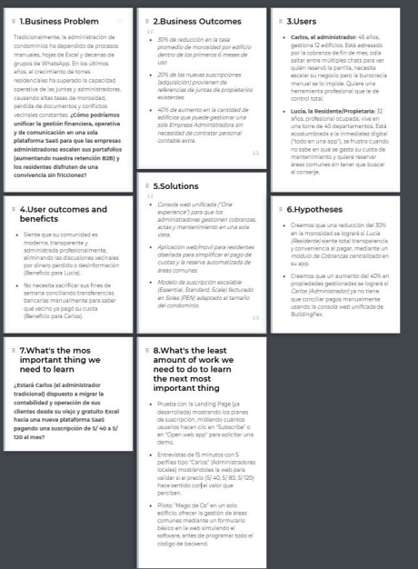
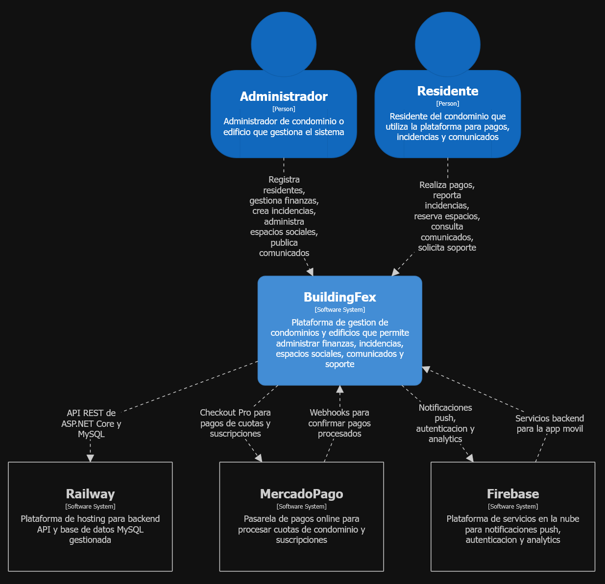
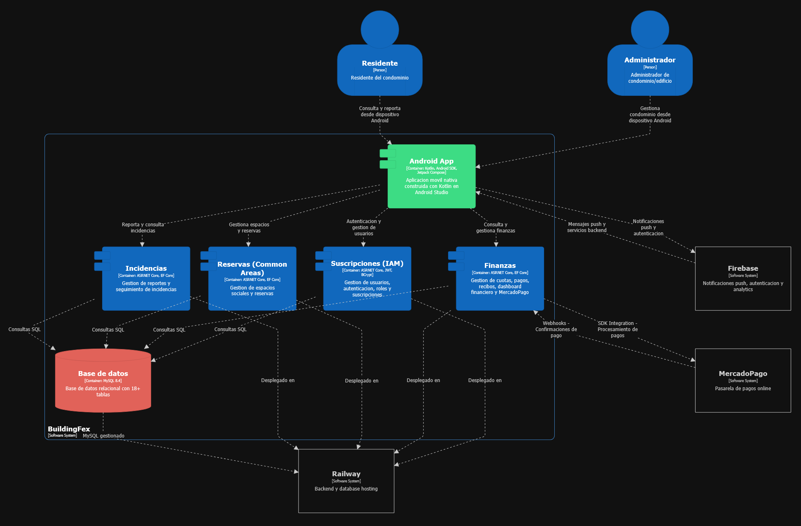

  

# Universidad Peruana de Ciencias Aplicadas
## Carrera de Ingeniería de Software

**Curso:** 1ACC0238 - Aplicaciones para Dispositivos Móviles  
**NRC:** 4939  

---

# Informe del Trabajo Final

**Docente:** Quevedo Velasco, David Gerardo  
**Equipo:** BuildingFex  
**Proyecto:** BuildingFex  

### Integrantes

| Código | Apellidos y Nombres |
| :--- | :--- |
| u202022211 | Javier Murillo, Mathias |
| | Hermoza Quispe, Jude Alessandro |
| u202312510 | Jave Chang, Alejandro Manuel |
| | Heredia Hoyos, Danitza Ivonne |
| | Suteau, Antonin |

**Período:** 2026-20  
**Fecha:** Setiembre 2026

## Registro de Versiones del Informe

| Versión | Fecha | Autor | Descripción de modificación |
| :--- | :--- | :--- | :--- |
| AV1 | 02-09-2026 | Equipo BuildingFex | Estructura inicial correspondiente a la primera entrega. |

## Project Report Collaboration Insights

**URL del repositorio del informe:** https://github.com/BuildingFex-UPC/report

Evidencias de colaboración y participación del equipo para la entrega AV1:

| Integrante | Participación |
| :--- | :--- |
| Javier Murillo, Mathias |  |
| Jude Alessandro Hermoza Quispe |  |
| Alejandro Manuel Jave Chang |  |
| Danitza Ivonne Heredia Hoyos |  |
| Antonin Suteau |  |

## Contenido Student Outcome

**ABET Student Outcome 5:** Funcionamiento en equipos multidisciplinarios.

<table>
  <tr>
    <th>Criterio Específico</th>
    <th>Nombre del Integrante</th>
    <th>Acciones Realizadas</th>
    <th>Conclusión</th>
  </tr>
  <tr>
    <td rowspan="5">Actualiza conceptos y conocimientos necesarios para su desarrollo profesional y en especial para su proyecto en soluciones de ingeniería de software</td>
    <td>Mathias Javier Murillo</td>
    <td><b>AV1:</b></td>
    <td><b>AV1:</b></td>
  </tr>
  <tr>
    <td>Jude Alessandro Hermoza Quispe</td>
    <td><b>AV1:</b></td>
    <td><b>AV1:</b></td>
  </tr>
  <tr>
    <td>Alejandro Manuel Jave Chang</td>
    <td><b>AV1:</b></td>
    <td><b>AV1:</b></td>
  </tr>
  <tr>
    <td>Danitza Ivonne Heredia Hoyos</td>
    <td><b>AV1:</b></td>
    <td><b>AV1:</b></td>
  </tr>
  <tr>
    <td>Antonin Suteau</td>
    <td><b>AV1:</b></td>
    <td><b>AV1:</b></td>
  </tr>
  <tr>
    <td rowspan="5">Reconoce la necesidad del aprendizaje permanente para el desempeño profesional y el desarrollo de proyectos en soluciones de tecnologías de ingeniería de software.</td>
    <td>Mathias Javier Murillo</td>
    <td><b>AV1:</b></td>
    <td><b>AV1:</b></td>
  </tr>
  <tr>
    <td>Jude Alessandro Hermoza Quispe</td>
    <td><b>AV1:</b></td>
    <td><b>AV1:</b></td>
  </tr>
  <tr>
    <td>Alejandro Manuel Jave Chang</td>
    <td><b>AV1:</b></td>
    <td><b>AV1:</b></td>
  </tr>
  <tr>
    <td>Danitza Ivonne Heredia Hoyos</td>
    <td><b>AV1:</b></td>
    <td><b>AV1:</b></td>
  </tr>
  <tr>
    <td>Antonin Suteau</td>
    <td><b>AV1:</b></td>
    <td><b>AV1:</b></td>
  </tr>
</table>

## Capítulo I: Presentación

### 1.1. Startup Profile
#### 1.1.1. Descripción de la Startup
La administración de condominios y torres residenciales implica gestionar múltiples procesos críticos: desde el control de las finanzas y la recaudación de cuotas, hasta
el mantenimiento de las instalaciones y la comunicación con los residentes. Tradicionalmente, estas operaciones se manejan de forma fragmentada, utilizando hojas de
cálculo, correos electrónicos y grupos de mensajería, lo que genera desorden, retrasos en los pagos y falta de transparencia.
A pesar de que existen algunas herramientas digitales en el mercado, muchas de ellas resultan demasiado complejas para los comités de administración o no ofrecen
una experiencia unificada tanto para el gestor como para el residente. Esto provoca que la información sobre normativas, actas o estados de cuenta no sea fácilmente
accesible para la comunidad.
Frente a esta situación, se requiere una plataforma centralizada y escalable que simplifique estas operaciones. Una solución en la nube que integre la gestión de áreas
comunes, cobranzas, mantenimiento y comunicados en un solo entorno, mejorando la convivencia, optimizando el tiempo de los administradores y brindando total
visibilidad a las juntas de propietarios.

#### 1.1.2. Perfiles de integrantes del equipo

| Foto | Nombre | Código | Carrera | Descripción de habilidades y conocimientos |
|------|--------|--------|---------|--------------------------------------------|
| | Mathias Javier Murillo | U202022211 | Ingeniería de Software | Soy estudiante de 7mo ciclo de Ingeniería de Software en la UPC. Me especializo en desarrollo full stack de webs y aplicaciones móviles. Me caracterizo por ser una persona muy responsable, puntual y organizada. Aporto al equipo apoyo en el diseño, organización y desarrollo de los Sprints. |
| |  | |  |  |
|  | Alejandro Manuel Jave Chang | U202312510 | Ingenieria de Software | Vengo de la carrera de Ingeniería de software, me gusta explorar diversas soluciones a desafíos tecnológicos y me apasiona aprender nuevas cosas. Mi enfoque dedicado a los proyectos que me apasionan me impulsa a explorar nuevas fronteras en mi carrera. |
| |  | |  |  |
| |  | |  |  |

### 1.2. Solution Profile
El nombre de nuestro producto es <b>“BuildingFex”</b>. Este término fusiona la palabra inglesa "Building" (edificio), haciendo referencia directa a nuestro rubro inmobiliario,
con "Fex", que evoca un sentido de eficiencia, agilidad y flexibilidad operativa. Este nombre transmite la misión principal de la plataforma: modernizar y agilizar las
operaciones de los condominios y torres residenciales bajo un ecosistema robusto y profesional.  
<b>Product Description:</b> BuildingFex es una plataforma SaaS (Software as a Service) integral diseñada para juntas de propietarios y empresas administradoras. El sistema
unifica la operatividad del edificio ofreciendo una misma experiencia fluida tanto en la aplicación web como en la versión móvil.  
El software centraliza las siguientes operaciones clave:
* <b>Áreas Comunes:</b> Gestión de reservas, reglas y mantenimiento en una sola vista.
* <b>Cobranzas (Collections):</b> Visibilidad de pagos, cuotas y recordatorios para los residentes, disminuyendo la morosidad.
* <b>Mantenimiento:</b> Registro de solicitudes, control de proveedores y estado de las reparaciones de todo el edificio.
* <b>Comunicados y Documentos:</b> Emisión de avisos oficiales y un repositorio seguro para actas, reglamentos y archivos de la comunidad.
* <b>Accesos y Visitas:</b> Registros alineados con las políticas de seguridad del edificio.

De esta forma, BuildingFex garantiza una entrega de servicio responsable y estandarizada, guiada por normativas éticas y de transparencia para toda la comunidad. 

<b>Monetización:</b> El modelo de negocio es B2B, basado en suscripciones mensuales (SaaS) facturadas en Soles Peruanos (PEN). Los planes están diseñados para escalar
según el tamaño del condominio:
* <b>Plan Essential (S/ 40 al mes):</b> Dirigido a edificios pequeños o condominios boutique (10 a 15 departamentos). Incluye la consola web, gestión de áreas comunes,
cobranzas, comunicados, documentos, registro de visitas y soporte por correo en días hábiles.
* <b>Plan Standard (S/ 80 al mes):</b> Diseñado para torres medianas y comunidades activas (16 a 40 departamentos). Suma a lo anterior una mayor capacidad,
visibilidad más clara de deudas, notificaciones masivas para residentes y soporte operativo prioritario.
* <b>Plan Scale (S/ 120 al mes):</b> Enfocado en grandes complejos y portafolios de gran altura (41 a 80 departamentos). Incluye reportes avanzados para comités
grandes, asistencia en la implementación (onboarding) y canales de soporte con tiempos de respuesta acordados.
#### 1.2.1. Antecedentes y problemática
<b>Descripción de la problemática:</b> El problema central se encuentra en la ineficiencia logística y financiera que sufren las administraciones de inmuebles al no contar con
un flujo de trabajo centralizado. La dependencia de procesos manuales dificulta el seguimiento de la morosidad, genera conflictos en la reserva de espacios
compartidos y propicia la pérdida de información histórica del edificio (como actas o contratos con proveedores). 

Esta carencia de tecnología perjudica tanto a las empresas administradoras, que ven limitada su capacidad de gestionar más propiedades, como a los propietarios, que
perciben una falta de transparencia sobre cómo se invierte su dinero y cómo se gestionan las incidencias del día a día. 

<b>Objetivos</b> 
* Desarrollar una plataforma SaaS que unifique la administración de finanzas, operaciones y comunicaciones de los edificios.
* Facilitar la visibilidad de los pagos y automatizar los recordatorios para reducir los índices de morosidad.
* Proveer un sistema transparente de reportes y almacenamiento de documentos accesibles para la comunidad.
* Escalar la capacidad operativa de los property managers mediante flujos de trabajo claros y estandarizados.

<b>Restricciones</b> 
* La plataforma depende de la conexión a internet para la sincronización de datos en tiempo real entre la aplicación web y los usuarios.
* La adopción del sistema requiere un cambio de hábitos en los residentes, especialmente en aquellos menos familiarizados con herramientas digitales.
* La gestión de datos financieros y personales exige altos estándares de seguridad y protección de la privacidad.

<b>Antecedentes</b> 
* <b>Administración tradicional:</b> El uso de herramientas genéricas como Excel y WhatsApp domina el mercado actual. Aunque son de bajo costo, no escalan, carecen
de seguridad de datos y no ofrecen transparencia financiera en tiempo real.
* <b>Sistemas contables genéricos:</b> Existen programas de contabilidad robustos, pero no están enfocados en la convivencia comunitaria, dejando de lado módulos
esenciales como la reserva de áreas comunes o el control de visitas.
* <b>Plataformas extranjeras:</b> Hay soluciones PropTech en otros países, pero sus planes de suscripción suelen ser elevados (facturados en dólares) y no siempre se
adaptan a las dinámicas residenciales locales. 

<b>Herramienta de 5W y 2H</b> 
* <b>What - ¿Cuál es el problema?:</b> La gestión dispersa, poco transparente y manual de las operaciones y cobranzas en condominios y torres residenciales. 
* <b>When - ¿Cuándo sucede el problema?:</b> Ocurre constantemente en el registro de visitas e incidencias diarias, y se agudiza a fin de mes durante los procesos de facturación y conciliación de pagos. 
* <b>Where - ¿Dónde surge el problema?:</b> En la administración interna de edificios de departamentos y complejos residenciales. 
* <b>Who - ¿Quiénes son afectados por el problema?:</b> Las empresas administradoras, las juntas de propietarios, los conserjes y, en última instancia, los residentes. 
* <b>Why - ¿Cuál es la causa del problema?:</b> La falta de adopción de plataformas centralizadas y la dependencia de métodos informales para la comunicación y contabilidad. 
* <b>How - ¿Cómo se manifiesta el problema?:</b> Mediante altos índices de pagos atrasados, desinformación sobre las normativas del edificio, cruces en reservas de áreas comunes y demoras en el
mantenimiento.
How much - ¿Cuál es la magnitud del problema?
Afecta directamente la salud financiera del condominio y genera horas de trabajo no productivo para los administradores, limitando el crecimiento de sus
portafolios.
#### 1.2.2. Lean UX Process
##### 1.2.2.1. Lean UX Problem Statements
La operación diaria de torres residenciales ha recaído históricamente en el esfuerzo manual de los administradores y en canales de comunicación no oficiales. Este
enfoque, aunque funcional para edificios muy pequeños, genera cuellos de botella en la recaudación de cuotas, pérdida de trazabilidad en las reparaciones y frustración
entre los propietarios por la falta de transparencia.

Debido a esto, los ecosistemas de gestión actuales están desconectados. Los administradores no tienen una única vista para controlar las áreas comunes y las finanzas al
mismo tiempo, lo que reduce su capacidad de respuesta y profesionalismo.

Nuestro producto resuelve esta fricción al ofrecer BuildingFex, una plataforma centralizada que actúa como el núcleo operativo del edificio.

<b>A través de esta plataforma unificada se cubren los frentes más críticos:</b> 
* Los residentes pueden revisar sus deudas, reservar áreas comunes y leer comunicados oficiales desde una misma interfaz. 
* Los administradores y juntas cuentan con una consola web para gestionar proveedores, emitir avisos, llevar el control de accesos y visualizar el estado financiero
de la comunidad de manera estructurada. 
A diferencia de los métodos improvisados, BuildingFex brinda flujos de trabajo claros, alineados con la ética profesional y términos de servicio transparentes, preparados
para escalar desde un edificio boutique hasta un gran complejo. 

<b>El éxito de la solución se medirá en función de:</b> 
* La disminución de la cartera morosa gracias a la visibilidad de los pagos y recordatorios. 
* El tiempo ahorrado por las empresas administradoras al gestionar múltiples tareas desde "una sola experiencia". 
* La cantidad de suscripciones activas (MRR) en los diferentes planes (Essential, Standard, Scale). 

##### 1.2.2.2. Lean UX Assumptions
En esta sección se detallan las suposiciones que validarán la viabilidad y adopción de BuildingFex. Se categorizan en impactos comerciales, beneficios para el usuario y
funcionalidades clave del software. 

<b>Business Outcomes</b> 
* Creemos que al centralizar la visibilidad de las cobranzas, reduciremos la tasa de morosidad en los condominios afiliados en un 25%. 
* Creemos que al ofrecer planes de suscripción escalonados basados en el número de departamentos, facilitaremos la adquisición de clientes de diversos tamaños. 
* Creemos que el diseño responsivo y la interfaz estandarizada reducirán los tiempos de capacitación (onboarding) para las empresas administradoras en un 40%. 
* Creemos que al proveer flujos de trabajo claros, las administradoras podrán gestionar más edificios simultáneamente, incrementando nuestra retención de
clientes B2B. 

<b>Business Outcomes Assumptions</b> 
* Creemos que las juntas de propietarios están dispuestas a pagar entre S/ 40 y S/ 120 mensuales si perciben un incremento real en la transparencia y orden del
edificio. 
* Creemos que el mercado local requiere facturación en moneda nacional (PEN) para agilizar la aprobación de presupuestos en asambleas. 
* Creemos que las agencias de administración prefieren un software unificado antes que utilizar múltiples aplicaciones desconectadas. 

<b>User Outcomes</b> 
* Creemos que al ofrecer un módulo digital de reservas, los residentes evitarán conflictos y malentendidos por el uso de áreas comunes. 
* Creemos que al disponer de un repositorio de documentos en la nube, los propietarios tendrán la tranquilidad de consultar reglamentos y actas cuando lo
necesiten. 
* Creemos que los avisos oficiales en la plataforma mejorarán la tasa de lectura de comunicados en comparación con los correos electrónicos tradicionales. 
* Creemos que el registro digital de visitas brindará un mayor sentido de seguridad y control a toda la comunidad. 

<b>User Outcomes Assumptions</b> 
* Creemos que los residentes demandan una manera rápida y transparente de verificar si sus pagos han sido registrados correctamente. 
* Creemos que los comités de administración necesitan reportes consolidados para justificar sus decisiones frente a los vecinos. 
* Creemos que la estandarización de procesos de mantenimiento calmará la ansiedad de los residentes frente a desperfectos en el edificio. 

<b>Features Assumptions</b> 
* Creemos que incluir un sistema de recordatorios de cobro será la característica más valorada por los tesoreros. 
* Creemos que la consola web para administradores facilitará la gestión simultánea de múltiples propiedades. 
* Creemos que ofrecer soporte segmentado (email en días hábiles vs. tiempos de respuesta acordados) aportará valor diferenciado a los planes superiores. 
* Creemos que un dashboard que resuma áreas comunes, cobranzas e incidencias en "una sola vista" será el diferencial principal frente a la competencia. 

##### 1.2.2.3. Lean UX Hypothesis Statements
Las siguientes hipótesis buscan validar el impacto de la adopción de BuildingFex en la operatividad de los condominios y el crecimiento del producto en el mercado. 

<b>Hypothesis Statement #1</b> 
* Creemos que incrementaremos la puntualidad en el pago de cuotas de mantenimiento. 
* Si las juntas de propietarios y residentes 
Obtienen visibilidad clara de las deudas y un sistema de recordatorios. 
* Con un módulo de "Collections" centralizado dentro de la plataforma. 

<b>Hypothesis Statement #2</b> 
* Creemos que optimizaremos la eficiencia del personal de administración y conserjería. 
* Si los property managers 
Obtienen la capacidad de gestionar visitas, solicitudes de mantenimiento y emitir anuncios masivos. 
* Con una consola web unificada que reemplaza los registros en papel y los avisos en ascensores. 

<b>Hypothesis Statement #3</b> 
* Creemos que reduciremos las quejas vecinales respecto al uso de las instalaciones. 
* Si los propietarios 
Obtienen un acceso directo a las normativas y disponibilidad de espacios. 
* Con un módulo de "Common areas" que muestra reservas, reglas y mantenimiento en una sola vista. 

<b>Hypothesis Statement #4</b> 
* Creemos que lograremos un rápido crecimiento comercial entre diferentes perfiles de clientes. 
* Si las comunidades de edificios 
Reciben opciones de precios adaptadas a su tamaño real. 
* Con una estructura de suscripción en tres niveles (Essential, Standard, Scale) basada en la cantidad de unidades 

##### 1.2.2.4. Lean UX Canvas
A continuación, se adjunta el Lean UX Canvas, una matriz colaborativa que nos ayuda a mapear los dolores de la administración de inmuebles con las soluciones de
nuestra plataforma, estructurando el diseño de nuestros MVP y las métricas que evaluarán la adopción de los planes de suscripción.  

### 1.3. Segmentos objetivo
La modernización del sector de la gestión de propiedades demuestra que implementar soluciones tecnológicas es fundamental no solo para llevar un control contable, sino para garantizar la armonía residencial y el mantenimiento del valor de los inmuebles. El uso de plataformas digitales elimina la fricción diaria y profesionaliza la labor de los comités vecinales.

Para dimensionar correctamente la cuota de mercado (Market Share) a la que apuntamos, hemos definido nuestros segmentos bajo variables geográficas, demográficas y operativas, enfocándonos inicialmente en el mercado inmobiliario de Lima Metropolitana:

- **Segmento 1: Empresas y agencias administradoras de inmuebles (Property Managers B2B).** Compañías constituidas que buscan escalar sus operaciones y gestionar múltiples torres residenciales o condominios bajo una misma consola web estandarizada y eficiente.
  - **Perfil Demográfico y Operativo:** Empresas formales (Mypes y medianas empresas) con equipos operativos conformados por profesionales de entre 24 y 50 años. Manejan portafolios que van desde 3 hasta más de 20 edificios (alcanzando volúmenes de 100 a 700+ departamentos gestionados simultáneamente).
  - **Perfil Geográfico (Market Focus):** Principalmente ubicadas en Lima Metropolitana, con fuerte enfoque en distritos de alta densidad vertical de Lima Moderna y Lima Top (ej. San Borja, Santiago de Surco, Jesús María, Miraflores, San Isidro, Magdalena).
  - **Comportamiento:** Son usuarios altamente tecnológicos y pragmáticos (nativos digitales en muchos casos), que buscan reemplazar el uso excesivo de Excel y WhatsApp por soluciones que reduzcan sus "horas-hombre" y les permitan captar más clientes sin aumentar su plantilla.

- **Segmento 2: Juntas de propietarios de condominios y torres residenciales (B2C / B2B2C).** Edificios autogestionados por los propios vecinos que requieren organizar sus cobros, áreas comunes y comunicaciones con total transparencia y seguridad para evitar conflictos internos.
  - **Perfil Demográfico:** Residentes y propietarios pertenecientes a los Niveles Socioeconómicos (NSE) A, B y C+. Los miembros de las juntas directivas suelen ser profesionales o personas jubiladas con edades que oscilan entre los 28 y 75 años, quienes asumen el cargo *ad honorem*.
  - **Perfil Geográfico y Estructural:** Edificios y torres residenciales ubicados en zonas urbanas de Lima Metropolitana. El segmento abarca desde condominios "boutique" pequeños (10 a 15 unidades) hasta grandes complejos residenciales (40 a 80 unidades).
  - **Comportamiento:** Valoran la confianza, la transparencia financiera y la comunicación clara. Tienen distintos niveles de adopción tecnológica, por lo que necesitan una plataforma sencilla e intuitiva que automatice los recordatorios de morosidad sin generar fricción vecinal.

## Capítulo II: Requirements Development and Software Solution Design

### 2.1. Competidores
<b>Condo Control</b> 
Es una plataforma SaaS especializada en la gestión de comunidades residenciales, principalmente en Norteamérica. Permite administrar unidades, gestionar
comunicaciones internas, controlar reservas de áreas comunes y llevar registros de visitantes. También ofrece herramientas básicas de reportes y gestión operativa.

<b>Buildium</b> 
Plataforma digital enfocada en la administración de propiedades residenciales y asociaciones. Incluye herramientas para la gestión financiera, cobranza automatizada,
generación de reportes y administración de mantenimiento.

<b>ComunidadFeliz</b> 
Plataforma orientada al mercado latinoamericano para la gestión de condominios. Permite gestionar cobros, comunicaciones, reservas de espacios y reportes financieros
dentro de una misma plataforma.

#### 2.1.1. Análisis competitivo

#### 2.1.2. Estrategias y tácticas frente a competidores

### 2.2. Entrevistas 

#### 2.2.1. Diseño de entrevistas
#### 2.2.2. Registro de entrevistas
#### 2.2.3. Análisis de entrevistas

### 2.3. Needfinding
#### 2.3.1. User Personas
#### 2.3.2. User Task Matrix
#### 2.3.3. User Journey Mapping
#### 2.3.4. Empathy Mapping
#### 2.3.5. Big Picture EventStorming
#### 2.3.6. Ubiquitous Language
### 2.4. Requirements specification
#### 2.4.1. User Stories
#### 2.4.2. Impact Mapping
#### 2.4.3. Product Backlog
### 2.5. Strategic-Level Domain-Driven Design
#### 2.5.1. EventStorming
##### 2.5.1.1. Candidate Context Discovery
##### 2.5.1.2. Domain Message Flows Modeling
##### 2.5.1.3. Bounded Context Canvases
#### 2.5.2. Context Mapping
#### 2.5.3. Software Architecture
##### 2.5.3.1. Software Architecture Context Level Diagrams

Este diagrama de contexto representa cómo funciona la plataforma BuildingFex: los visitantes envian consultas y revisan informacion de suscripciones, mientras que los administradores analizan las respuestas. El sistema central, la aplicacion, se conecta con un API externo para obtener datos de edificios y con Firebase Cloud Messaging para enviar notificaciones push, mostrando así el flujo de interaccion entre usuarios, la plataforma y servicios externos.

##### 2.5.3.2. Software Architecture Container Level Diagrams

Este diagrama de BuildingFex resume la estructura del sistema: los usuarios interactuan con una aplicación web Angular que envia solicitudes al API Gateway, el cual distribuye el trafico hacia tres modulos principales (reportes, contactos/marketing y planes de suscripcion), cada uno con su propia base de datos. Ademas, el sistema se conecta con un API externo para obtener datos de edificios y con Firebase para enviar notificaciones push. En conjunto, muestra cómo fluye la informacion entre usuarios, aplicación, bases de datos y servicios externos.

##### 2.5.3.3. Software Architecture Deployment Diagrams
### 2.6. Tactical-Level Domain-Driven Design
#### 2.6.x. Bounded Context: <Bounded Context Name>
##### 2.6.x.1. Domain Layer
##### 2.6.x.2. Interface Layer
##### 2.6.x.3. Application Layer
##### 2.6.x.4 Infrastructure Layer
##### 2.6.x.5. Bounded Context Software Architecture Component Level Diagrams
##### 2.6.x.6. Bounded Context Software Architecture Code Level Diagrams
###### 2.6.x.6.1. Bounded Context Domain Layer Class Diagrams
###### 2.6.x.6.2. Bounded Context Database Design Diagram

## Conclusiones

## Bibliografía

## Anexos

