

  

# Universidad Peruana de Ciencias Aplicadas
## Carrera de Ingeniería de Software

**Curso:** 1ACC0238 - Aplicaciones para Dispositivos Móviles  
**NRC:** 4939  

---

# Informe del Trabajo Final

**Docente:** Quevedo Velasco, David Gerardo  
**Equipo:** BuildingFex  
**Proyecto:** BuildingFex  

### Integrantes

| Código | Apellidos y Nombres |
| :--- | :--- |
| u202022211 | Javier Murillo, Mathias |
| | Hermoza Quispe, Jude Alessandro |
| u202312510 | Jave Chang, Alejandro Manuel |
| | Heredia Hoyos, Danitza Ivonne |
| | Suteau, Antonin |

**Período:** 2026-20  
**Fecha:** Setiembre 2026

## Registro de Versiones del Informe

| Versión | Fecha | Autor | Descripción de modificación |
| :--- | :--- | :--- | :--- |
| AV1 | 02-09-2026 | Equipo BuildingFex | Estructura inicial correspondiente a la primera entrega. |

## Project Report Collaboration Insights

**URL del repositorio del informe:** https://github.com/BuildingFex-UPC/report

Evidencias de colaboración y participación del equipo para la entrega AV1:

| Integrante | Participación |
| :--- | :--- |
| Javier Murillo, Mathias |  |
| Jude Alessandro Hermoza Quispe |  |
| Alejandro Manuel Jave Chang |  |
| Danitza Ivonne Heredia Hoyos |  |
| Antonin Suteau |  |

## Contenido Student Outcome

**ABET Student Outcome 5:** Funcionamiento en equipos multidisciplinarios.

<table>
  <tr>
    <th>Criterio Específico</th>
    <th>Nombre del Integrante</th>
    <th>Acciones Realizadas</th>
    <th>Conclusión</th>
  </tr>
  <tr>
    <td rowspan="5">Actualiza conceptos y conocimientos necesarios para su desarrollo profesional y en especial para su proyecto en soluciones de ingeniería de software</td>
    <td>Mathias Javier Murillo</td>
    <td><b>AV1:</b></td>
    <td><b>AV1:</b></td>
  </tr>
  <tr>
    <td>Jude Alessandro Hermoza Quispe</td>
    <td><b>AV1:</b></td>
    <td><b>AV1:</b></td>
  </tr>
  <tr>
    <td>Alejandro Manuel Jave Chang</td>
    <td><b>AV1:</b></td>
    <td><b>AV1:</b></td>
  </tr>
  <tr>
    <td>Danitza Ivonne Heredia Hoyos</td>
    <td><b>AV1:</b></td>
    <td><b>AV1:</b></td>
  </tr>
  <tr>
    <td>Antonin Suteau</td>
    <td><b>AV1:</b></td>
    <td><b>AV1:</b></td>
  </tr>
  <tr>
    <td rowspan="5">Reconoce la necesidad del aprendizaje permanente para el desempeño profesional y el desarrollo de proyectos en soluciones de tecnologías de ingeniería de software.</td>
    <td>Mathias Javier Murillo</td>
    <td><b>AV1:</b></td>
    <td><b>AV1:</b></td>
  </tr>
  <tr>
    <td>Jude Alessandro Hermoza Quispe</td>
    <td><b>AV1:</b></td>
    <td><b>AV1:</b></td>
  </tr>
  <tr>
    <td>Alejandro Manuel Jave Chang</td>
    <td><b>AV1:</b></td>
    <td><b>AV1:</b></td>
  </tr>
  <tr>
    <td>Danitza Ivonne Heredia Hoyos</td>
    <td><b>AV1:</b></td>
    <td><b>AV1:</b></td>
  </tr>
  <tr>
    <td>Antonin Suteau</td>
    <td><b>AV1:</b></td>
    <td><b>AV1:</b></td>
  </tr>
</table>

## Capítulo I: Presentación

### 1.1. Startup Profile
#### 1.1.1. Descripción de la Startup
La administración de condominios y torres residenciales implica gestionar múltiples procesos críticos: desde el control de las finanzas y la recaudación de cuotas, hasta
el mantenimiento de las instalaciones y la comunicación con los residentes. Tradicionalmente, estas operaciones se manejan de forma fragmentada, utilizando hojas de
cálculo, correos electrónicos y grupos de mensajería, lo que genera desorden, retrasos en los pagos y falta de transparencia.
A pesar de que existen algunas herramientas digitales en el mercado, muchas de ellas resultan demasiado complejas para los comités de administración o no ofrecen
una experiencia unificada tanto para el gestor como para el residente. Esto provoca que la información sobre normativas, actas o estados de cuenta no sea fácilmente
accesible para la comunidad.
Frente a esta situación, se requiere una plataforma centralizada y escalable que simplifique estas operaciones. Una solución en la nube que integre la gestión de áreas
comunes, cobranzas, mantenimiento y comunicados en un solo entorno, mejorando la convivencia, optimizando el tiempo de los administradores y brindando total
visibilidad a las juntas de propietarios.

#### 1.1.2. Perfiles de integrantes del equipo

| Foto | Nombre | Código | Carrera | Descripción de habilidades y conocimientos |
|------|--------|--------|---------|--------------------------------------------|
| | Mathias Javier Murillo | U202022211 | Ingeniería de Software | Soy estudiante de 7mo ciclo de Ingeniería de Software en la UPC. Me especializo en desarrollo full stack de webs y aplicaciones móviles. Me caracterizo por ser una persona muy responsable, puntual y organizada. Aporto al equipo apoyo en el diseño, organización y desarrollo de los Sprints. |
| |  | |  |  |
|  | Alejandro Manuel Jave Chang | U202312510 | Ingenieria de Software | Vengo de la carrera de Ingeniería de software, me gusta explorar diversas soluciones a desafíos tecnológicos y me apasiona aprender nuevas cosas. Mi enfoque dedicado a los proyectos que me apasionan me impulsa a explorar nuevas fronteras en mi carrera. |
| |  | |  |  |
| |  | |  |  |

### 1.2. Solution Profile
El nombre de nuestro producto es <b>“BuildingFex”</b>. Este término fusiona la palabra inglesa "Building" (edificio), haciendo referencia directa a nuestro rubro inmobiliario,
con "Fex", que evoca un sentido de eficiencia, agilidad y flexibilidad operativa. Este nombre transmite la misión principal de la plataforma: modernizar y agilizar las
operaciones de los condominios y torres residenciales bajo un ecosistema robusto y profesional.  
<b>Product Description:</b> BuildingFex es una plataforma SaaS (Software as a Service) integral diseñada para juntas de propietarios y empresas administradoras. El sistema
unifica la operatividad del edificio ofreciendo una misma experiencia fluida tanto en la aplicación web como en la versión móvil.  
El software centraliza las siguientes operaciones clave:
* <b>Áreas Comunes:</b> Gestión de reservas, reglas y mantenimiento en una sola vista.
* <b>Cobranzas (Collections):</b> Visibilidad de pagos, cuotas y recordatorios para los residentes, disminuyendo la morosidad.
* <b>Mantenimiento:</b> Registro de solicitudes, control de proveedores y estado de las reparaciones de todo el edificio.
* <b>Comunicados y Documentos:</b> Emisión de avisos oficiales y un repositorio seguro para actas, reglamentos y archivos de la comunidad.
* <b>Accesos y Visitas:</b> Registros alineados con las políticas de seguridad del edificio.

De esta forma, BuildingFex garantiza una entrega de servicio responsable y estandarizada, guiada por normativas éticas y de transparencia para toda la comunidad. 

<b>Monetización:</b> El modelo de negocio es B2B, basado en suscripciones mensuales (SaaS) facturadas en Soles Peruanos (PEN). Los planes están diseñados para escalar
según el tamaño del condominio:
* <b>Plan Essential (S/ 40 al mes):</b> Dirigido a edificios pequeños o condominios boutique (10 a 15 departamentos). Incluye la consola web, gestión de áreas comunes,
cobranzas, comunicados, documentos, registro de visitas y soporte por correo en días hábiles.
* <b>Plan Standard (S/ 80 al mes):</b> Diseñado para torres medianas y comunidades activas (16 a 40 departamentos). Suma a lo anterior una mayor capacidad,
visibilidad más clara de deudas, notificaciones masivas para residentes y soporte operativo prioritario.
* <b>Plan Scale (S/ 120 al mes):</b> Enfocado en grandes complejos y portafolios de gran altura (41 a 80 departamentos). Incluye reportes avanzados para comités
grandes, asistencia en la implementación (onboarding) y canales de soporte con tiempos de respuesta acordados.
#### 1.2.1. Antecedentes y problemática
<b>Descripción de la problemática:</b> El problema central se encuentra en la ineficiencia logística y financiera que sufren las administraciones de inmuebles al no contar con
un flujo de trabajo centralizado. La dependencia de procesos manuales dificulta el seguimiento de la morosidad, genera conflictos en la reserva de espacios
compartidos y propicia la pérdida de información histórica del edificio (como actas o contratos con proveedores). 

Esta carencia de tecnología perjudica tanto a las empresas administradoras, que ven limitada su capacidad de gestionar más propiedades, como a los propietarios, que
perciben una falta de transparencia sobre cómo se invierte su dinero y cómo se gestionan las incidencias del día a día. 

<b>Objetivos</b> 
* Desarrollar una plataforma SaaS que unifique la administración de finanzas, operaciones y comunicaciones de los edificios.
* Facilitar la visibilidad de los pagos y automatizar los recordatorios para reducir los índices de morosidad.
* Proveer un sistema transparente de reportes y almacenamiento de documentos accesibles para la comunidad.
* Escalar la capacidad operativa de los property managers mediante flujos de trabajo claros y estandarizados.

<b>Restricciones</b> 
* La plataforma depende de la conexión a internet para la sincronización de datos en tiempo real entre la aplicación web y los usuarios.
* La adopción del sistema requiere un cambio de hábitos en los residentes, especialmente en aquellos menos familiarizados con herramientas digitales.
* La gestión de datos financieros y personales exige altos estándares de seguridad y protección de la privacidad.

<b>Antecedentes</b> 
* <b>Administración tradicional:</b> El uso de herramientas genéricas como Excel y WhatsApp domina el mercado actual. Aunque son de bajo costo, no escalan, carecen
de seguridad de datos y no ofrecen transparencia financiera en tiempo real.
* <b>Sistemas contables genéricos:</b> Existen programas de contabilidad robustos, pero no están enfocados en la convivencia comunitaria, dejando de lado módulos
esenciales como la reserva de áreas comunes o el control de visitas.
* <b>Plataformas extranjeras:</b> Hay soluciones PropTech en otros países, pero sus planes de suscripción suelen ser elevados (facturados en dólares) y no siempre se
adaptan a las dinámicas residenciales locales. 

<b>Herramienta de 5W y 2H</b> 
* <b>What - ¿Cuál es el problema?:</b> La gestión dispersa, poco transparente y manual de las operaciones y cobranzas en condominios y torres residenciales. 
* <b>When - ¿Cuándo sucede el problema?:</b> Ocurre constantemente en el registro de visitas e incidencias diarias, y se agudiza a fin de mes durante los procesos de facturación y conciliación de pagos. 
* <b>Where - ¿Dónde surge el problema?:</b> En la administración interna de edificios de departamentos y complejos residenciales. 
* <b>Who - ¿Quiénes son afectados por el problema?:</b> Las empresas administradoras, las juntas de propietarios, los conserjes y, en última instancia, los residentes. 
* <b>Why - ¿Cuál es la causa del problema?:</b> La falta de adopción de plataformas centralizadas y la dependencia de métodos informales para la comunicación y contabilidad. 
* <b>How - ¿Cómo se manifiesta el problema?:</b> Mediante altos índices de pagos atrasados, desinformación sobre las normativas del edificio, cruces en reservas de áreas comunes y demoras en el
mantenimiento.
How much - ¿Cuál es la magnitud del problema?
Afecta directamente la salud financiera del condominio y genera horas de trabajo no productivo para los administradores, limitando el crecimiento de sus
portafolios.
#### 1.2.2. Lean UX Process
##### 1.2.2.1. Lean UX Problem Statements
La operación diaria de torres residenciales ha recaído históricamente en el esfuerzo manual de los administradores y en canales de comunicación no oficiales. Este
enfoque, aunque funcional para edificios muy pequeños, genera cuellos de botella en la recaudación de cuotas, pérdida de trazabilidad en las reparaciones y frustración
entre los propietarios por la falta de transparencia.

Debido a esto, los ecosistemas de gestión actuales están desconectados. Los administradores no tienen una única vista para controlar las áreas comunes y las finanzas al
mismo tiempo, lo que reduce su capacidad de respuesta y profesionalismo.

Nuestro producto resuelve esta fricción al ofrecer BuildingFex, una plataforma centralizada que actúa como el núcleo operativo del edificio.

<b>A través de esta plataforma unificada se cubren los frentes más críticos:</b> 
* Los residentes pueden revisar sus deudas, reservar áreas comunes y leer comunicados oficiales desde una misma interfaz. 
* Los administradores y juntas cuentan con una consola web para gestionar proveedores, emitir avisos, llevar el control de accesos y visualizar el estado financiero
de la comunidad de manera estructurada. 
A diferencia de los métodos improvisados, BuildingFex brinda flujos de trabajo claros, alineados con la ética profesional y términos de servicio transparentes, preparados
para escalar desde un edificio boutique hasta un gran complejo. 

<b>El éxito de la solución se medirá en función de:</b> 
* La disminución de la cartera morosa gracias a la visibilidad de los pagos y recordatorios. 
* El tiempo ahorrado por las empresas administradoras al gestionar múltiples tareas desde "una sola experiencia". 
* La cantidad de suscripciones activas (MRR) en los diferentes planes (Essential, Standard, Scale). 

##### 1.2.2.2. Lean UX Assumptions
En esta sección se detallan las suposiciones que validarán la viabilidad y adopción de BuildingFex. Se categorizan en impactos comerciales, beneficios para el usuario y
funcionalidades clave del software. 

<b>Business Outcomes</b> 
* Creemos que al centralizar la visibilidad de las cobranzas, reduciremos la tasa de morosidad en los condominios afiliados en un 25%. 
* Creemos que al ofrecer planes de suscripción escalonados basados en el número de departamentos, facilitaremos la adquisición de clientes de diversos tamaños. 
* Creemos que el diseño responsivo y la interfaz estandarizada reducirán los tiempos de capacitación (onboarding) para las empresas administradoras en un 40%. 
* Creemos que al proveer flujos de trabajo claros, las administradoras podrán gestionar más edificios simultáneamente, incrementando nuestra retención de
clientes B2B. 

<b>Business Outcomes Assumptions</b> 
* Creemos que las juntas de propietarios están dispuestas a pagar entre S/ 40 y S/ 120 mensuales si perciben un incremento real en la transparencia y orden del
edificio. 
* Creemos que el mercado local requiere facturación en moneda nacional (PEN) para agilizar la aprobación de presupuestos en asambleas. 
* Creemos que las agencias de administración prefieren un software unificado antes que utilizar múltiples aplicaciones desconectadas. 

<b>User Outcomes</b> 
* Creemos que al ofrecer un módulo digital de reservas, los residentes evitarán conflictos y malentendidos por el uso de áreas comunes. 
* Creemos que al disponer de un repositorio de documentos en la nube, los propietarios tendrán la tranquilidad de consultar reglamentos y actas cuando lo
necesiten. 
* Creemos que los avisos oficiales en la plataforma mejorarán la tasa de lectura de comunicados en comparación con los correos electrónicos tradicionales. 
* Creemos que el registro digital de visitas brindará un mayor sentido de seguridad y control a toda la comunidad. 

<b>User Outcomes Assumptions</b> 
* Creemos que los residentes demandan una manera rápida y transparente de verificar si sus pagos han sido registrados correctamente. 
* Creemos que los comités de administración necesitan reportes consolidados para justificar sus decisiones frente a los vecinos. 
* Creemos que la estandarización de procesos de mantenimiento calmará la ansiedad de los residentes frente a desperfectos en el edificio. 

<b>Features Assumptions</b> 
* Creemos que incluir un sistema de recordatorios de cobro será la característica más valorada por los tesoreros. 
* Creemos que la consola web para administradores facilitará la gestión simultánea de múltiples propiedades. 
* Creemos que ofrecer soporte segmentado (email en días hábiles vs. tiempos de respuesta acordados) aportará valor diferenciado a los planes superiores. 
* Creemos que un dashboard que resuma áreas comunes, cobranzas e incidencias en "una sola vista" será el diferencial principal frente a la competencia. 

##### 1.2.2.3. Lean UX Hypothesis Statements
Las siguientes hipótesis buscan validar el impacto de la adopción de BuildingFex en la operatividad de los condominios y el crecimiento del producto en el mercado. 

<b>Hypothesis Statement #1</b> 
* Creemos que incrementaremos la puntualidad en el pago de cuotas de mantenimiento. 
* Si las juntas de propietarios y residentes 
Obtienen visibilidad clara de las deudas y un sistema de recordatorios. 
* Con un módulo de "Collections" centralizado dentro de la plataforma. 

<b>Hypothesis Statement #2</b> 
* Creemos que optimizaremos la eficiencia del personal de administración y conserjería. 
* Si los property managers 
Obtienen la capacidad de gestionar visitas, solicitudes de mantenimiento y emitir anuncios masivos. 
* Con una consola web unificada que reemplaza los registros en papel y los avisos en ascensores. 

<b>Hypothesis Statement #3</b> 
* Creemos que reduciremos las quejas vecinales respecto al uso de las instalaciones. 
* Si los propietarios 
Obtienen un acceso directo a las normativas y disponibilidad de espacios. 
* Con un módulo de "Common areas" que muestra reservas, reglas y mantenimiento en una sola vista. 

<b>Hypothesis Statement #4</b> 
* Creemos que lograremos un rápido crecimiento comercial entre diferentes perfiles de clientes. 
* Si las comunidades de edificios 
Reciben opciones de precios adaptadas a su tamaño real. 
* Con una estructura de suscripción en tres niveles (Essential, Standard, Scale) basada en la cantidad de unidades 

##### 1.2.2.4. Lean UX Canvas
A continuación, se adjunta el Lean UX Canvas, una matriz colaborativa que nos ayuda a mapear los dolores de la administración de inmuebles con las soluciones de
nuestra plataforma, estructurando el diseño de nuestros MVP y las métricas que evaluarán la adopción de los planes de suscripción.  

### 1.3. Segmentos objetivo
La modernización del sector de la gestión de propiedades demuestra que implementar soluciones tecnológicas es fundamental no solo para llevar un control contable, sino para garantizar la armonía residencial y el mantenimiento del valor de los inmuebles. El uso de plataformas digitales elimina la fricción diaria y profesionaliza la labor de los comités vecinales.

Para dimensionar correctamente la cuota de mercado (Market Share) a la que apuntamos, hemos definido nuestros segmentos bajo variables geográficas, demográficas y operativas, enfocándonos inicialmente en el mercado inmobiliario de Lima Metropolitana:

- **Segmento 1: Empresas y agencias administradoras de inmuebles (Property Managers B2B).** Compañías constituidas que buscan escalar sus operaciones y gestionar múltiples torres residenciales o condominios bajo una misma consola web estandarizada y eficiente.
  - **Perfil Demográfico y Operativo:** Empresas formales (Mypes y medianas empresas) con equipos operativos conformados por profesionales de entre 24 y 50 años. Manejan portafolios que van desde 3 hasta más de 20 edificios (alcanzando volúmenes de 100 a 700+ departamentos gestionados simultáneamente).
  - **Perfil Geográfico (Market Focus):** Principalmente ubicadas en Lima Metropolitana, con fuerte enfoque en distritos de alta densidad vertical de Lima Moderna y Lima Top (ej. San Borja, Santiago de Surco, Jesús María, Miraflores, San Isidro, Magdalena).
  - **Comportamiento:** Son usuarios altamente tecnológicos y pragmáticos (nativos digitales en muchos casos), que buscan reemplazar el uso excesivo de Excel y WhatsApp por soluciones que reduzcan sus "horas-hombre" y les permitan captar más clientes sin aumentar su plantilla.

- **Segmento 2: Juntas de propietarios de condominios y torres residenciales (B2C / B2B2C).** Edificios autogestionados por los propios vecinos que requieren organizar sus cobros, áreas comunes y comunicaciones con total transparencia y seguridad para evitar conflictos internos.
  - **Perfil Demográfico:** Residentes y propietarios pertenecientes a los Niveles Socioeconómicos (NSE) A, B y C+. Los miembros de las juntas directivas suelen ser profesionales o personas jubiladas con edades que oscilan entre los 28 y 75 años, quienes asumen el cargo *ad honorem*.
  - **Perfil Geográfico y Estructural:** Edificios y torres residenciales ubicados en zonas urbanas de Lima Metropolitana. El segmento abarca desde condominios "boutique" pequeños (10 a 15 unidades) hasta grandes complejos residenciales (40 a 80 unidades).
  - **Comportamiento:** Valoran la confianza, la transparencia financiera y la comunicación clara. Tienen distintos niveles de adopción tecnológica, por lo que necesitan una plataforma sencilla e intuitiva que automatice los recordatorios de morosidad sin generar fricción vecinal.

## Capítulo II: Requirements Development and Software Solution Design

### 2.1. Competidores
<b>Condo Control</b> 
Es una plataforma SaaS especializada en la gestión de comunidades residenciales, principalmente en Norteamérica. Permite administrar unidades, gestionar
comunicaciones internas, controlar reservas de áreas comunes y llevar registros de visitantes. También ofrece herramientas básicas de reportes y gestión operativa.

<b>Buildium</b> 
Plataforma digital enfocada en la administración de propiedades residenciales y asociaciones. Incluye herramientas para la gestión financiera, cobranza automatizada,
generación de reportes y administración de mantenimiento.

<b>ComunidadFeliz</b> 
Plataforma orientada al mercado latinoamericano para la gestión de condominios. Permite gestionar cobros, comunicaciones, reservas de espacios y reportes financieros
dentro de una misma plataforma.

#### 2.1.1. Análisis competitivo

#### 2.1.2. Estrategias y tácticas frente a competidores

### 2.2. Entrevistas 

#### 2.2.1. Diseño de entrevistas
#### 2.2.2. Registro de entrevistas
#### 2.2.3. Análisis de entrevistas

### 2.3. Needfinding
#### 2.3.1. User Personas
#### 2.3.2. User Task Matrix
#### 2.3.3. User Journey Mapping
#### 2.3.4. Empathy Mapping
#### 2.3.5. Big Picture EventStorming
#### 2.3.6. Ubiquitous Language
### 2.4. Requirements specification
#### 2.4.1. User Stories
#### 2.4.2. Impact Mapping
#### 2.4.3. Product Backlog
### 2.5. Strategic-Level Domain-Driven Design
#### 2.5.1. EventStorming
##### 2.5.1.1. Candidate Context Discovery
##### 2.5.1.2. Domain Message Flows Modeling
##### 2.5.1.3. Bounded Context Canvases
#### 2.5.2. Context Mapping
#### 2.5.3. Software Architecture
##### 2.5.3.1. Software Architecture Context Level Diagrams

Este diagrama de contexto representa cómo funciona la plataforma BuildingFex: los visitantes envian consultas y revisan informacion de suscripciones, mientras que los administradores analizan las respuestas. El sistema central, la aplicacion, se conecta con un API externo para obtener datos de edificios y con Firebase Cloud Messaging para enviar notificaciones push, mostrando así el flujo de interaccion entre usuarios, la plataforma y servicios externos.

##### 2.5.3.2. Software Architecture Container Level Diagrams

Este diagrama de BuildingFex resume la estructura del sistema: los usuarios interactuan con una aplicación web Angular que envia solicitudes al API Gateway, el cual distribuye el trafico hacia tres modulos principales (reportes, contactos/marketing y planes de suscripcion), cada uno con su propia base de datos. Ademas, el sistema se conecta con un API externo para obtener datos de edificios y con Firebase para enviar notificaciones push. En conjunto, muestra cómo fluye la informacion entre usuarios, aplicación, bases de datos y servicios externos.

##### 2.5.3.3. Software Architecture Deployment Diagrams

El Deployment Diagram de BuildingFex muestra la distribución de los principales componentes de la plataforma sobre la infraestructura utilizada para su despliegue. El usuario accede al sistema mediante un navegador web, desde donde interactúa con el frontend desarrollado con Vue.js y Vite, el cual se encuentra alojado en Vercel. El frontend se comunica mediante solicitudes HTTPS con la API desarrollada en ASP.NET Core Web API y desplegada en Railway.

El backend concentra la lógica de negocio de los principales módulos de la plataforma, entre ellos IAM, Finances, Incidents y SocialSpaces, además de los servicios relacionados con la gestión de información y servicios. La API se conecta con una instancia de base de datos desplegada en Railway, donde se almacenan y consultan los datos necesarios para el funcionamiento de la aplicación.

Por otro lado, GitHub funciona como repositorio del código fuente y se encuentra integrado con las plataformas de despliegue. De esta manera, los cambios incorporados a la rama principal pueden activar automáticamente los procesos de construcción y despliegue tanto del frontend en Vercel como del backend en Railway. Esta distribución permite separar la interfaz de usuario, la lógica de negocio y el almacenamiento de datos, manteniendo una infraestructura centralizada en la nube.

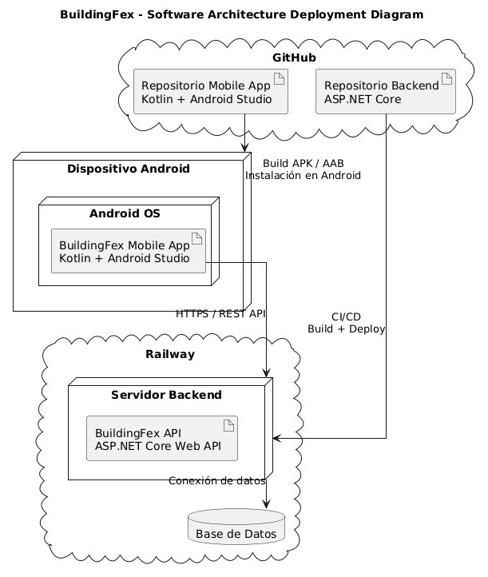

### 2.6. Tactical-Level Domain-Driven Design

---

#### 2.6.1. Bounded Context: Finanzas

Este contexto gestiona el sistema financiero completo: cuotas, pagos, recibos, configuración, KPIs, gastos administrativos, servicios compartidos y pagos fijos a trabajadores. Incluye integración con MercadoPago.

##### 2.6.1.1. Domain Layer

**Diccionario de Clases del Dominio**

- **IOwnerScopedFinanceEntity** (Interface)
  - **Propósito:** Define el contrato para aislamiento de datos por propietario.
  - **Propiedades:** `ExternalId: string`, `OwnerAdminId: int`, `ResidentExternalId: string?`

- **Fee** (Aggregate Root)
  - **Propósito:** Cuota de mantenimiento mensual asignada a un residente.
  - **Atributos:** Id, ExternalId, OwnerAdminId, OwnerAdmin (User?), ResidentExternalId, Month (string), Amount (decimal), DueDate (string), Status (string), CreatedAt, UpdatedAt
  - **Métodos:** `Create(...)`, `UpdateStatus(status): void`

- **Payment** (Aggregate Root)
  - **Propósito:** Pago registrado (MercadoPago o manual). Inmutable después de creado.
  - **Atributos:** Id, ExternalId, OwnerAdminId, OwnerAdmin, ResidentExternalId, FeeExternalId?, FeeMonth?, Amount, PaidAt?, Method?, Reference?, CreatedAt, UpdatedAt
  - **Método:** `Create(...)`

- **Receipt** (Aggregate Root)
  - **Propósito:** Recibo/boleta de expensas con monto, recargo, cargos extra y concepto.
  - **Atributos:** Id, ExternalId, OwnerAdminId, OwnerAdmin, ResidentExternalId, IssueDate?, DueDate?, Amount, Status (default "Pending"), LateFee, ExtraCharges, Concept?, CreatedAt, UpdatedAt
  - **Métodos:** `Create(...)`, `Patch(status, lateFee, extraCharges, concept): void`, `MarkAsPaid(): void`

- **FinanceSetting** (Aggregate Root)
  - **Propósito:** Configuración financiera del edificio (singleton por admin).
  - **Atributos:** Id, ExternalId, OwnerAdminId, OwnerAdmin, BaseMonthlyExpense (decimal), LateFeeRate (decimal), CreatedAt, UpdatedAt
  - **Métodos:** `Create(...)`, `Patch(baseMonthlyExpense, lateFeeRate): void`

- **KpiRecord** (Aggregate Root)
  - **Propósito:** Snapshot de KPIs financieros del edificio.
  - **Atributos:** Id, ExternalId, OwnerAdminId, OwnerAdmin, TotalResidents (int), OccupiedUnits (int), EmptyUnits (int), TotalDebt (decimal), CreatedAt, UpdatedAt
  - **Método:** `Create(...)`

- **AdminManagementExpense** (Aggregate Root)
  - **Propósito:** Gasto administrativo del edificio (compras, facturas).
  - **Atributos:** Id, ExternalId, OwnerAdminId, OwnerAdmin, Name, Amount, PurchaseDate, InvoicePhotoUrl, CreatedAt, UpdatedAt
  - **Método:** `Create(...)`

- **SharedUtilityService** (Aggregate Root)
  - **Propósito:** Servicio compartido (agua, luz) cuyo costo se distribuye entre residentes.
  - **Atributos:** Id, ExternalId, OwnerAdminId, OwnerAdmin, Type, Amount, Month?, ResidentCount?, PerResidentShare?, CreatedAt, UpdatedAt
  - **Método:** `Create(...)`

- **FixedPayoutRecipient** (Aggregate Root)
  - **Propósito:** Beneficiario de pago fijo (personal del edificio).
  - **Atributos:** Id, ExternalId, OwnerAdminId, OwnerAdmin, Name, Dni, Phone, Salary, IntervalDays, NextPaymentDate, PhotoUrl, PaymentHistoryJson, CreatedAtIso?, CreatedAt, UpdatedAt
  - **Métodos:** `Create(...)`, `ReplaceFrom(...)` (reemplazo completo de todos los campos editables)

- **IFeeRepository** (Interface)
  - **Métodos:** FindByExternalIdAsync, ListAsync(ownerAdminExternalId, residentExternalId), AddAsync, Update, AnyAsync

- **IPaymentRepository** (Interface)
  - **Métodos:** FindByExternalIdAsync, ListAsync, AddAsync, AnyAsync (sin Update, inmutable)

- **IReceiptRepository** (Interface)
  - **Métodos:** FindByExternalIdAsync, ListAsync, AddAsync, Update, AnyAsync

- **IFinanceSettingRepository** (Interface)
  - **Métodos:** FindByExternalIdAsync, ListAsync, AddAsync, Update, AnyAsync

- **IKpiRepository** (Interface)
  - **Métodos:** FindByExternalIdAsync, ListAsync, AddAsync, AnyAsync (sin Update)

- **IAdminManagementExpenseRepository** (Interface)
  - **Métodos:** ListAsync, AddAsync, AnyAsync

- **ISharedUtilityServiceRepository** (Interface)
  - **Métodos:** ListAsync, AddAsync, AnyAsync

- **IFixedPayoutRecipientRepository** (Interface)
  - **Métodos:** FindByExternalIdAsync, ListAsync, AddAsync, Update, AnyAsync

##### 2.6.1.2. Interface Layer

- **DashboardController**
  - **Ruta base:** `/api/v1/finances`
  - **Propósito:** Endpoint versionado para KPIs del dashboard financiero.
  - **Endpoints:**
    - `GET /kpi`: Obtener KPIs consolidados (filtro: ownerAdminId)

- **MercadoPagoController**
  - **Ruta base:** `/api/v1/payments`
  - **Propósito:** Controlador principal de pagos con MercadoPago.
  - **Endpoints:**
    - `GET /config`: Configuración pública de MP (AllowAnonymous)
    - `POST /preference`: Crear preferencia de pago
    - `POST /checkout`: Checkout de mantenimiento
    - `POST /confirm`: Confirmar pago
    - `POST /process`: Procesar pago con tarjeta
    - `POST /webhook`: Recibir webhooks de MP (AllowAnonymous, con validación HMAC)

- **FeesCompatController** (`/fees`)
  - **Endpoints:** GET (listar con filtros ownerAdminId, residentId), PATCH (actualizar estado)

- **PaymentsCompatController** (`/payments`)
  - **Endpoints:** GET (listar), POST (crear pago manual)

- **ReceiptsCompatController** (`/receipts`)
  - **Endpoints:** GET (listar), POST (crear), PATCH (actualizar status, lateFee, extraCharges, concept)

- **FinanceSettingsCompatController** (`/financeSettings`)
  - **Endpoints:** GET (listar), POST (crear), PATCH (upsert - crea si no existe)

- **KpiCompatController** (`/kpi`)
  - **Endpoints:** GET (listar), POST (crear snapshot)

- **AdminManagementExpensesCompatController** (`/adminManagementExpenses`)
  - **Endpoints:** GET (listar), POST (crear)

- **SharedUtilityServicesCompatController** (`/sharedUtilityServices`)
  - **Endpoints:** GET (listar), POST (crear)

- **FixedPayoutRecipientsCompatController** (`/fixedPayoutRecipients`)
  - **Endpoints:** GET (listar), POST (crear), PUT (reemplazo completo)

- **FinanceCompatSerializer** (Transformador)
  - **Propósito:** Serializa entidades a formato JSON compatible con el frontend legacy.
  - **Métodos:** FeeToJson, PaymentToJson, ReceiptToJson, FinanceSettingToJson, KpiToJson, AdminExpenseToJson, SharedServiceToJson, FixedPayoutToJson, ToCompatId, OwnerExternalId

- **Dtos.cs** (DTOs MercadoPago)
  - CreatePreferenceRequest, CreateMaintenanceCheckoutRequest, ConfirmMaintenancePaymentRequest, MaintenancePaymentResult, CreateSubscriptionPreferenceRequest, SubscriptionActivationResult, PreferenceResult, CardPaymentRequest, CardPaymentResult, WebhookResult

##### 2.6.1.3. Application Layer

- **FinanceOwnerResolver** (Domain Service)
  - **Propósito:** Resuelve externalId de admin a User válido con rol "admin". Guardián de seguridad para operaciones financieras.
  - **Método:** `ResolveOwnerAdminAsync(ownerAdminExternalId, CancellationToken): Task<User?>`

- **IDashboardQueryService** (Interface)
  - **Método:** `GetKpisAsync(ownerAdminId, CancellationToken): Task<DashboardKpiResponse>`

- **DashboardQueryService** (Implementación)
  - **Propósito:** Calcula KPIs del dashboard consultando directamente AppDbContext (sin repositorios).
  - **Dependencia:** AppDbContext
  - **Métodos privados:** `MonthKeyFromIso(value)`, `BuildMonthlyChartAsync(ownerAdminId, ct)`

- **DashboardKpiResponse** (DTOs)
  - `RecentPaymentDto`: Id, ResidentId, Amount, PaidAt, Method, Reference
  - `AdminExpenseSummaryDto`: Name, Amount, PurchaseDate
  - `MonthlyChartPointDto`: MonthKey, Income, Expenses
  - `DashboardKpiResponse`: TotalCollectedThisMonth, TotalPendingDebt, TotalResidents, OccupiedUnits, EmptyUnits, TotalDebt, RecentPayments, TotalAdminExpenses, AdminExpenses, MonthlyChart

- **IMercadoPagoService** (Interface)
  - **Métodos:**
    - `CreatePreferenceAsync(request, ct): Task<PreferenceResult>`
    - `CreateMaintenanceCheckoutPreferenceAsync(request, ct): Task<PreferenceResult>`
    - `ConfirmMaintenancePaymentAsync(request, ct): Task<MaintenancePaymentResult>`
    - `CreateSubscriptionPreferenceAsync(request, ct): Task<PreferenceResult>`
    - `ConfirmSubscriptionPaymentAsync(adminExternalId, planId, mpPaymentId, allowDemo, ct): Task<SubscriptionActivationResult>`
    - `ProcessCardPaymentAsync(request, ct): Task<CardPaymentResult>`
    - `HandleWebhookAsync(mpPaymentId, ct): Task<WebhookResult>`

- **MercadoPagoService** (Implementación - 686 líneas)
  - **Propósito:** Implementación completa de integración con MercadoPago SDK.
  - **Dependencias:** MercadoPagoSettings, IReceiptRepository, IFeeRepository, IPaymentRepository, IUserRepository, FinanceOwnerResolver, IUnitOfWork, IHostEnvironment, ILogger
  - **Métodos privados:** EnsureSdkConfigured, IsMercadoPagoConfigured, IsValidMercadoPagoUrl, ResolveFrontendBaseForCheckout, ResolveNotificationUrl, BuildBackUrls, CreatePreferenceSafeAsync, HandleSubscriptionWebhookAsync, HandleMaintenanceWebhookAsync, ReconcileMaintenanceAsync, ActivateAdminSubscriptionAsync, ReconcilePaymentAsync

- **MercadoPagoSettings** (Configuración)
  - **Propiedades:** AccessToken, PublicKey, WebhookSecret, FrontendBaseUrl (default "http://localhost:5173"), NotificationUrl

- **MercadoPagoWebhookValidator** (Helper estático)
  - **Propósito:** Valida firma HMAC-SHA256 de webhooks entrantes de MercadoPago.
  - **Método:** `TryValidateSignature(signatureHeader, requestId, dataId, webhookSecret, out failureReason): bool`

##### 2.6.1.4. Infrastructure Layer

- **FinanceRepositories.cs** (8 repositorios en un solo archivo)
  - FeeRepository, PaymentRepository, ReceiptRepository, FinanceSettingRepository, KpiRepository, AdminManagementExpenseRepository, SharedUtilityServiceRepository, FixedPayoutRecipientRepository
  - Todos heredan de `BaseRepository<T>` e implementan sus interfaces respectivas
  - Todos incluyen método privado `WithOwner()` para eager loading

- **ModelBuilderExtensions** (Configuración EF Core)
  - **Método:** `ApplyFinancesConfiguration(this ModelBuilder)`
  - **Configuración de 8 entidades:** Precisión decimal(18,2) para montos, decimal(8,4) para LateFeeRate, columnas LONGTEXT para PhotoUrl, InvoicePhotoUrl, PaymentHistoryJson

- **DbJsonFinanceSeeder** (Semilla de datos)
  - **Método:** `SeedAsync(dbJsonPath, CancellationToken)`
  - **Siembra las 8 tablas:** fees, payments, receipts, financeSettings, kpi, adminManagementExpenses, sharedUtilityServices, fixedPayoutRecipients

##### 2.6.1.5. Bounded Context Software Architecture Component Level Diagrams

```mermaid
graph TB
    subgraph Actores
        Admin["Administrador"]
        Resident["Residente"]
    end

    subgraph Externos
        API["API REST - ASP.NET Core"]
        MP["MercadoPago SDK"]
        DB["MySQL 8 - EF Core"]
    end

    subgraph Finanzas["Financial Billing Management"]
        subgraph Interface["Interface Layer - Controllers"]
            DC["DashboardController<br/>/api/v1/finances"]
            MPC["MercadoPagoController<br/>/api/v1/payments"]
            FC["FeesCompatController<br/>/fees"]
            PC["PaymentsCompatController<br/>/payments"]
            RC["ReceiptsCompatController<br/>/receipts"]
            FSC["FinanceSettingsCompatController<br/>/financeSettings"]
            KC["KpiCompatController<br/>/kpi"]
            AMEC["AdminManagementExpensesCompatController<br/>/adminManagementExpenses"]
            SUC["SharedUtilityServicesCompatController<br/>/sharedUtilityServices"]
            FPRC["FixedPayoutRecipientsCompatController<br/>/fixedPayoutRecipients"]
            FCS["FinanceCompatSerializer<br/>JSON Transform"]
        end

        subgraph Application["Application Layer - Services"]
            FOR["FinanceOwnerResolver<br/>Domain Service"]
            IDQS["DashboardQueryService<br/>KPI Calculator"]
            IMPS["MercadoPagoService<br/>686 lines - Payment Integration"]
            MPWV["MercadoPagoWebhookValidator<br/>HMAC-SHA256"]
        end

        subgraph Domain["Domain Layer - Aggregates"]
            Fee["Fee<br/>Aggregate Root"]
            Payment["Payment<br/>Aggregate Root"]
            Receipt["Receipt<br/>Aggregate Root"]
            FS["FinanceSetting<br/>Aggregate Root"]
            KPI["KpiRecord<br/>Aggregate Root"]
            AME["AdminManagementExpense<br/>Aggregate Root"]
            SUS["SharedUtilityService<br/>Aggregate Root"]
            FPR["FixedPayoutRecipient<br/>Aggregate Root"]
        end

        subgraph Infrastructure["Infrastructure Layer - Repositories"]
            FeeRepo["FeeRepository<br/>BaseRepository Fee"]
            PayRepo["PaymentRepository<br/>BaseRepository Payment"]
            RecRepo["ReceiptRepository<br/>BaseRepository Receipt"]
            FSRepo["FinanceSettingRepository<br/>BaseRepository FinanceSetting"]
            KPIRepo["KpiRepository<br/>BaseRepository KpiRecord"]
            AMERepo["AdminManagementExpenseRepository<br/>BaseRepository AdminManagementExpense"]
            SUSRepo["SharedUtilityServiceRepository<br/>BaseRepository SharedUtilityService"]
            FPRRepo["FixedPayoutRecipientRepository<br/>BaseRepository FixedPayoutRecipient"]
        end
    end

    Admin -->|"HTTP GET/POST"| API
    Resident -->|"HTTP GET"| API
    API --> DC
    API --> MPC
    API --> FC
    API --> PC
    API --> RC
    API --> FSC
    API --> KC
    API --> AMEC
    API --> SUC
    API --> FPRC

    DC -->|"GetKpisAsync()"| IDQS
    MPC -->|"CreatePreferenceAsync()"| IMPS
    FC -->|"CRUD"| Fee
    PC -->|"CRUD"| Payment
    RC -->|"CRUD"| Receipt

    IMPS -->|"SDK .NET"| MP
    IMPS -->|"Query fees"| FeeRepo
    IMPS -->|"Persist payments"| PayRepo
    IMPS -->|"Persist receipts"| RecRepo
    FOR -->|"ResolveOwner()"| Fee

    FeeRepo -->|"EF Core"| DB
    PayRepo -->|"EF Core"| DB
    RecRepo -->|"EF Core"| DB
    FSRepo -->|"EF Core"| DB
    KPIRepo -->|"EF Core"| DB
    AMERepo -->|"EF Core"| DB
    SUSRepo -->|"EF Core"| DB
    FPRRepo -->|"EF Core"| DB
```

**Explicación del Diagrama de Componentes - Finanzas:**

El bounded context de **Finanzas** gestiona toda la facturación, pagos y recibos del edificio. Está compuesto por cuatro capas principales.

La **Interface Layer** expone 10 controllers REST bajo las rutas `/api/v1/finances` y `/api/v1/payments`, además de endpoints compatibles con json-server para fees, payments, receipts, financeSettings, kpi, adminManagementExpenses, sharedUtilityServices y fixedPayoutRecipients. El **DashboardController** retorna KPIs consolidados como total recaudado y deuda pendiente. El **MercadoPagoController** gestiona checkout, confirmación y webhooks con validación HMAC-SHA256. El **FinanceCompatSerializer** transforma entidades a formato JSON legacy.

La **Application Layer** contiene el **FinanceOwnerResolver** que resuelve externalId de admin a User válido como guardián de seguridad, el **DashboardQueryService** que calcula KPIs consultando AppDbContext directamente, el **MercadoPagoService** con 686 líneas de integración completa con MercadoPago SDK (checkout, webhooks, reconciliación), y el **MercadoPagoWebhookValidator** para validación HMAC-SHA256.

La **Domain Layer** define 8 aggregate roots: **Fee** (cuota mensual), **Payment** (pago inmutable), **Receipt** (recibo con recargos), **FinanceSetting** (configuración singleton), **KpiRecord** (snapshot de métricas), **AdminManagementExpense** (gasto administrativo), **SharedUtilityService** (servicio compartido distribuido), y **FixedPayoutRecipient** (beneficiario de pago fijo).

La **Infrastructure Layer** implementa 8 repositorios que heredan de `BaseRepository<T>`, cada uno con método privado `WithOwner()` para eager loading de la relación con User. La configuración EF Core se realiza via `ModelBuilderExtensions.ApplyFinancesConfiguration()`.

##### 2.6.1.6. Bounded Context Software Architecture Code Level Diagrams

###### 2.6.1.6.1. Bounded Context Domain Layer Class Diagrams

```mermaid
classDiagram
    class BaseEntity {
        +int Id
    }

    class IAuditableEntity {
        <<interface>>
        +DateTimeOffset? CreatedAt
        +DateTimeOffset? UpdatedAt
    }

    class IOwnerScopedFinanceEntity {
        <<interface>>
        +string ExternalId
        +int OwnerAdminId
        +string ResidentExternalId
    }

    class Fee {
        -int _id
        +string ExternalId
        +int OwnerAdminId
        +string ResidentExternalId
        +string Month
        +decimal Amount
        +string DueDate
        +string Status
        +DateTimeOffset? CreatedAt
        +DateTimeOffset? UpdatedAt
        +static Fee Create(string externalId, int ownerAdminId, string residentExternalId, string month, decimal amount, string dueDate, string status) Fee
        +void UpdateStatus(string status)
    }

    class Payment {
        -int _id
        +string ExternalId
        +int OwnerAdminId
        +string ResidentExternalId
        +string FeeExternalId
        +string FeeMonth
        +decimal Amount
        +DateTimeOffset? PaidAt
        +string Method
        +string Reference
        +DateTimeOffset? CreatedAt
        +DateTimeOffset? UpdatedAt
        +static Payment Create(string externalId, int ownerAdminId, string residentExternalId, string feeExternalId, string feeMonth, decimal amount, DateTimeOffset? paidAt, string method, string reference) Payment
    }

    class Receipt {
        -int _id
        +string ExternalId
        +int OwnerAdminId
        +string ResidentExternalId
        +string IssueDate
        +string DueDate
        +decimal Amount
        +string Status
        +decimal LateFee
        +decimal ExtraCharges
        +string Concept
        +DateTimeOffset? CreatedAt
        +DateTimeOffset? UpdatedAt
        +static Receipt Create(string externalId, int ownerAdminId, string residentExternalId, string issueDate, string dueDate, decimal amount, string status, decimal lateFee, decimal extraCharges, string concept) Receipt
        +void Patch(string status, decimal lateFee, decimal extraCharges, string concept)
        +void MarkAsPaid()
    }

    class FinanceSetting {
        -int _id
        +string ExternalId
        +int OwnerAdminId
        +decimal BaseMonthlyExpense
        +decimal LateFeeRate
        +DateTimeOffset? CreatedAt
        +DateTimeOffset? UpdatedAt
        +static FinanceSetting Create(string externalId, int ownerAdminId, decimal baseMonthlyExpense, decimal lateFeeRate) FinanceSetting
        +void Patch(decimal baseMonthlyExpense, decimal lateFeeRate)
    }

    class KpiRecord {
        -int _id
        +string ExternalId
        +int OwnerAdminId
        +int TotalResidents
        +int OccupiedUnits
        +int EmptyUnits
        +decimal TotalDebt
        +DateTimeOffset? CreatedAt
        +DateTimeOffset? UpdatedAt
        +static KpiRecord Create(string externalId, int ownerAdminId, int totalResidents, int occupiedUnits, int emptyUnits, decimal totalDebt) KpiRecord
    }

    class AdminManagementExpense {
        -int _id
        +string ExternalId
        +int OwnerAdminId
        +string Name
        +decimal Amount
        +string PurchaseDate
        +string InvoicePhotoUrl
        +DateTimeOffset? CreatedAt
        +DateTimeOffset? UpdatedAt
        +static AdminManagementExpense Create(string externalId, int ownerAdminId, string name, decimal amount, string purchaseDate, string invoicePhotoUrl) AdminManagementExpense
    }

    class SharedUtilityService {
        -int _id
        +string ExternalId
        +int OwnerAdminId
        +string Type
        +decimal Amount
        +string Month
        +int ResidentCount
        +decimal PerResidentShare
        +DateTimeOffset? CreatedAt
        +DateTimeOffset? UpdatedAt
        +static SharedUtilityService Create(string externalId, int ownerAdminId, string type, decimal amount, string month, int residentCount, decimal perResidentShare) SharedUtilityService
    }

    class FixedPayoutRecipient {
        -int _id
        +string ExternalId
        +int OwnerAdminId
        +string Name
        +string Dni
        +string Phone
        +decimal Salary
        +int IntervalDays
        +string NextPaymentDate
        +string PhotoUrl
        +string PaymentHistoryJson
        +DateTimeOffset? CreatedAt
        +DateTimeOffset? UpdatedAt
        +static FixedPayoutRecipient Create(string externalId, int ownerAdminId, string name, string dni, string phone, decimal salary, int intervalDays, string nextPaymentDate, string photoUrl, string paymentHistoryJson) FixedPayoutRecipient
        +void ReplaceFrom(FixedPayoutRecipient other)
    }

    class IFeeRepository {
        <<interface>>
        +Task FindByExternalIdAsync(string externalId, CancellationToken ct)
        +Task ListAsync(string ownerAdminExternalId, string residentExternalId, CancellationToken ct)
        +Task AddAsync(Fee entity, CancellationToken ct)
        +void Update(Fee entity)
        +Task AnyAsync(CancellationToken ct)
    }

    class IPaymentRepository {
        <<interface>>
        +Task FindByExternalIdAsync(string externalId, CancellationToken ct)
        +Task ListAsync(string ownerAdminExternalId, CancellationToken ct)
        +Task AddAsync(Payment entity, CancellationToken ct)
        +Task AnyAsync(CancellationToken ct)
    }

    class IReceiptRepository {
        <<interface>>
        +Task FindByExternalIdAsync(string externalId, CancellationToken ct)
        +Task ListAsync(string ownerAdminExternalId, CancellationToken ct)
        +Task AddAsync(Receipt entity, CancellationToken ct)
        +void Update(Receipt entity)
        +Task AnyAsync(CancellationToken ct)
    }

    BaseEntity <|-- Fee : inherits
    BaseEntity <|-- Payment : inherits
    BaseEntity <|-- Receipt : inherits
    BaseEntity <|-- FinanceSetting : inherits
    BaseEntity <|-- KpiRecord : inherits
    BaseEntity <|-- AdminManagementExpense : inherits
    BaseEntity <|-- SharedUtilityService : inherits
    BaseEntity <|-- FixedPayoutRecipient : inherits

    IAuditableEntity <|.. Fee : implements
    IAuditableEntity <|.. Payment : implements
    IAuditableEntity <|.. Receipt : implements
    IAuditableEntity <|.. FinanceSetting : implements
    IAuditableEntity <|.. KpiRecord : implements
    IAuditableEntity <|.. AdminManagementExpense : implements
    IAuditableEntity <|.. SharedUtilityService : implements
    IAuditableEntity <|.. FixedPayoutRecipient : implements

    IOwnerScopedFinanceEntity <|.. Fee : implements
    IOwnerScopedFinanceEntity <|.. Payment : implements
    IOwnerScopedFinanceEntity <|.. Receipt : implements
    IOwnerScopedFinanceEntity <|.. FinanceSetting : implements
    IOwnerScopedFinanceEntity <|.. KpiRecord : implements
    IOwnerScopedFinanceEntity <|.. AdminManagementExpense : implements
    IOwnerScopedFinanceEntity <|.. SharedUtilityService : implements
    IOwnerScopedFinanceEntity <|.. FixedPayoutRecipient : implements

    Fee "0..*" --> "1" User : OwnerAdminId
    Payment "0..*" --> "1" User : OwnerAdminId
    Receipt "0..*" --> "1" User : OwnerAdminId
    FinanceSetting "0..*" --> "1" User : OwnerAdminId
    KpiRecord "0..*" --> "1" User : OwnerAdminId
    AdminManagementExpense "0..*" --> "1" User : OwnerAdminId
    SharedUtilityService "0..*" --> "1" User : OwnerAdminId
    FixedPayoutRecipient "0..*" --> "1" User : OwnerAdminId
```

**Explicación del Diagrama de Clases - Finanzas:**

El diagrama de clases del dominio Finanzas muestra la estructura completa de entidades, interfaces y sus relaciones. Todas las entidades heredan de **BaseEntity** (que proporciona `int Id` como PK auto-incremental) e implementan **IAuditableEntity** (con `DateTimeOffset? CreatedAt` y `UpdatedAt`). Además, todas implementan **IOwnerScopedFinanceEntity** que define el contrato de scope por propietario con `ExternalId`, `OwnerAdminId` y `ResidentExternalId`.

Las entidades de dominio son **Fee**, **Payment**, **Receipt**, **FinanceSetting**, **KpiRecord**, **AdminManagementExpense**, **SharedUtilityService** y **FixedPayoutRecipient**. Cada una tiene atributos privados (`_id`) y propiedades públicas con factory methods estáticos (`Create`) y mutadores (`UpdateStatus`, `Patch`, `MarkAsPaid`, `ReplaceFrom`). Los atributos incluyen `ExternalId` (string único), `OwnerAdminId` (FK al admin), y campos específicos de cada entidad como `Month`, `Amount`, `Status`, `DueDate`, `Method`, `LateFee`, `ExtraCharges`, `BaseMonthlyExpense`, `LateFeeRate`, etc.

Las interfaces de repositorio **IFeeRepository**, **IPaymentRepository** e **IReceiptRepository** definen operaciones CRUD: `FindByExternalIdAsync`, `ListAsync`, `AddAsync`, `Update` y `AnyAsync`.

Las relaciones muestran herencia (`<|--`), implementación (`<|..`) y asociaciones con multiplicidad. Todas las entidades tienen relación `"0..*" --> "1"` con **User** via `OwnerAdminId`, indicando que muchas cuotas/pagos/recibos/configuraciones/KPIs/gastos/servicios/beneficiarios pertenecen a un usuario admin.

###### 2.6.1.6.2. Bounded Context Database Design Diagram

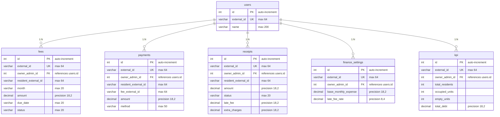

**Explicación del Diagrama de Base de Datos - Finanzas:**

El diagrama de entidad-relación muestra 6 tablas del bounded context Finanzas. La tabla **users** es compartida con otros contextos y contiene `id` (PK auto-increment), `external_id` (UK, max 64) y `name`. Las tablas de dominio son **fees** (cuotas de mantenimiento con `month`, `amount`, `due_date`, `status`), **payments** (pagos con `fee_external_id`, `amount`, `method`), **receipts** (recibos con `amount`, `status`, `late_fee`, `extra_charges`), **finance_settings** (configuración con `base_monthly_expense`, `late_fee_rate`) y **kpi** (métricas con `total_residents`, `occupied_units`, `empty_units`, `total_debt`).

Todas las tablas de dominio tienen `id` como PK auto-incremental y `external_id` como UK con max 64 caracteres. Todas referencian a `users` via `owner_admin_id` como FK. Los montos (`amount`, `late_fee`, `extra_charges`, `base_monthly_expense`, `total_debt`) usan precisión `decimal(18,2)`. Las fechas y estados usan `varchar` con longitudes específicas (max 20 para `month` y `status`, max 50 para `method`).

Las relaciones son todas de tipo **1:N** desde `users` hacia cada tabla de dominio, indicando que un usuario admin puede tener múltiples cuotas, pagos, recibos, configuraciones y registros KPI.

---

#### 2.6.2. Bounded Context: Suscripciones

Este contexto administra la autenticación, autorización, registro de administradores y residentes, y la gestión de planes de suscripción SaaS.

##### 2.6.2.1. Domain Layer

**Diccionario de Clases del Dominio**

- **User** (Aggregate Root)
  - **Propósito:** Entidad raíz de agregado que unifica administradores y residentes en una tabla única. Administra multi-tenancy (residentes pertenecen a un admin) y planes de suscripción.
  - **Atributos:**
    - `Id`: int (PK auto-incremental)
    - `ExternalId`: string (ID externo compatible con json-server)
    - `Name`: string (nombre completo)
    - `Email`: string (email normalizado lowercase)
    - `PasswordHash`: string (hash BCrypt, ignorado en JSON via `[JsonIgnore]`)
    - `Role`: string ("admin" o "resident")
    - `Dni`: string? (DNI del admin)
    - `Address`: string? (dirección del admin)
    - `Company`: string? (empresa del admin)
    - `Ruc`: string? (RUC del admin)
    - `Floor`: string? (piso del residente)
    - `Code`: string? (código único del residente)
    - `AdmissionDate`: DateOnly? (fecha de admisión del residente)
    - `OwnerAdminId`: int? (FK auto-referenciada al admin propietario)
    - `OwnerAdmin`: User? (navegación al admin dueño)
    - `SubscriptionPlanId`: string (plan de suscripción, default "free")
    - `SubscriptionPaidUntil`: DateTime? (fecha de expiración del plan)
    - `CreatedAt`: DateTimeOffset? (de IAuditableEntity)
    - `UpdatedAt`: DateTimeOffset? (de IAuditableEntity)
  - **Métodos:**
    - `CreateAdmin(externalId, name, email, passwordHash, dni, address, company, ruc): User` (factory estático)
    - `CreateResident(externalId, name, email, passwordHash, floor, code, ownerAdminId, admissionDate): User` (factory estático)
    - `UpdateCredentials(email, passwordHash): void`
    - `UpdateSubscription(planId, paidUntil): void`
  - **Relaciones:** Implementa `IAuditableEntity`. Auto-relación con `User` via `OwnerAdminId`.

- **SubscriptionPlans** (Domain Service estático)
  - **Propósito:** Encapsula la lógica de negocio para validar, normalizar y consultar límites/precios de planes de suscripción.
  - **Constantes:** `SubscriptionPlanIds` (Free="free", Essential="essential", Standard="standard", Scale="scale")
  - **Diccionarios internos:** ResidentLimits (free=9, essential=15, standard=40, scale=80), MonthlyPricesPen (free=0, essential=40, standard=80, scale=120)
  - **Métodos:**
    - `IsValid(planId): bool`
    - `Normalize(planId): string`
    - `MaxResidents(planId): int`
    - `MonthlyPricePen(planId): decimal`
    - `IsPaid(planId): bool`

- **IamError** (Enum)
  - **Propósito:** Catalogo centralizado de errores del dominio IAM.
  - **Valores:** InvalidCredentials, EmailNotFound, InvalidPassword, EmailAlreadyExists, UserNotFound, ResidentFieldsRequired, ResidentCodeAlreadyExists, ResidentOwnerRequired, ResidentNotFound, ResidentPlanLimitReached

- **IUserRepository** (Interface)
  - **Propósito:** Contrato de persistencia del aggregate User.
  - **Herencia:** `IBaseRepository<User>`
  - **Métodos:**
    - `FindByEmailAsync(email, CancellationToken): Task<User?>`
    - `FindByExternalIdAsync(externalId, CancellationToken): Task<User?>`
    - `ExistsByEmailAsync(email, CancellationToken): Task<bool>`
    - `ListByOwnerAdminIdAsync(ownerAdminId, CancellationToken): Task<IEnumerable<User>>`
    - `SearchAsync(email, role, code, ownerAdminId, CancellationToken): Task<IEnumerable<User>>`
    - `AnyUsersAsync(CancellationToken): Task<bool>`
    - `ExistsResidentByCodeAsync(code, ownerAdminId, CancellationToken): Task<bool>`
    - `CountResidentsByOwnerAdminIdAsync(ownerAdminId, CancellationToken): Task<int>`

- **SignInCommand** (Command)
  - **Propósito:** Comando CQRS para iniciar sesión.
  - **Atributos:** `Email: string`, `Password: string`

- **RegisterAdminCommand** (Command)
  - **Propósito:** Comando CQRS para registrar un nuevo administrador.
  - **Atributos:** `Name: string`, `Email: string`, `Password: string`, `Dni: string?`, `Address: string?`, `Company: string?`, `Ruc: string?`

- **CreateResidentCommand** (Command)
  - **Propósito:** Comando CQRS para crear un residente bajo un admin existente.
  - **Atributos:** `ExternalId: string`, `Name: string`, `Floor: string`, `Code: string`, `OwnerAdminExternalId: string`, `AdmissionDate: string?`

- **DeleteResidentCommand** (Command)
  - **Propósito:** Comando CQRS para eliminar un residente.
  - **Atributos:** `ExternalId: string`

- **UpdateResidentCredentialsCommand** (Command)
  - **Propósito:** Comando CQRS para actualizar credenciales de residente.
  - **Atributos:** `ExternalId: string`, `Email: string`, `Password: string`

##### 2.6.2.2. Interface Layer

Expone la funcionalidad del Bounded Context hacia clientes externos (API REST).

- **AuthenticationController**
  - **Ruta base:** `/api/v1/authentication`
  - **Propósito:** API REST versionada para autenticación y registro. No requiere autorización (`[AllowAnonymous]`).
  - **Endpoints:**
    - `POST /sign-in`: Login con email+password → usuario+token JWT
    - `POST /register-admin`: Registro de admin → usuario+token JWT
    - `GET /check-email?email=`: Verificar si email existe → `{ exists: bool }`
    - `GET /residents/invite?code=`: Buscar residente por código para flujo de invitación
    - `POST /residents/set-credentials`: Establecer credenciales de residente por código

- **UsersCompatController**
  - **Ruta base:** `/users`
  - **Propósito:** API REST compatible con json-server. Requiere autorización (`[Authorize]`).
  - **Endpoints:**
    - `GET /`: Listar/buscar usuarios con filtros (ownerAdminId, role, email, code)
    - `GET /{id}`: Obtener usuario por ExternalId
    - `POST /`: Crear usuario (admin o residente según role)
    - `PATCH /{id}`: Actualizar credenciales de residente
    - `DELETE /{id}`: Eliminar residente

- **SubscriptionController**
  - **Ruta base:** `/api/v1/subscription`
  - **Propósito:** API REST para gestión de planes de suscripción con MercadoPago. Requiere autorización.
  - **Endpoints:**
    - `GET /`: Obtener suscripción actual del admin autenticado
    - `PATCH /`: Cambiar a otro plan gratuito (valida downgrade)
    - `POST /checkout`: Crear preferencia de pago en MercadoPago para planes pagados
    - `POST /confirm`: Confirmar pago y activar plan

- **UserResource** (DTOs)
  - `UserResource`: DTO de respuesta de usuario (Id, Name, Email, Role, Floor, Code, OwnerAdminId, Dni, Address, Company, Ruc, AdmissionDate, HasCredentials, SubscriptionPlanId, SubscriptionPaidUntil, ResidentLimit)
  - `AuthenticatedUserResource`: Respuesta de login/registro (User, Token)
  - `SignInResource`: Petición de login (Email, Password)
  - `RegisterAdminResource`: Petición de registro admin (Name, Email, Password, Dni, Address, Company, Ruc)
  - `CreateUserCompatResource`: Petición de creación compatible con json-server
  - `UpdateResidentCredentialsResource`: Petición de actualización (Email, Password)
  - `SetResidentCredentialsByCodeResource`: Petición de credenciales por código (Code, Email, Password)
  - `SubscriptionResponseResource`: Respuesta de suscripción (PlanId, ResidentLimit, ResidentsCount, MonthlyPricePen, PaidUntil, IsPaid)
  - `ChangeSubscriptionPlanResource`: Petición de cambio de plan (PlanId)
  - `SubscriptionCheckoutResource`: Petición de checkout (PlanId, FrontendBaseUrl)
  - `ConfirmSubscriptionResource`: Petición de confirmación (PlanId, PaymentId, Demo)

- **UserResourceAssembler** (Transformador)
  - **Propósito:** Transforma la entidad `User` en `UserResource` para respuestas HTTP.
  - **Método:** `ToResource(user): UserResource`

##### 2.6.2.3. Application Layer

Coordina los flujos de uso, ejecutando casos de negocio e instruyendo mutaciones en el dominio.

- **IUserCommandService** (Interface)
  - **Propósito:** Contrato de la capa de aplicación para operaciones de escritura.
  - **Métodos:**
    - `Handle(SignInCommand, CancellationToken): Task<Result<(User, string)>>`
    - `Handle(RegisterAdminCommand, CancellationToken): Task<Result<(User, string)>>`
    - `Handle(CreateResidentCommand, CancellationToken): Task<Result<User>>`
    - `Handle(UpdateResidentCredentialsCommand, CancellationToken): Task<Result<User>>`
    - `Handle(DeleteResidentCommand, CancellationToken): Task<Result<User>>`

- **UserCommandService** (Implementación)
  - **Propósito:** Implementa toda la lógica de negocio para login, registro de admin, CRUD de residentes con validaciones de plan.
  - **Dependencias:** IUserRepository, ITokenService, IHashingService, IUnitOfWork
  - **Lógica clave:** Valida límite de residentes según plan (`SubscriptionPlans.MaxResidents`), verifica email único, hashea contraseñas, genera ExternalId con timestamp.

- **IUserQueryService** (Interface)
  - **Propósito:** Contrato para operaciones de lectura.
  - **Métodos:**
    - `GetByExternalIdAsync(externalId, CancellationToken): Task<User?>`
    - `GetAllAsync(CancellationToken): Task<IEnumerable<User>>`
    - `GetResidentsByOwnerExternalIdAsync(ownerAdminExternalId, CancellationToken): Task<IEnumerable<User>>`
    - `SearchAsync(email, role, code, ownerAdminExternalId, CancellationToken): Task<IEnumerable<User>>`

- **UserQueryService** (Implementación)
  - **Propósito:** Implementa consultas de solo lectura de usuarios.
  - **Dependencias:** IUserRepository

- **IHashingService** (Interface - Outbound Service)
  - **Propósito:** Abstracción para hashing de contraseñas.
  - **Métodos:** `HashPassword(password): string`, `VerifyPassword(password, passwordHash): bool`

- **ITokenService** (Interface - Outbound Service)
  - **Propósito:** Abstracción para generación de tokens JWT.
  - **Método:** `GenerateToken(user): string`

##### 2.6.2.4. Infrastructure Layer

Proporciona el acceso a la base de datos y servicios externos.

- **UserRepository** (Implementación del repositorio)
  - **Propósito:** Implementación concreta de `IUserRepository` usando EF Core y MySQL.
  - **Herencia:** `BaseRepository<User>`
  - **Método privado:** `WithOwner()` para eager loading de `OwnerAdmin` via `.Include()`

- **ModelBuilderExtensions** (Configuración EF Core)
  - **Propósito:** Configura el mapeo de `User` a tabla MySQL con Fluent API.
  - **Método:** `ApplyIamConfiguration(this ModelBuilder)`
  - **Configuración:** PK Id (auto), ExternalId (unique, max 64), Name (max 200), Email (max 320), PasswordHash, Role (max 20), FK OwnerAdminId con DeleteBehavior.Restrict

- **DbJsonUserSeeder** (Semilla de datos)
  - **Propósito:** Carga usuarios iniciales desde `db.json` (formato json-server).
  - **Método:** `SeedAsync(dbJsonPath, CancellationToken)`
  - **Lógica:** Verifica si hay datos, lee JSON, procesa admins primero, luego residentes resolviendo su owner.

- **HashingService** (Implementación BCrypt)
  - **Propósito:** Implementa hashing con `BCrypt.Net.BCrypt`.

- **TokenService** (Implementación JWT)
  - **Propósito:** Genera tokens JWT con claims sub, email, role, name, ownerAdminId.
  - **Dependencia:** `IOptions<TokenSettings>` (Secret, ExpirationHours)

##### 2.6.2.5. Bounded Context Software Architecture Component Level Diagrams

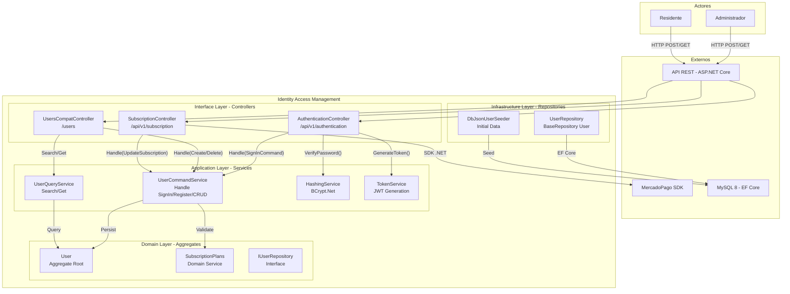

**Explicación del Diagrama de Componentes - Suscripciones:**

El bounded context de **Suscripciones** (Identity Access Management) gestiona autenticación, autorización y planes de suscripción de residentes. Está compuesto por cuatro capas.

La **Interface Layer** expone 3 controllers: el **AuthenticationController** en `/api/v1/authentication` para SignIn y registro con JWT Bearer, el **UsersCompatController** en `/users` para CRUD de usuarios con creación de residentes, y el **SubscriptionController** en `/api/v1/subscription` para gestión de planes y verificación de pago con MercadoPago.

La **Application Layer** contiene el **UserCommandService** que maneja SignIn, registro, actualización y eliminación usando BCrypt.Net para hashing, el **UserQueryService** que busca usuarios por email, externalId y ownerAdminId con Include, el **HashingService** como wrapper de BCrypt.Net, y el **TokenService** que genera JWT con claims personalizados (Email, Role, Name).

La **Domain Layer** define el aggregate root **User** que unifica admin y resident en una tabla con campos como `Email`, `PasswordHash`, `Role`, `Floor`, `Code`, `OwnerAdminId`, `SubscriptionPlanId` y `SubscriptionPaidUntil`. El **SubscriptionPlans** es un Domain Service estático que define planes (free, basic, pro, premium) con límites de residentes y precios.

La **Infrastructure Layer** implementa **UserRepository** con eager loading de suscripciones y **DbJsonUserSeeder** para datos iniciales.

##### 2.6.2.6. Bounded Context Software Architecture Code Level Diagrams

###### 2.6.2.6.1. Bounded Context Domain Layer Class Diagrams

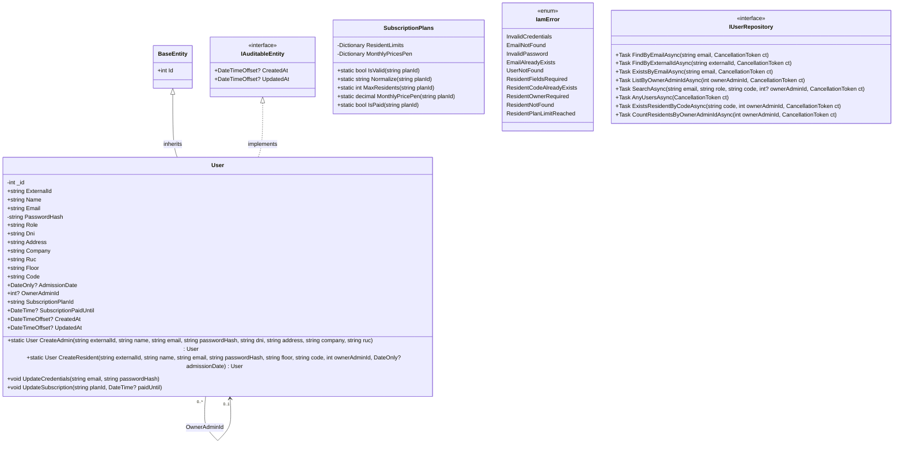

**Explicación del Diagrama de Clases - Suscripciones:**

El diagrama de clases del dominio Suscripciones muestra la estructura de autenticación y autorización. **BaseEntity** proporciona `int Id` como PK, e **IAuditableEntity** define `CreatedAt` y `UpdatedAt` para auditoría.

La entidad principal es **User** (Aggregate Root) con atributos privados `_id` y `PasswordHash` (protegido con `[JsonIgnore]`), y propiedades públicas: `ExternalId`, `Name`, `Email`, `Role` ("admin"/"resident"), `Dni`, `Address`, `Company`, `Ruc`, `Floor`, `Code`, `AdmissionDate`, `OwnerAdminId` (FK auto-referenciada), `SubscriptionPlanId` y `SubscriptionPaidUntil`. Tiene dos factory methods: `CreateAdmin()` y `CreateResident()`, y mutadores `UpdateCredentials()` y `UpdateSubscription()`.

**SubscriptionPlans** es un Domain Service estático con diccionarios privados `ResidentLimits` y `MonthlyPricesPen`, y métodos públicos `IsValid()`, `Normalize()`, `MaxResidents()`, `MonthlyPricePen()` e `IsPaid()`.

**IamError** es un enum con errores del dominio: `InvalidCredentials`, `EmailNotFound`, `InvalidPassword`, `EmailAlreadyExists`, `UserNotFound`, `ResidentFieldsRequired`, `ResidentCodeAlreadyExists`, `ResidentOwnerRequired`, `ResidentNotFound`, `ResidentPlanLimitReached`.

**IUserRepository** define 8 operaciones: `FindByEmailAsync`, `FindByExternalIdAsync`, `ExistsByEmailAsync`, `ListByOwnerAdminIdAsync`, `SearchAsync`, `AnyUsersAsync`, `ExistsResidentByCodeAsync` y `CountResidentsByOwnerAdminIdAsync`.

La relación clave es la **auto-referencia** de User: `"0..*" --> "0..1"` via `OwnerAdminId`, indicando que un admin puede tener 0 o más residentes, y un residente pertenece a 0 o 1 admin.

###### 2.6.2.6.2. Bounded Context Database Design Diagram

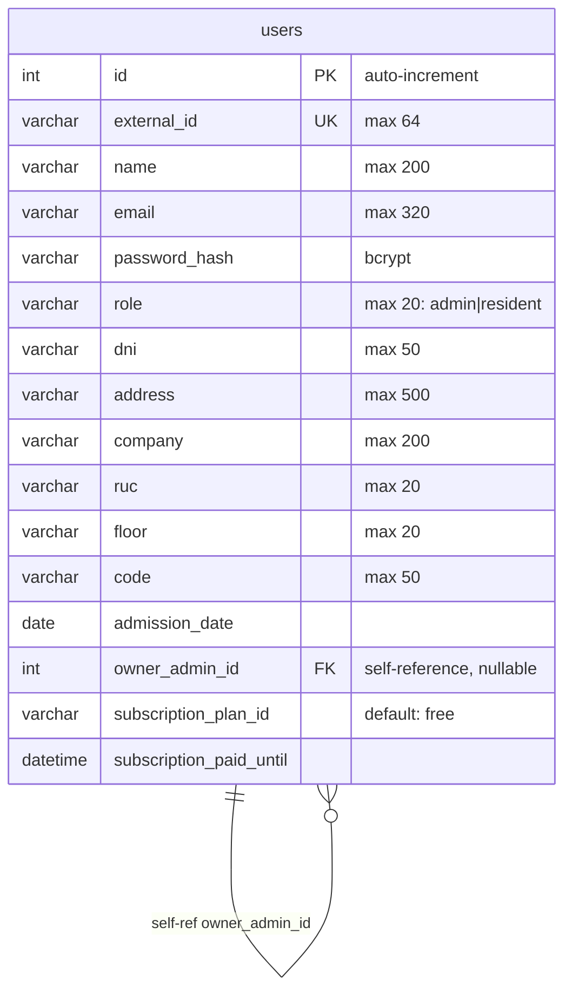

**Explicación del Diagrama de Base de Datos - Suscripciones:**

El diagrama muestra una única tabla **users** que funciona como tabla unificada para administradores y residentes. La tabla tiene `id` como PK auto-incremental, `external_id` como UK con max 64 caracteres, y `name` con max 200.

Las columnas de autenticación incluyen `email` (max 320, único por contexto), `password_hash` (almacena hash BCrypt), y `role` (max 20, valores "admin" o "resident"). Las columnas de administrador son `dni`, `address`, `company` y `ruc`, mientras que las de residente son `floor`, `code` y `admission_date`.

La columna clave es `owner_admin_id` que es una FK auto-referenciada a la misma tabla (nullable), permitiendo que un admin sea propietario de múltiples residentes. Las columnas de suscripción son `subscription_plan_id` (default "free") y `subscription_paid_until` (fecha de expiración del plan pagado).

La relación es de tipo **1:N auto-referenciada**: un usuario admin puede tener múltiples residentes a través de `owner_admin_id`, pero un residente pertenece a un solo admin.

---

Este contexto gestiona el catálogo de espacios comunes del edificio y el sistema de reservas con validación de solapamiento.

##### 2.6.3.1. Domain Layer

**Diccionario de Clases del Dominio**

- **SocialSpace** (Aggregate Root)
  - **Propósito:** Espacio común del edificio que puede ser reservado (salón de fiestas, gimnasio, piscina, etc.).
  - **Atributos:**
    - `Id`: int (PK auto-incremental)
    - `ExternalId`: string (ID externo único)
    - `OwnerAdminId`: int (FK al admin propietario)
    - `OwnerAdmin`: User? (navegación al admin)
    - `Name`: string (nombre del espacio)
    - `Description`: string (descripción)
    - `Capacity`: int? (capacidad máxima, nullable)
    - `ImageUrl`: string (URL de imagen)
    - `CreatedAt`: DateTimeOffset? (de IAuditableEntity)
    - `UpdatedAt`: DateTimeOffset? (de IAuditableEntity)
  - **Métodos:**
    - `Create(externalId, ownerAdminId, name, description, capacity, imageUrl): SocialSpace` (factory estático)
    - `Patch(name, description, capacity, imageUrl?): void`
  - **Relaciones:** FK a `User` via `OwnerAdminId`. Implementa `IAuditableEntity`.

- **Reservation** (Aggregate Root)
  - **Propósito:** Reserva de un SocialSpace por un residente, con datos del residente, horario, invitados y token de invitación.
  - **Atributos:**
    - `Id`: int (PK auto-incremental)
    - `ExternalId`: string (ID externo único)
    - `OwnerAdminId`: int (FK al admin propietario)
    - `OwnerAdmin`: User? (navegación al admin)
    - `SpaceExternalId`: string (ExternalId del SocialSpace reservado)
    - `ResidentExternalId`: string (ExternalId del residente que reserva)
    - `ResidentName`: string (nombre del residente)
    - `ResidentCode`: string (código del residente)
    - `Date`: string (fecha de la reserva, formato "yyyy-MM-dd")
    - `StartTime`: string (hora de inicio, formato "HH:mm")
    - `EndTime`: string (hora de fin, formato "HH:mm")
    - `GuestsJson`: string (JSON de invitados, default "[]")
    - `GuestInviteToken`: string? (token para lookup público de invitados)
    - `CreatedAt`: DateTimeOffset?
    - `UpdatedAt`: DateTimeOffset?
  - **Métodos:**
    - `Create(externalId, ownerAdminId, spaceExternalId, residentExternalId, residentName, residentCode, date, startTime, endTime, guestsJson, guestInviteToken): Reservation`
    - `PatchGuests(guestsJson, guestInviteToken?): void`
  - **Relaciones:** FK a `User` via `OwnerAdminId`. Relación lógica con `SocialSpace` via `SpaceExternalId` (no es FK directa).

- **ISocialSpaceRepository** (Interface)
  - **Métodos:** FindByExternalIdAsync, ListByOwnerExternalIdAsync, AddAsync, Update, Remove, AnyAsync

- **IReservationRepository** (Interface)
  - **Métodos:** FindByExternalIdAsync, ListAsync(ownerAdminExternalId, spaceExternalId, residentExternalId, date, guestInviteToken), AddAsync, Update, Remove, AnyAsync

##### 2.6.3.2. Interface Layer

- **SocialSpacesCompatController**
  - **Ruta base:** `/socialSpaces`
  - **Propósito:** CRUD de espacios sociales. Requiere autorización.
  - **Endpoints:**
    - `GET /`: Listar espacios (filtro: ownerAdminId)
    - `GET /{id}`: Obtener espacio por ID
    - `POST /`: Crear espacio (valida owner via SocialSpacesOwnerResolver)
    - `PATCH /{id}`: Actualizar espacio
    - `DELETE /{id}`: Eliminar espacio

- **ReservationsCompatController**
  - **Ruta base:** `/reservations`
  - **Propósito:** CRUD de reservas con validación de solapamiento y lookup público por guestInviteToken.
  - **Endpoints:**
    - `GET /`: Listar reservas (filtros: ownerAdminId, spaceId, residentId, date, guestInviteToken). Funciona sin auth si se envía `guestInviteToken`.
    - `GET /{id}`: Obtener reserva
    - `POST /`: Crear reserva (con validación de solapamiento via ReservationOverlapHelper)
    - `PATCH /{id}`: Actualizar guests
    - `DELETE /{id}`: Eliminar reserva
  - **Errores:** RESERVATION_TIME_INVALID, RESERVATION_OVERLAP

- **SocialSpacesCompatSerializer** (Transformador)
  - **Métodos:** `SpaceToJson(space)`, `ReservationToJson(reservation)`

##### 2.6.3.3. Application Layer

- **ReservationOverlapHelper** (Helper estático)
  - **Propósito:** Determina si dos reservas se solapan en fecha y horario.
  - **Método:** `Overlaps(existing, date, startTime, endTime): bool`
  - **Lógica:** Convierte horas a minutos y verifica intersección de intervalos: `aStart < bEnd && bStart < aEnd`

- **SocialSpacesOwnerResolver** (Domain Service)
  - **Propósito:** Resuelve admin propietario desde externalId.
  - **Método:** `ResolveOwnerAdminAsync(ownerAdminExternalId, CancellationToken): Task<User?>`
  - **Dependencia:** IUserRepository (módulo IAM)

##### 2.6.3.4. Infrastructure Layer

- **SocialSpaceRepository** (Implementación)
  - **Herencia:** `BaseRepository<SocialSpace>`
  - **Método privado:** `WithOwner()` para eager loading

- **ReservationRepository** (Implementación)
  - **Herencia:** `BaseRepository<Reservation>`
  - **Lógica especial:** Si `guestInviteToken` está presente, filtra SOLO por ese token (búsqueda pública). Si no, aplica filtros acumulativos.

- **ModelBuilderExtensions** (Configuración EF Core)
  - **Método:** `ApplySocialSpacesConfiguration(this ModelBuilder)`
  - **Configuración:** SocialSpace (Name max 200, Description max 2000, ImageUrl LONGTEXT), Reservation (SpaceExternalId max 64, Date max 20, StartTime/EndTime max 10, GuestsJson LONGTEXT, GuestInviteToken max 64 con índice)

- **DbJsonSocialSpacesSeeder** (Semilla de datos)
  - **Método:** `SeedAsync(dbJsonPath, CancellationToken)`
  - **Siembra:** socialSpaces y reservations

##### 2.6.3.5. Bounded Context Software Architecture Component Level Diagrams

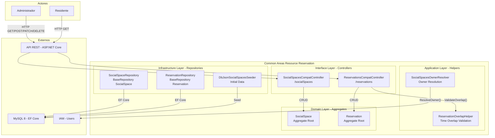

**Explicación del Diagrama de Componentes - Reservas:**

El bounded context de **Reservas** gestiona áreas comunes y el sistema de reservas de espacios del edificio. Está compuesto por cuatro capas.

La **Interface Layer** expone 2 controllers: el **SocialSpacesCompatController** en `/socialSpaces` para CRUD de espacios sociales con soporte de creación, actualización, eliminación y listado, e incluye seed de datos iniciales desde JSON; y el **ReservationsCompatController** en `/reservations` para CRUD de reservas con validación de overlap de horarios, límites de capacidad y generación de tokens de invitación.

La **Application Layer** contiene el **ReservationOverlapHelper** que valida si una nueva reserva se superpone con existentes comparando fechas y rangos de horas, y el **SocialSpacesOwnerResolver** que resuelve externalId de admin a User válido para filtrar datos por propietario.

La **Domain Layer** define 2 aggregate roots: **SocialSpace** que representa espacios comunes (salón de eventos, gimnasio, etc.) con capacidad e imagen, y **Reservation** que representa una reserva con datos del residente, fecha, horario y lista de invitados en formato JSON.

La **Infrastructure Layer** implementa **SocialSpaceRepository** y **ReservationRepository** con filtrado múltiple, y **DbJsonSocialSpacesSeeder** para datos iniciales.

##### 2.6.3.6. Bounded Context Software Architecture Code Level Diagrams

###### 2.6.3.6.1. Bounded Context Domain Layer Class Diagrams

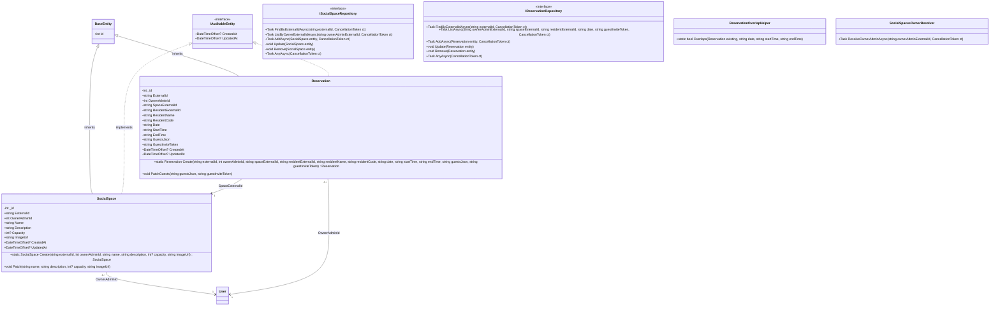

**Explicación del Diagrama de Clases - Reservas:**

El diagrama de clases del dominio Reservas muestra la estructura de espacios comunes y reservas. **BaseEntity** y **IAuditableEntity** proporcionan la base común con `Id`, `CreatedAt` y `UpdatedAt`.

**SocialSpace** (Aggregate Root) tiene atributos privados `_id` y propiedades públicas: `ExternalId`, `OwnerAdminId`, `Name`, `Description`, `Capacity` (nullable) e `ImageUrl`. Su factory method `Create()` recibe todos los parámetros y su mutador `Patch()` permite actualizar nombre, descripción, capacidad e imagen.

**Reservation** (Aggregate Root) tiene atributos privados `_id` y propiedades públicas: `ExternalId`, `OwnerAdminId`, `SpaceExternalId`, `ResidentExternalId`, `ResidentName`, `ResidentCode`, `Date`, `StartTime`, `EndTime`, `GuestsJson` (JSON de invitados) y `GuestInviteToken` (token único para invitados). Su factory method `Create()` recibe 11 parámetros y su mutador `PatchGuests()` actualiza la lista de invitados.

**ISocialSpaceRepository** define 6 operaciones: `FindByExternalIdAsync`, `ListByOwnerExternalIdAsync`, `AddAsync`, `Update`, `Remove` y `AnyAsync`. **IReservationRepository** también define 6 operaciones incluyendo `ListAsync` con filtrado múltiple por owner, space, resident, date y guestInviteToken.

**ReservationOverlapHelper** es un helper estático con `Overlaps()` que compara una reserva existente con una nueva fecha/hora para detectar solapamientos. **SocialSpacesOwnerResolver** resuelve externalId de admin con `ResolveOwnerAdminAsync()`.

Las relaciones muestran que **SocialSpace** y **Reservation** heredan de BaseEntity e implementan IAuditableEntity. Ambas tienen relación `"0..*" --> "1"` con User via OwnerAdminId, y **Reservation** tiene relación `"0..*" --> "1"` con **SocialSpace** via SpaceExternalId.

###### 2.6.3.6.2. Bounded Context Database Design Diagram

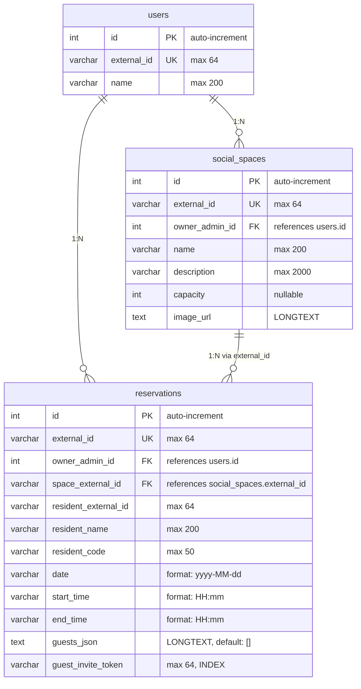

**Explicación del Diagrama de Base de Datos - Reservas:**

El diagrama muestra 3 tablas del bounded context Reservas. La tabla **users** es compartida y contiene `id` (PK), `external_id` (UK) y `name`. La tabla **social_spaces** almacena los espacios comunes con `id` (PK), `external_id` (UK), `owner_admin_id` (FK a users), `name`, `description` (max 2000), `capacity` (nullable) e `image_url` (LONGTEXT para URLs de imágenes).

La tabla **reservations** es la más compleja, con `id` (PK), `external_id` (UK), `owner_admin_id` (FK a users), `space_external_id` (FK a social_spaces.external_id), `resident_external_id`, `resident_name`, `resident_code`, `date` (formato yyyy-MM-dd), `start_time` y `end_time` (formato HH:mm), `guests_json` (LONGTEXT con JSON de invitados, default []) y `guest_invite_token` (max 64, INDEX para búsqueda rápida).

Las relaciones son: **users 1:N social_spaces** (un usuario tiene muchos espacios), **users 1:N reservations** (un usuario tiene muchas reservas), y **social_spaces 1:N reservations** (un espacio tiene muchas reservas, vinculadas via `external_id` en lugar de `id`).

---

Este contexto gestiona la creación, seguimiento y resolución de incidencias reportadas por residentes o administradores dentro del edificio.

##### 2.6.4.1. Domain Layer

**Diccionario de Clases del Dominio**

- **Incident** (Aggregate Root)
  - **Propósito:** Entidad agregada que representa una incidencia reportada en el sistema.
  - **Atributos:**
    - `Id`: int (PK auto-incremental)
    - `ExternalId`: string (ID externo único)
    - `OwnerAdminId`: int (FK al admin propietario)
    - `OwnerAdmin`: User? (navegación al admin)
    - `ResidentExternalId`: string? (ExternalId del residente asociado)
    - `ResidentName`: string (nombre del residente)
    - `Description`: string (descripción de la incidencia)
    - `Status`: string (default "open")
    - `Provider`: string? (proveedor asignado)
    - `ReportedAt`: DateTimeOffset (fecha/hora de reporte)
    - `CreatedAt`: DateTimeOffset? (de IAuditableEntity)
    - `UpdatedAt`: DateTimeOffset? (de IAuditableEntity)
  - **Métodos:**
    - `Create(externalId, ownerAdminId, description, status, residentExternalId, residentName, provider, reportedAt): Incident` (factory estático)
    - `Update(description, status, provider, residentExternalId, residentName): void`
  - **Relaciones:** FK a `User` via `OwnerAdminId` con `DeleteBehavior.Restrict`. Implementa `IAuditableEntity`.

- **IncidentStatuses** (Value Object Helper)
  - **Propósito:** Define valores válidos de estado y métodos de normalización.
  - **Constantes:** Open="open", InProgress="in-progress", Resolved="resolved"
  - **Métodos:** `Normalize(status): string`, `IsValid(status): bool`

- **IncidentError** (Enum)
  - **Valores:** IncidentNotFound, OwnerAdminRequired, DescriptionRequired, InvalidStatus, ResidentRequired, ProviderRequired

- **IIncidentRepository** (Interface)
  - **Herencia:** `IBaseRepository<Incident>`
  - **Métodos:**
    - `FindByExternalIdAsync(externalId, CancellationToken): Task<Incident?>`
    - `ListByOwnerAdminIdAsync(ownerAdminId, CancellationToken): Task<IEnumerable<Incident>>`
    - `AnyIncidentsAsync(CancellationToken): Task<bool>`

- **CreateIncidentCommand** (Command)
  - **Atributos:** `ExternalId`, `OwnerAdminExternalId`, `Description`, `Status`, `ResidentExternalId?`, `ResidentName?`, `Provider?`, `CreatedAt?`

- **UpdateIncidentCommand** (Command)
  - **Atributos:** `ExternalId`, `Description`, `Status`, `Provider?`, `ResidentExternalId?`, `ResidentName?`

- **DeleteIncidentCommand** (Command)
  - **Atributos:** `ExternalId`

##### 2.6.4.2. Interface Layer

- **IncidentsCompatController**
  - **Ruta base:** `/incidents`
  - **Propósito:** Controlador REST con CRUD de incidencias. Requiere autorización (`[Authorize]`).
  - **Endpoints:**
    - `GET /`: Listar incidencias (filtro: ownerAdminId)
    - `POST /`: Crear incidencia
    - `PUT /{id}`: Actualizar incidencia
    - `DELETE /{id}`: Eliminar incidencia

- **IncidentResource** (DTOs)
  - `IncidentResource`: DTO de respuesta (Id, ResidentId, ResidentName, Description, Status, CreatedAt, Provider, OwnerAdminId)
  - `CreateIncidentCompatResource`: DTO de entrada POST
  - `UpdateIncidentCompatResource`: DTO de entrada PUT

- **IncidentResourceAssembler** (Transformador)
  - **Método:** `ToResource(incident): IncidentResource`

##### 2.6.4.3. Application Layer

- **IIncidentQueryService** (Interface)
  - **Método:** `ListByOwnerExternalIdAsync(ownerAdminExternalId, CancellationToken): Task<IEnumerable<Incident>>`

- **IIncidentCommandService** (Interface)
  - **Métodos:**
    - `Handle(CreateIncidentCommand, CancellationToken): Task<Result<Incident>>`
    - `Handle(UpdateIncidentCommand, CancellationToken): Task<Result<Incident>>`
    - `Handle(DeleteIncidentCommand, CancellationToken): Task<Result<Incident>>`

- **IncidentQueryService** (Implementación)
  - **Dependencias:** IIncidentRepository, IUserRepository

- **IncidentCommandService** (Implementación)
  - **Dependencias:** IIncidentRepository, IUserRepository, IUnitOfWork
  - **Lógica clave:** Valida que el owner sea role "admin", genera ExternalId con timestamp si está vacío, usa `Incident.Create()` y `Incident.Update()` del dominio.

##### 2.6.4.4. Infrastructure Layer

- **IncidentRepository** (Implementación del repositorio)
  - **Herencia:** `BaseRepository<Incident>`
  - **Método privado:** `WithOwner()` para eager loading

- **ModelBuilderExtensions** (Configuración EF Core)
  - **Método:** `ApplyIncidentsConfiguration(this ModelBuilder)`
  - **Configuración:** ExternalId (unique, max 64), Description (max 2000, required), Status (max 20, required), FK OwnerAdminId con DeleteBehavior.Restrict

- **DbJsonIncidentSeeder** (Semilla de datos)
  - **Método:** `SeedAsync(dbJsonPath, CancellationToken)`

##### 2.6.4.5. Bounded Context Software Architecture Component Level Diagrams

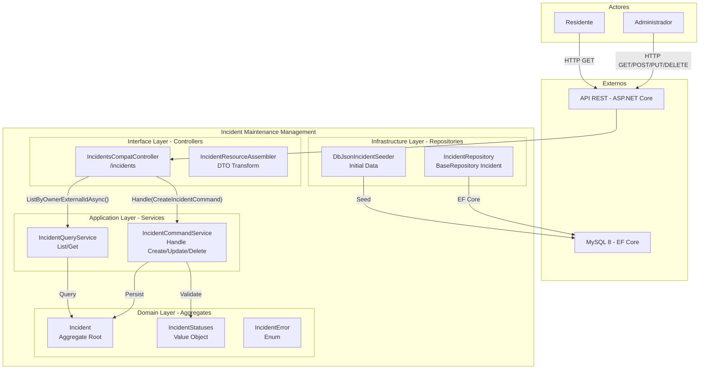

**Explicación del Diagrama de Componentes - Incidencias:**

El bounded context de **Incidencias** gestiona reportes de mantenimiento y problemas del edificio. Está compuesto por cuatro capas.

La **Interface Layer** expone el **IncidentsCompatController** en `/incidents` para CRUD de incidencias con filtros por ownerAdminId, y el **IncidentResourceAssembler** que transforma entidades Incident a formato DTO con mapeo de campos y validación de nulls.

La **Application Layer** contiene el **IncidentCommandService** que maneja Create, Update y Delete con validación de estado y campos requeridos, y el **IncidentQueryService** que lista incidencias por ownerAdminId retornando DTOs con mapeo automático.

La **Domain Layer** define el aggregate root **Incident** con campos como `Description`, `Status`, `Provider` y `ReportedAt`, el Value Object **IncidentStatuses** con estados válidos (open, in_progress, resolved) y normalización de strings, y el enum **IncidentError** con errores específicos del dominio.

La **Infrastructure Layer** implementa **IncidentRepository** con filtrado por ownerAdminId y **DbJsonIncidentSeeder** para datos iniciales.

##### 2.6.4.6. Bounded Context Software Architecture Code Level Diagrams

###### 2.6.4.6.1. Bounded Context Domain Layer Class Diagrams

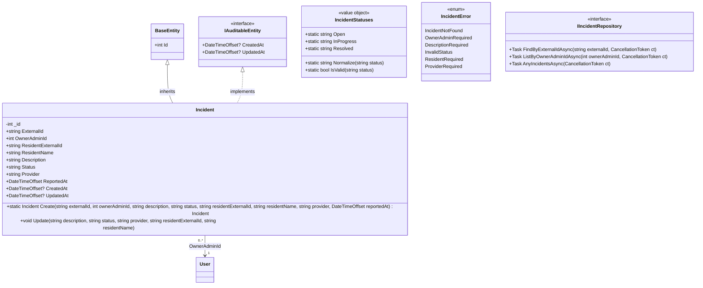

**Explicación del Diagrama de Clases - Incidencias:**

El diagrama de clases del dominio Incidencias muestra la estructura de reportes de mantenimiento. **BaseEntity** e **IAuditableEntity** proporcionan la base común.

**Incident** (Aggregate Root) tiene atributos privados `_id` y propiedades públicas: `ExternalId`, `OwnerAdminId`, `ResidentExternalId`, `ResidentName`, `Description`, `Status`, `Provider` y `ReportedAt` (DateTimeOffset). Su factory method `Create()` recibe 8 parámetros y su mutador `Update()` permite modificar descripción, estado, proveedor y datos del residente.

**IncidentStatuses** es un Value Object estático con cadenas constantes `Open`, `InProgress` y `Resolved`, y métodos auxiliares `Normalize()` (convierte a minúsculas y reemplaza espacios por guiones bajos) e `IsValid()` (valida contra la lista de estados permitidos).

**IncidentError** es un enum con 6 errores: `IncidentNotFound`, `OwnerAdminRequired`, `DescriptionRequired`, `InvalidStatus`, `ResidentRequired` y `ProviderRequired`.

**IIncidentRepository** define 3 operaciones: `FindByExternalIdAsync`, `ListByOwnerAdminIdAsync` y `AnyIncidentsAsync`.

Las relaciones muestran herencia de BaseEntity, implementación de IAuditableEntity, y relación `"0..*" --> "1"` con User via OwnerAdminId.

###### 2.6.4.6.2. Bounded Context Database Design Diagram

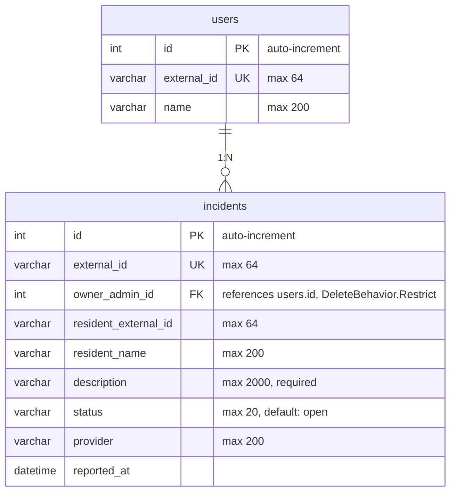

**Explicación del Diagrama de Base de Datos - Incidencias:**

El diagrama muestra 2 tablas del bounded context Incidencias. La tabla **users** es compartida con `id` (PK), `external_id` (UK) y `name`. La tabla **incidents** almacena los reportes de mantenimiento con `id` (PK auto-increment), `external_id` (UK, max 64), `owner_admin_id` (FK a users.id con DeleteBehavior.Restrict para evitar cascade delete), `resident_external_id` (max 64), `resident_name` (max 200), `description` (max 2000, required), `status` (max 20, default "open"), `provider` (max 200) y `reported_at` (datetime).

La restricción DeleteBehavior en `owner_admin_id` garantiza que no se pueda eliminar un usuario que tenga incidencias asociadas. La tabla tiene un diseño simple con solo una relación hacia users, lo que permite consultas rápidas por ownerAdminId.

La relación es **users 1:N incidents**: un usuario admin puede tener múltiples incidencias reportadas.

---

Este contexto provee la infraestructura transversal de auditoría: patrón Result, repositorio base, unidad de trabajo, DbContext y configuración de hosting. Todas las entidades principales implementan `IAuditableEntity` para rastrear timestamps de creación y actualización.

##### 2.6.5.1. Domain Layer

**Diccionario de Clases del Dominio**

- **IBaseRepository<TEntity>** (Interface genérica)
  - **Propósito:** Contrato CRUD genérico para todas las entidades de dominio.
  - **Restricción:** `where TEntity : class`
  - **Métodos:**
    - `AddAsync(entity, CancellationToken): Task`
    - `FindByIdAsync(id, CancellationToken): Task<TEntity?>`
    - `Update(entity): void`
    - `Remove(entity): void`
    - `ListAsync(CancellationToken): Task<IEnumerable<TEntity>>`

- **IUnitOfWork** (Interface)
  - **Propósito:** Contrato del patrón Unidad de Trabajo para confirmar transacciones atómicas.
  - **Método:** `CompleteAsync(CancellationToken): Task`

- **IAuditableEntity** (Interface)
  - **Propósito:** Contrato para entidades con campos de auditoría.
  - **Propiedades:**
    - `CreatedAt`: DateTimeOffset? (get/set)
    - `UpdatedAt`: DateTimeOffset? (get/set)

##### 2.6.5.2. Interface Layer

No aplica (este bounded context es transversal y no expone endpoints propios).

##### 2.6.5.3. Application Layer

- **Result<T>** (Modelo genérico)
  - **Propósito:** Encapsula el éxito o fallo de operaciones, transportando valor, mensaje y error tipado.
  - **Propiedades:** IsSuccess (bool), IsFailure (bool), Value (T?), Message (string), Error (Enum?)
  - **Métodos estáticos:** `Success(value): Result<T>`, `Failure(error, message): Result<T>`

- **Result** (hereda de `Result<object>`)
  - **Métodos estáticos:** `Success(): Result`, `Failure(error, message): Result`

##### 2.6.5.4. Infrastructure Layer

- **BaseRepository<TEntity>** (Implementación genérica)
  - **Propósito:** Implementación base del repositorio con Entity Framework Core.
  - **Herencia:** Implementa `IBaseRepository<TEntity>`
  - **Dependencia:** `AppDbContext` (protected readonly)
  - **Implementación:** Delega a `Context.Set<TEntity>()` para AddAsync, FindByIdAsync, Update, Remove, ListAsync

- **UnitOfWork** (Implementación)
  - **Propósito:** Implementación concreta de `IUnitOfWork`.
  - **Herencia:** Implementa `IUnitOfWork`
  - **Dependencia:** `AppDbContext`
  - **Implementación:** `context.SaveChangesAsync()`

- **AppDbContext** (DbContext central)
  - **Propósito:** DbContext compartido por TODOS los bounded contexts.
  - **Herencia:** `DbContext`
  - **Configura en OnModelCreating:**
    - Entidades de IAM, Incidents, Finances, SocialSpaces, Information (vía extension methods)
    - Entidades de Support (SupportChat), Import (ImportUpload), Team (TeamWorker) directamente
    - Convención: `UseSnakeCaseNamingConvention()` para tablas y columnas

- **AppDbContextFactory** (Fábrica para migraciones)
  - **Propósito:** Crea `AppDbContext` en tiempo de diseño para migraciones EF Core.
  - **Implementa:** `IDesignTimeDbContextFactory<AppDbContext>`
  - **Conexión hardcoded:** MySQL localhost (server=localhost, port=3306, user=root, password=root, database=buildingfex)

- **StringExtensions** (Helpers de cadena)
  - **Métodos:**
    - `ToSnakeCase(this string text)`: Convierte "PascalCase" a "pascal_case"
    - `ToPlural(this string text)`: Pluraliza texto vía librería Humanizer

- **ModelBuilderExtensions** (Convención global)
  - **Método:** `UseSnakeCaseNamingConvention(this ModelBuilder)`
  - **Lógica:** Recorre todas las entidades y convierte nombres de tablas, columnas, claves, foreign keys e índices a snake_case

- **RailwayHosting** (Configuración de hosting)
  - **Propósito:** Resolución de variables de entorno para despliegue en Railway.
  - **Métodos:**
    - `ConfigureKestrelPort(builder)`: Lee PORT de env y configura Kestrel
    - `ResolveConnectionString(configuration)`: Resuelve cadena MySQL desde env o appsettings
    - `ApplySecretsFromEnvironment(builder)`: Inyecta JWT secret, MercadoPago config y connection string desde env
    - `ValidateProductionSecrets(configuration, environment)`: Valida JWT secret en producción (>= 32 chars)
    - `IsRailwayDeployment()`: Detecta variables RAILWAY_ENVIRONMENT o PORT
  - **Variables soportadas:** PORT, RAILWAY_ENVIRONMENT, JWT_SECRET, MP_ACCESS_TOKEN, MP_PUBLIC_KEY, MP_WEBHOOK_SECRET, MP_FRONTEND_BASE_URL, MP_NOTIFICATION_URL, MYSQL_URL, DATABASE_URL, MYSQLHOST, MYSQLPORT, MYSQLUSER, MYSQLPASSWORD, MYSQLDATABASE

##### 2.6.5.5. Bounded Context Software Architecture Component Level Diagrams

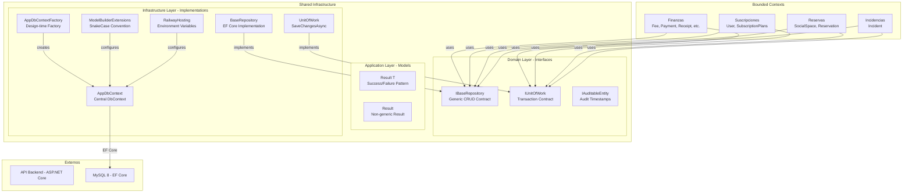

**Explicación del Diagrama de Componentes - Auditoría:**

El bounded context de **Auditoría** (Shared Infrastructure) proporciona infraestructura transversal compartida para todos los bounded contexts del sistema.

La **Domain Layer** define 3 interfaces clave: **IBaseRepository** (interfaz genérica para operaciones CRUD: AddAsync, FindByIdAsync, Update, Remove, ListAsync), **IUnitOfWork** (contrato para transacciones atómicas con CompleteAsync) e **IAuditableEntity** (contrato para campos de auditoría CreatedAt y UpdatedAt).

La **Application Layer** contiene los modelos **Result\<T>** (genérico para éxito/fallo con valor tipado, patrón Railway-oriented programming) y **Result** (no genérico para operaciones sin retorno).

La **Infrastructure Layer** implementa: **BaseRepository** (implementación genérica de IBaseRepository con EF Core y lazy loading via AsSplitQuery), **UnitOfWork** (ejecuta SaveChangesAsync para confirmar transacciones), **AppDbContext** (DbContext central que configura todas las entidades con SnakeCase naming convention), **AppDbContextFactory** (factory para tiempo de diseño), **ModelBuilderExtensions** (configura entidades y relaciones) y **RailwayHosting** (configura Kestrel, variables de entorno y connection string para Railway).

Los 4 bounded contexts que dependen de esta infraestructura son **Finanzas** (Fee, Payment, Receipt, FinanceSetting, KpiRecord, AdminManagementExpense, SharedUtilityService, FixedPayoutRecipient), **Suscripciones** (User, SubscriptionPlans), **Reservas** (SocialSpace, Reservation) e **Incidencias** (Incident).

##### 2.6.5.6. Bounded Context Software Architecture Code Level Diagrams

###### 2.6.5.6.1. Bounded Context Domain Layer Class Diagrams

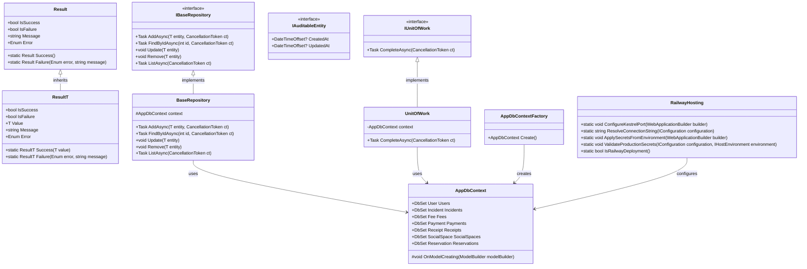

**Explicación del Diagrama de Clases - Auditoría (Shared Infrastructure):**

El diagrama de clases de Auditoría muestra la infraestructura compartida del sistema. No hay herencia de BaseEntity ni implementación de IAuditableEntity en este diagrama, ya que es la definición de esas interfaces.

**IBaseRepository** es una interfaz genérica con restricción `where TEntity : class` que define 5 operaciones CRUD: `AddAsync` (agrega entidad), `FindByIdAsync` (busca por ID), `Update` (actualiza), `Remove` (elimina) y `ListAsync` (lista todas).

**IUnitOfWork** es una interfaz simple con un solo método `CompleteAsync` que confirma transacciones atómicas.

**IAuditableEntity** es una interfaz con dos propiedades: `CreatedAt` (DateTimeOffset?, get/set) y `UpdatedAt` (DateTimeOffset?, get/set).

**Result\<T>** y **Result** son clases del patrón Railway-oriented programming. Ambas tienen propiedades `IsSuccess`, `IsFailure`, `Message` y `Error` (Enum), pero Result\<T> agrega `Value` (T). Los factory methods estáticos son `Success()` y `Failure()`.

**BaseRepository** es una clase genérica con campo protegido `#AppDbContext context` que implementa IBaseRepository. **UnitOfWork** tiene campo privado `-AppDbContext context` e implementa IUnitOfWork ejecutando `SaveChangesAsync()`.

**AppDbContext** es el DbContext central con 7 DbSets: `Users`, `Incidents`, `Fees`, `Payments`, `Receipts`, `SocialSpaces` y `Reservations`. Su método protegido `OnModelCreating` configura el modelo.

**AppDbContextFactory** crea instancias de AppDbContext para tiempo de diseño. **RailwayHosting** es una clase estática con 5 métodos para configurar el hosting en Railway (Kestrel port, connection string, environment variables, validación de secrets, detección de deployment).

Las relaciones muestran que Result hereda de Result\<T>, BaseRepository implementa IBaseRepository, UnitOfWork implementa IUnitOfWork, y ambas implementaciones dependen de AppDbContext (usan/crean/configuran).

###### 2.6.5.6.2. Bounded Context Database Design Diagram

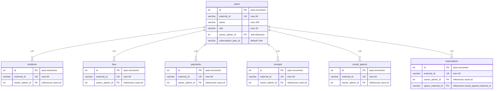

**Explicación del Diagrama de Base de Datos - Auditoría (Vista Global):**

Este diagrama muestra la vista transversal de todas las tablas del sistema con sus relaciones clave foránea, representando la estructura completa de base de datos de BuildingFex.

La tabla central es **users** que almacena todos los usuarios del sistema (admins y residentes) con `id` (PK), `external_id` (UK), `name`, `role` (max 20), `owner_admin_id` (FK auto-referenciada) y `subscription_plan_id` (default "free"). Todas las demás tablas dependen de esta tabla via `owner_admin_id`.

Las tablas de dominio son **incidents** (reportes de mantenimiento), **fees** (cuotas de mantenimiento), **payments** (pagos registrados), **receipts** (recibos de expensas), **social_spaces** (espacios comunes) y **reservations** (reservas de espacios). Cada una tiene `id` (PK auto-increment), `external_id` (UK, max 64) y `owner_admin_id` (FK a users).

La tabla **reservations** además tiene `space_external_id` como FK a `social_spaces.external_id`, creando una relación adicional entre reservas y espacios.

Las relaciones son todas de tipo **1:N** desde `users` hacia cada tabla de dominio, lo que significa que un usuario admin puede tener múltiples incidencias, cuotas, pagos, recibos, espacios y reservas. La relación **social_spaces 1:N reservations** indica que un espacio puede tener múltiples reservas asociadas.

## Conclusiones

## Bibliografía

## Anexos

